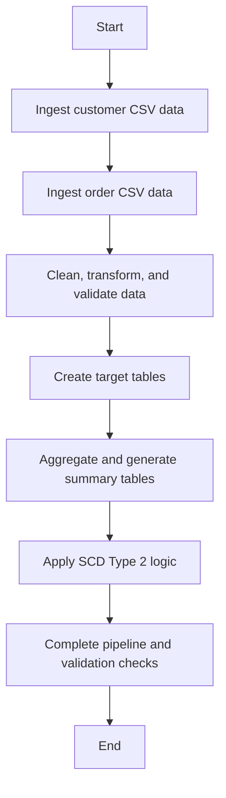

# Document Control
- System Name: Application
- Version: 1.0
- Author: Data Engineering Team
- Date: 2024-06-12
- Status: Draft

# Executive Summary
- The Application facilitates an automated ETL pipeline involving source CSV data ingestion, transformation, cleaning, aggregation, and SCD Type 2 history management, implemented using Delta Live Tables.

# Business Objectives
- Automate data ingestion from CSV files to Delta tables
- Ensure data quality through null and duplicate removal
- Aggregate customer spend and maintain accurate, auditable transaction history
- Enable change data capture via SCD Type 2 implementation

# In-Scope
- Source CSV data reading and delta table loading
- Schema enforcement for customer and order tables
- Data transformation and cleaning logic
- Creation of ordersummary and customeraggregatespend tables
- Aggregation logic on ordersummary data
- SCD Type 2 implementation for ordersummary
- Process deployment using Delta Live Tables

# Out-of-Scope
- Any manual data manipulation
- External system integrations beyond defined delta tables
- Real-time or streaming ingestion
- Data visualization or reporting dashboards

# Stakeholders
- Data Engineering Team
- Business Analysts
- Compliance Team

# Business Requirements

### BR-ETL-001 — Load Source Customer Data
- Description: Read customer CSV data and load to delta table /Volumes/gen_ai_poc_databrickscoe/sdlc_wizard/customerdata
- Business Value: Automated, structured customer data ingestion
- Priority: High

### BR-ETL-002 — Load Source Order Data
- Description: Read order CSV data and load to delta table /Volumes/gen_ai_poc_databrickscoe/sdlc_wizard/orderdata
- Business Value: Automated, structured order data ingestion
- Priority: High

### BR-ETL-003 — Customer Table Schema Enforcement
- Description: Enforce schema with fields CustId, Name, EmailId, Region for customer table
- Business Value: Consistency and data quality assurance
- Priority: High

### BR-ETL-004 — Order Table Schema Enforcement
- Description: Enforce schema with fields OrderId, ItemName, PricePerUnit, Qty, Date, CustId for order table
- Business Value: Consistency and data quality assurance
- Priority: High

### BR-ETL-005 — Calculate TotalAmount Field
- Description: Add column TotalAmount to order table (PricePerUnit * Qty)
- Business Value: Simplifies downstream aggregation and analytics
- Priority: Medium

### BR-ETL-006 — Data Quality: Null and Duplicate Removal
- Description: Remove nulls and duplicates from customer and order tables
- Business Value: Improves analytical accuracy and reliability
- Priority: High

### BR-ETL-007 — Create Ordersummary Table
- Description: Create ordersummary table in catalog=gen_ai_poc_databrickscoe, schema=sdlc_wizard if not exists
- Business Value: Centralized storage for enriched order data
- Priority: High

### BR-ETL-008 — SCD Type 2 on Ordersummary
- Description: Apply SCD Type 2 methodology to ordersummary based on updates in customer table
- Business Value: Ensures historical accuracy and traceability of data changes
- Priority: High

### BR-ETL-009 — Create CustomerAggregateSpend Table
- Description: Create customeraggregatespend table with columns Name, TotalAmount, Date if not exists
- Business Value: Enables spend analysis and reporting
- Priority: Medium

### BR-ETL-010 — Aggregate Customer Spend
- Description: Aggregate TotalAmount grouped by Name and Date from ordersummary and load into customeraggregatespend
- Business Value: Facilitates spend tracking for business insights
- Priority: Medium

### BR-ETL-011 — Delta Live Tables Implementation
- Description: Implement the entire processing steps using Delta Live Tables
- Business Value: Simplifies workflow orchestration and monitoring
- Priority: High

# Assumptions & Constraints
- Source data is available and accessible via defined CSV file paths
- Only the specified schemas will be enforced
- Delta Lake infrastructure is operational

# Success Metrics
- Successful, automated runs from CSV to target tables
- Zero null/duplicate records post-processing
- Accurate aggregation results in customeraggregatespend
- SCD Type 2 audit trails present

# Risks & Mitigations
- Source data format changes — Mitigation: Schema enforcement and validation
- Data quality issues from source — Mitigation: Robust null and duplicate handling logic
- Infrastructure/permission errors — Mitigation: Pre-execution checks and monitoring

# Approval
- Business Owner: <TBD>
- Data Engineering Lead: <TBD>
- Compliance Review: <TBD>
- Date: <TBD>

# Appendix

Appendix A: Source Definitions  
Source Name | Type | Location | Format | Notes  
----------- | ---- | -------- | ------ | -----  
customerdata | CSV | /Volumes/gen_ai_poc_databrickscoe/sdlc_wizard/customerdata | CSV | Customer table source  
orderdata | CSV | /Volumes/gen_ai_poc_databrickscoe/sdlc_wizard/orderdata | CSV | Order table source  

Appendix B: Target Definitions  
Target Name | Layer | Table | Columns | Notes  
----------- | ----- | ----- | ------- | -----  
ordersummary | Delta | sdlc_wizard.ordersummary | OrderId, ItemName, PricePerUnit, Qty, Date, CustId, Name, EmailId, Region, TotalAmount | Enriched order data  
customeraggregatespend | Delta | sdlc_wizard.customeraggregatespend | Name, TotalAmount, Date | Aggregated customer spend  

Appendix C: Transformations  
Step | Transformation | Input | Output | Logic  
---- | ------------- | ----- | ------ | -----  
1 | Add TotalAmount | orderdata | orderdata | PricePerUnit * Qty  
2 | Null/Duplicate Removal | customerdata, orderdata | cleansed tables | Remove invalid records  
3 | Aggregation | ordersummary | customeraggregatespend | Group by Name, Date and sum TotalAmount  
4 | SCD Type 2 | ordersummary, customerdata | ordersummary | Track historical changes  

Appendix D: Business Rules  
Rule ID | Area | Description | Source  
-------- | ----- | ----------- | ------  
BR-ETL-003 | Customer | Enforce schema, validate CustId, Name, EmailId, Region | requirements  
BR-ETL-004 | Order | Enforce schema, validate OrderId, ItemName, etc. | requirements  
BR-ETL-006 | Data Quality | Remove nulls/duplicates before loading | requirements  

Appendix E: Process Flow  
Step | Description | Dependency  
---- | ----------- | ----------  
1 | Ingest customer CSV data | None  
2 | Ingest order CSV data | None  
3 | Clean, transform, and validate data | 1, 2  
4 | Create/overwrite target tables | 3  
5 | Aggregate and generate summary tables | 4  
6 | Apply SCD Type 2 logic | 4  
7 | Complete pipeline and validation checks | 5, 6  

