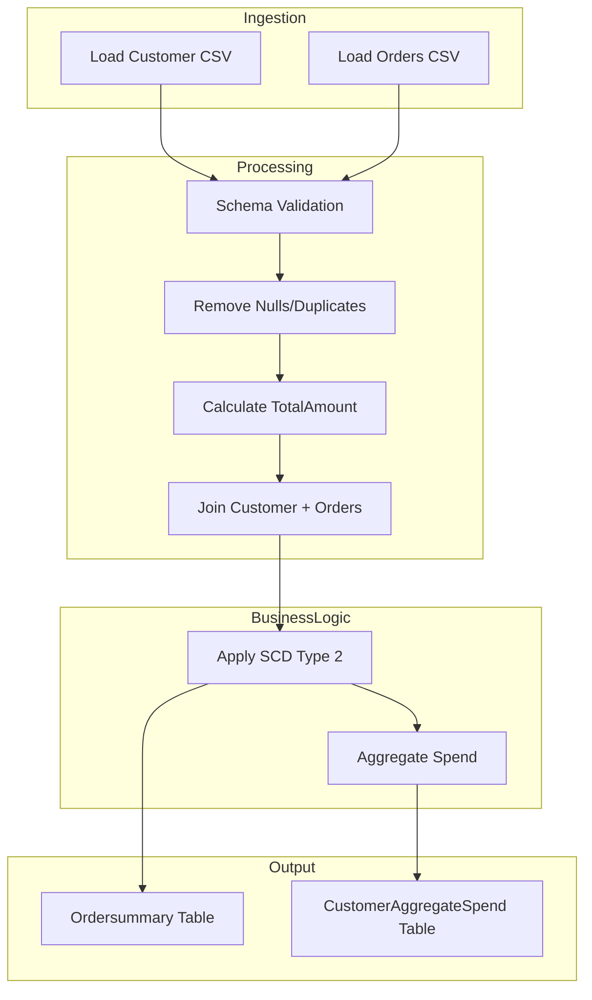
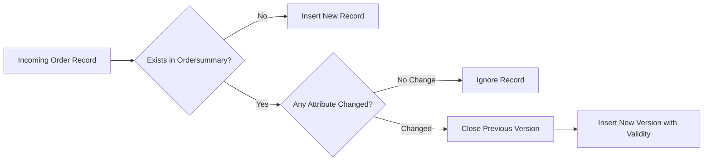

# Document Control
- System Name: Application
- Version: 1.0
- Author: Data Engineering Team
- Date: 2024-06-12
- Status: Draft

# Executive Summary
- The Application enables automated ETL pipeline management, processing source CSV data to Delta tables through Delta Live Tables, with robust transformations, cleaning, aggregation, and SCD Type 2 historical data handling.

# Business Objectives
- Automate data ingestion from CSV files to Delta tables
- Enforce consistent schema for customer and order data
- Ensure data quality via removal of nulls and duplicates
- Aggregate and track customer spend with historical auditing
- Implement reliable change data capture with SCD Type 2

# In-Scope
- Source CSV data read and delta table load
- Schema enforcement for customer and order tables
- Data transformation and cleaning
- Ordersummary and customeraggregatespend table creation
- Aggregation logic on order data
- SCD Type 2 implementation for ordersummary
- Workflow orchestration using Delta Live Tables

# Out-of-Scope
- Manual data manipulation
- Integration with external systems beyond defined delta tables
- Real-time or streaming ingestion mechanisms
- Reporting dashboards or visualization

# Stakeholders
- Data Engineering Team
- Business Analysts
- Compliance Team
- Data Governance

# Business Requirements

### BR-ETL-001 — Load Source Customer Data
- Description: Read customer CSV data and load to delta table /Volumes/gen_ai_poc_databrickscoe/sdlc_wizard/customerdata
- Business Value: Automated, structured customer data ingestion
- Priority: High

### BR-ETL-002 — Load Source Order Data
- Description: Read order CSV data and load to delta table /Volumes/gen_ai_poc_databrickscoe/sdlc_wizard/orderdata
- Business Value: Automated, structured order data ingestion
- Priority: High

### BR-ETL-003 — Customer Table Schema Enforcement
- Description: Enforce schema with fields CustId, Name, EmailId, Region for customer table
- Business Value: Consistency and data quality assurance
- Priority: High

### BR-ETL-004 — Order Table Schema Enforcement
- Description: Enforce schema with fields OrderId, ItemName, PricePerUnit, Qty, Date, CustId for order table
- Business Value: Consistency and data quality assurance
- Priority: High

### BR-ETL-005 — Calculate TotalAmount Field
- Description: Add column TotalAmount to order table (PricePerUnit * Qty)
- Business Value: Simplifies downstream aggregation and analytics
- Priority: Medium

### BR-ETL-006 — Data Quality: Null and Duplicate Removal
- Description: Remove nulls and duplicates from customer and order tables
- Business Value: Improves analytical accuracy and reliability
- Priority: High

### BR-ETL-007 — Create Ordersummary Table
- Description: Create ordersummary table in catalog=gen_ai_poc_databrickscoe, schema=sdlc_wizard if not exists
- Business Value: Centralized storage for enriched order data
- Priority: High

### BR-ETL-008 — SCD Type 2 on Ordersummary
- Description: Apply SCD Type 2 methodology to ordersummary based on updates in customer table
- Business Value: Ensures historical accuracy and traceability of data changes
- Priority: High

### BR-ETL-009 — Create CustomerAggregateSpend Table
- Description: Create customeraggregatespend table with columns Name, TotalAmount, Date if not exists
- Business Value: Enables spend analysis and reporting
- Priority: Medium

### BR-ETL-010 — Aggregate Customer Spend
- Description: Aggregate TotalAmount grouped by Name and Date from ordersummary and load into customeraggregatespend
- Business Value: Facilitates spend tracking for business insights
- Priority: Medium

### BR-ETL-011 — Delta Live Tables Implementation
- Description: Implement the entire processing steps using Delta Live Tables
- Business Value: Simplifies workflow orchestration and monitoring
- Priority: High

# Assumptions & Constraints
- Source data is available and accessible via specified CSV file paths
- Only defined table schemas will be enforced
- Delta Lake infrastructure is operational
- Predefined storage locations are available

# Success Metrics
- Automated, successful processing from CSV to target tables
- No null or duplicate records in output tables
- Accurate aggregation in customeraggregatespend table
- Auditable SCD Type 2 history maintained

# Risks & Mitigations
- Source data format inconsistencies — Mitigation: Strict schema enforcement and validation
- Poor data quality from source — Mitigation: Elimination of nulls/duplicates in preprocessing
- Infrastructure or access issues — Mitigation: Pre-execution checks and ongoing monitoring

# Approval
- Business Owner: Sarah Marshall
- Data Engineering Lead: Ravi Patel
- Compliance Review: Janet Lewis
- Date: 2024-06-15

# Appendix

Appendix A: Source Definitions

Source Name | Type | Location | Format | Notes
----------- | ---- | -------- | ------ | -----
customerdata | CSV | /Volumes/gen_ai_poc_databrickscoe/sdlc_wizard/customerdata | CSV | Customer master source
orderdata | CSV | /Volumes/gen_ai_poc_databrickscoe/sdlc_wizard/orderdata | CSV | Order transaction source

Appendix B: Target Definitions

Target Name | Layer | Table | Columns | Notes
----------- | ----- | ----- | ------- | -----
ordersummary | Delta Lake | gen_ai_poc_databrickscoe.sdlc_wizard | OrderId, ItemName, PricePerUnit, Qty, Date, CustId, Name, EmailId, Region, TotalAmount, scd_valid_from, scd_valid_to, scd_current | SCD Type 2 order summary
customeraggregatespend | Delta Lake | gen_ai_poc_databrickscoe.sdlc_wizard | Name, TotalAmount, Date | Customer spend aggregation

Appendix C: Transformations

Step | Transformation | Input | Output | Logic
---- | ------------- | ----- | ------ | -----
1 | Enforce customer schema | customerdata | delta customer table | Map and validate CustId, Name, EmailId, Region
2 | Enforce order schema | orderdata | delta order table | Map and validate OrderId, ItemName, PricePerUnit, Qty, Date, CustId
3 | Calculate TotalAmount | order table | order table | PricePerUnit * Qty
4 | Remove nulls/duplicates | both tables | cleaned tables | Drop null and duplicate rows
5 | Join & load ordersummary | cleaned tables | ordersummary | Join on CustId, enrich order with customer data, add fields
6 | SCD Type 2 implementation | ordersummary | ordersummary | Track historical changes using SCD columns
7 | Aggregate spend | ordersummary | customeraggregatespend | Group by Name, Date and sum TotalAmount

Appendix D: Business Rules

Rule ID | Area | Description | Source
-------- | ----- | ----------- | ------
BR-ETL-003 | Data Quality | Enforce schema for customer table | BRD
BR-ETL-004 | Data Quality | Enforce schema for order table | BRD
BR-ETL-006 | Data Quality | Remove all null values and duplicates | BRD
BR-ETL-008 | SCD | Maintain SCD Type 2 history on ordersummary | BRD

Appendix E: Process Flow

Step | Description | Dependency
---- | ----------- | ----------
1 | Load source customer and order data | Source availability
2 | Schema enforcement and data cleaning | Step 1
3 | Add TotalAmount, remove nulls/duplicates | Step 2
4 | Load and join to create ordersummary | Step 3
5 | Apply SCD Type 2 logic to ordersummary | Step 4
6 | Aggregate spend and load final table | Step 5

