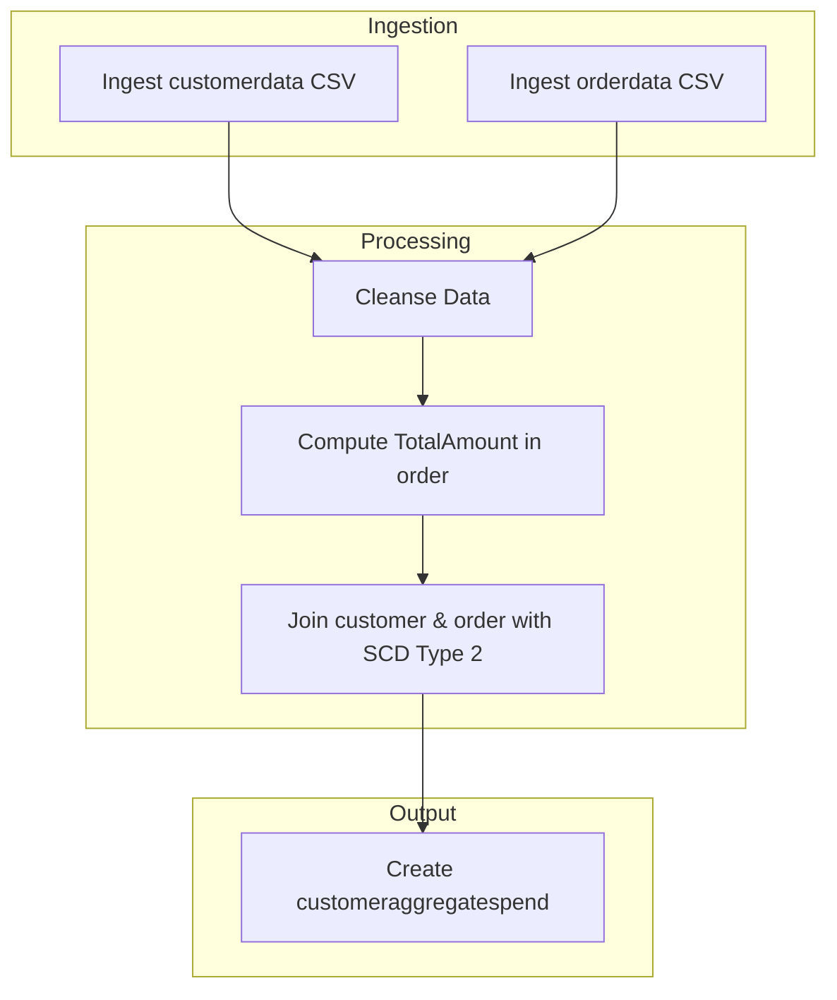
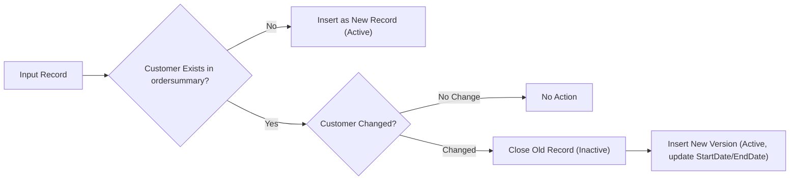

# Document Control
- Document Type: Business Requirements Document (BRD)
- System Name: Application

# Executive Summary
- This BRD defines the business requirements for ingesting customer and order CSV data into Delta tables.
- Focuses on data cleansing, enrichment, SCD Type 2 change handling, and daily spend aggregation.
- The pipeline is implemented using Delta Live Tables.
- System Name: Application

# Business Objectives
- Load customer and order source CSVs into Delta tables.
- Cleanse datasets by removing "Null"/Null literals and duplicates.
- Enrich order data with a computed TotalAmount field.
- Join customer and order data to create an ordersummary table, applying SCD Type 2 logic.
- Create a customeraggregatespend table for daily customer spend totals.
- End-to-end data pipeline orchestrated using Delta Live Tables.

# In-Scope
- Ingestion from specified file paths for customer and order CSVs.
- Delta table creation: customer, order, ordersummary, customeraggregatespend.
- Data cleansing operations for both datasets.
- Adding computed TotalAmount field in order.
- Join operation and SCD Type 2 logic in ordersummary.
- Aggregating spend in customeraggregatespend.
- Implementation via Delta Live Tables.

# Out-of-Scope
- Data sources and fields outside the provided JSON requirements.
- Security, access controls, SLAs, monitoring, alerting mechanisms.
- Performance tuning and scaling.
- Scheduling and orchestration details not tied to "Delta Live Tables."
- Additional data quality metrics or reporting/analytics layers.

# Stakeholders
- Stakeholder details not specified in requirements.

# Business Requirements

### BR-APP-001 — Source Data Ingestion
- Description: Ingest customer and order data from specified CSV file locations into Delta tables.
- Business Value: Enables unified, structured data storage for downstream processing.
- Priority: High

### BR-APP-002 — Data Schema Enforcement
- Description: Enforce target schema on customer (CustId, Name, EmailId, Region) and order (OrderId, ItemName, PricePerUnit, Qty, Date, CustId) tables.
- Business Value: Ensures data consistency for later processing steps.
- Priority: High

### BR-APP-003 — Data Cleansing Operations
- Description: Remove rows containing "Null"/Null literals and any duplicate records from both datasets.
- Business Value: Improves downstream data quality and integrity.
- Priority: High

### BR-APP-004 — Computed Column Creation
- Description: Compute a TotalAmount field as PricePerUnit × Qty in the order table.
- Business Value: Provides essential measure for aggregation and business insight.
- Priority: High

### BR-APP-005 — Ordersummary Table Creation
- Description: Create an ordersummary table by joining customer and order on CustId, applying SCD Type 2 logic for customer changes.
- Business Value: Maintains a complete view and history of customer-order relationships.
- Priority: High

### BR-APP-006 — SCD Type 2 Change Handling
- Description: For customer changes, close old records, insert new active records, and update StartDate/EndDate to retain change history.
- Business Value: Enables historical tracking for regulatory and analytical use.
- Priority: High

### BR-APP-007 — Aggregation Table Creation
- Description: Aggregate ordersummary data by Name and Date to create customeraggregatespend with total daily spend.
- Business Value: Delivers actionable business metrics and supports analytics.
- Priority: High

### BR-APP-008 — Pipeline Implementation
- Description: Implement all steps using Delta Live Tables.
- Business Value: Simplifies orchestration and ensures consistency.
- Priority: Medium

# Assumptions & Constraints
- Only actions and attributes explicitly listed in requirements are assumed.
- Delta Live Tables is the prescribed solution for implementation.
- StartDate, EndDate, Active flag fields are implied in SCD Type 2 logic but detailed field definitions are not specified.

# Success Metrics
- 100% of ingested rows validated against schema and cleansing rules.
- Accurate TotalAmount calculation in all order records.
- Ordersummary table reflects full SCD Type 2 history for all customer changes.
- Customeraggregatespend reflects correct daily aggregations by Name.
- All pipeline steps executed successfully via Delta Live Tables.

# Risks & Mitigations
- Missing explicit data types or field definitions for SCD tracking fields
  - Mitigation: Consult data model team or clarify with stakeholders.
- No error handling or monitoring processes defined
  - Mitigation: Propose adding standard data pipeline monitoring as a future enhancement.
- Unknown expected data volume or performance SLAs
  - Mitigation: Include scalability evaluation after initial pipeline deployment.

# Approval
- To be completed by project sponsors and key stakeholders upon review.

# Appendix

Appendix A: Source Definitions  
Source Name | Type | Location | Format | Notes  
----------- | ---- | -------- | ------ | -----  
customerdata | CSV | /Volumes/gen_ai_poc_databrickscoe/sdlc_wizard/customerdata | CSV | Source for Delta table customer  
orderdata | CSV | /Volumes/gen_ai_poc_databrickscoe/sdlc_wizard/orderdata | CSV | Source for Delta table order  

Appendix B: Target Definitions  
Target Name | Layer | Table | Columns | Notes  
----------- | ----- | ----- | ------- | -----  
customer | Raw | customer | CustId, Name, EmailId, Region | Loaded from customerdata  
order | Raw | order | OrderId, ItemName, PricePerUnit, Qty, Date, CustId | Loaded from orderdata  
ordersummary | Processed | ordersummary | CustId, Name, EmailId, Region, OrderId, ItemName, PricePerUnit, Qty, Date | SCD Type 2 join logic  
customeraggregatespend | Aggregate | customeraggregatespend | Name, TotalAmount, Date | Aggregated daily by Name  

Appendix C: Transformations  
Step | Transformation | Input | Output | Logic  
---- | ------------- | ----- | ------ | -----  
1 | Ingest | customerdata | customer | CSV to Delta table  
2 | Ingest | orderdata | order | CSV to Delta table  
3 | Cleanse | customer, order | cleansed tables | Remove "Null"/Null literals and duplicates  
4 | Compute | order | order | TotalAmount = PricePerUnit × Qty  
5 | Join | customer, order | ordersummary | Join on CustId and apply SCD Type 2  
6 | Aggregate | ordersummary | customeraggregatespend | Sum TotalAmount by Name and Date  

Appendix D: Business Rules  
Rule ID | Area | Description | Source  
-------- | ----- | ----------- | ------  
BR-APP-001 | Cleansing | Remove "Null"/Null literals and duplicates from all tables | Requirements  
BR-APP-002 | Computation | TotalAmount = PricePerUnit × Qty in order table | Requirements  
BR-APP-003 | Join | Join customer and order on CustId | Requirements  
BR-APP-004 | SCD Type 2 | Maintain historical customer changes in ordersummary | Requirements  
BR-APP-005 | Aggregation | Group and sum TotalAmount by Name, Date | Requirements  

Appendix E: Process Flow  
Step | Description | Dependency  
---- | ----------- | ----------  
1 | Ingest customerdata into customer Delta table | Source available  
2 | Ingest orderdata into order Delta table | Source available  
3 | Cleanse data (remove Nulls, duplicates) | Step 1, Step 2  
4 | Compute TotalAmount in order | Step 3  
5 | Join customer and order, create ordersummary with SCD Type 2 | Step 4  
6 | Aggregate spend by Name/Date, create customeraggregatespend | Step 5  

