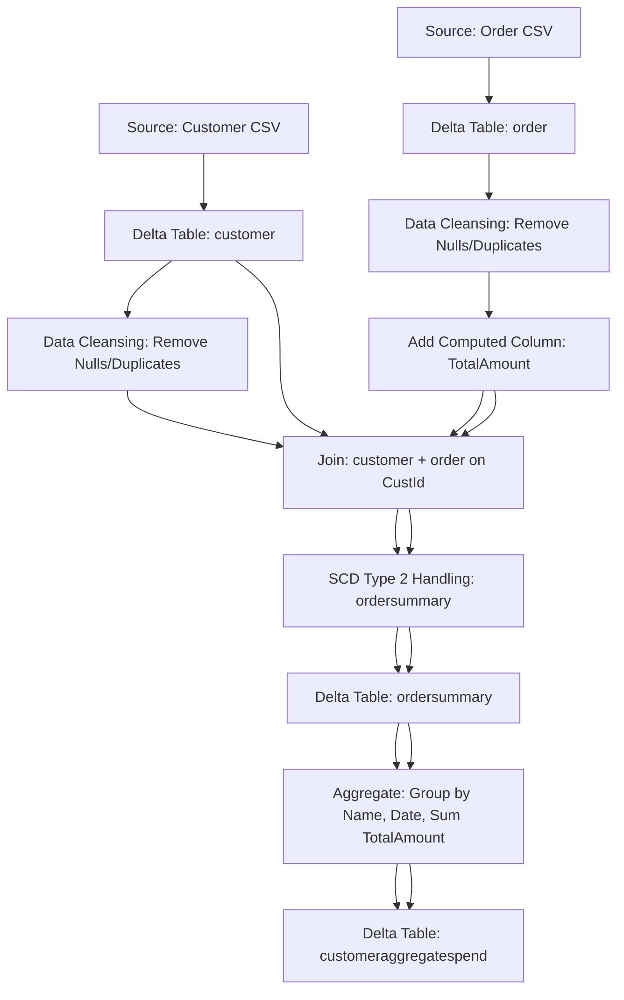

# Document Control
- System Name: Application
- Document Version: 1.0
- Date: Not present in source JSON
- Author: Not present in source JSON

# Executive Summary
- This BRD addresses the ingestion of customer and order CSV data into Delta tables using Delta Live Tables, applying cleansing, enrichment, SCD Type 2 handling, and aggregation to enable high-quality analytical datasets for the Application.

# Business Objectives
- Ingest source CSVs for customer and order data into durable Delta tables.
- Cleanse loaded data by removing "Null"/Null literals and duplicate records.
- Enrich order data with a computed TotalAmount field.
- Create an integrated ordersummary table reflecting SCD Type 2 change handling for customer data.
- Aggregate daily spend at the customer level in customeraggregatespend.
- Execute the entire pipeline with Delta Live Tables for enterprise data reliability.

# In-Scope
- Ingestion from specific filesystem locations for customer and order data.
- Delta table creation and management for customer, order, ordersummary, and customeraggregatespend.
- Application of cleansing procedures and enrichment logic.
- SCD Type 2 processing within the ordersummary.
- Aggregation and construction of customeraggregatespend.
- Implementation exclusively via Delta Live Tables.

# Out-of-Scope
- Any data sources, columns, or systems not explicitly described.
- Security, SLAs, access controls, monitoring, alerting, and performance parameters.
- Scheduling, orchestration, DevOps practices beyond Delta Live Tables pipeline steps.
- User interfaces, downstream analytics, and reporting layers.

# Stakeholders
- Information not present in source JSON.

# Business Requirements

### BR-APP-001 — Source Data Ingestion
- Description: Source customer and order CSVs are to be ingested into Delta tables from defined filesystem locations.
- Business Value: Enables processing on unified, ACID-compliant storage.
- Priority: High

### BR-APP-002 — Schema Enforcement
- Description: Customer table columns: CustId, Name, EmailId, Region; Order table columns: OrderId, ItemName, PricePerUnit, Qty, Date, CustId.
- Business Value: Promotes data consistency and correct integration.
- Priority: High

### BR-APP-003 — Data Cleansing
- Description: Remove "Null"/Null literals and duplicate records from customer and order tables.
- Business Value: Ensures accuracy and reliability of downstream processes.
- Priority: High

### BR-APP-004 — Computed TotalAmount
- Description: Add computed column TotalAmount = PricePerUnit × Qty to the order table.
- Business Value: Facilitates downstream aggregation and analytics.
- Priority: Medium

### BR-APP-005 — Ordersummary Table Creation
- Description: Create the ordersummary Delta table with SCD Type 2 tracking, joining customer and order on CustId.
- Business Value: Delivers an integrated, historized customer-order dataset.
- Priority: High

### BR-APP-006 — SCD Type 2 Handling
- Description: Apply SCD Type 2 logic to ordersummary for customer attribute changes, updating status and timestamps.
- Business Value: Retains auditability and history of customer changes.
- Priority: High

### BR-APP-007 — Aggregates for Customer Spend
- Description: Build customeraggregatespend table with total daily spend by customer (group by Name, Date, sum TotalAmount).
- Business Value: Provides key business metrics for spend analysis.
- Priority: Medium

### BR-APP-008 — Implementation via Delta Live Tables
- Description: End-to-end pipeline must be orchestrated using Delta Live Tables, adhering to all steps 1–10.
- Business Value: Streamlines deployment, maintenance, and data reliability.
- Priority: High

# Assumptions & Constraints
- Requirements follow only the source JSON; no additional assumptions are made.
- Delta Live Tables is the mandated implementation tool.
- Aggregated and SCD Type 2 attributes may require explicit field definitions, which are not detailed in the requirements.

# Success Metrics
- 100% of valid records successfully loaded and cleansed.
- All enrichment and business rules applied without data quality exceptions.
- Complete SCD Type 2 history maintained in ordersummary.
- Daily customer spend fully aggregated.
- Zero critical errors in Delta Live Tables execution.

# Risks & Mitigations
- Risk: Ambiguity regarding SCD Type 2 attribute field names (StartDate, EndDate, Active).
  - Mitigation: Confirm field details with stakeholders before design.
- Risk: Additional required data quality or error handling controls not specified.
  - Mitigation: Recommend best practices and stakeholder input during implementation.
- Risk: Lack of environment, scheduling, and security details.
  - Mitigation: Flag open questions to business and technical owners.

# Approval
- Business Owner: Not present in source JSON
- Technical Lead: Not present in source JSON
- Date: Not present in source JSON

# Appendix

Appendix A: Source Definitions  
Source Name | Type | Location | Format | Notes
----------- | ---- | -------- | ------ | -----
Customer source | CSV | /Volumes/gen_ai_poc_databrickscoe/sdlc_wizard/customerdata | CSV | Loaded into Delta table customer
Order source    | CSV | /Volumes/gen_ai_poc_databrickscoe/sdlc_wizard/orderdata    | CSV | Loaded into Delta table order

Appendix B: Target Definitions  
Target Name | Layer | Table | Columns | Notes
----------- | ----- | ----- | ------- | -----
customer | Bronze/Silver equivalent | customer | CustId, Name, EmailId, Region | Derived from customer source
order | Bronze/Silver equivalent | order | OrderId, ItemName, PricePerUnit, Qty, Date, CustId | Derived from order source
ordersummary | Silver/Gold equivalent | ordersummary | CustId, Name, EmailId, Region, OrderId, ItemName, PricePerUnit, Qty, Date | Join of customer and order with SCD Type 2
customeraggregatespend | Gold | customeraggregatespend | Name, TotalAmount, Date | Aggregated spend per customer per day

Appendix C: Transformations  
Step | Transformation | Input | Output | Logic
---- | ------------- | ----- | ------ | -----
1 | Data Cleansing | customer, order | cleansed tables | Remove "Null"/Null, deduplicate
2 | Computed Column | order | order (with TotalAmount) | TotalAmount = PricePerUnit × Qty
3 | Join and SCD Type 2 | customer + order | ordersummary | Join on CustId, SCD Type 2 change handling for customer
4 | Aggregation | ordersummary | customeraggregatespend | Group by Name, Date, sum TotalAmount

Appendix D: Business Rules  
Rule ID | Area | Description | Source
-------- | ----- | ----------- | ------
BR-1 | Computed Column | TotalAmount = PricePerUnit × Qty | Requirements input
BR-2 | Cleansing | Remove "Null"/Null, deduplication | Requirements input
BR-3 | Join | Join customer to order on CustId | Requirements input
BR-4 | SCD Type 2 | Set previous recs to Inactive, new to Active, maintain history | Requirements input
BR-5 | Aggregation | Group by Name, Date, sum(TotalAmount) | Requirements input

Appendix E: Process Flow  
Step | Description | Dependency
---- | ----------- | ----------
1 | Load customer and order data from CSV source paths | None
2 | Cleanse data and add computed columns | Step 1
3 | Join and apply SCD Type 2 logic in ordersummary | Step 2
4 | Aggregate spend to generate customeraggregatespend | Step 3

Appendix F: Process Flow Diagram

