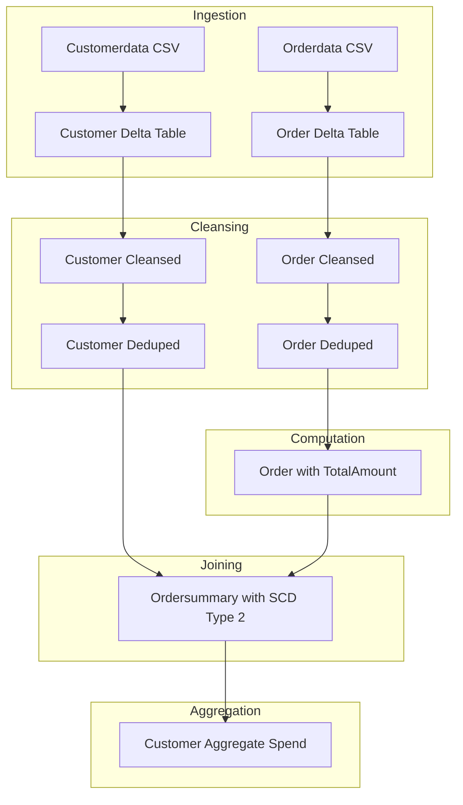

# Document Control
- Document Title: Business Requirements Document (BRD)
- System Name: Application

# Executive Summary
- This document defines the business requirements for the Application system.
- The application ingests customer and order CSV data into Delta tables, performs data cleansing, computes TotalAmount, creates ordersummary with SCD Type 2 handling, and aggregates daily spend into customeraggregatespend.
- The process is implemented via Delta Live Tables.

# Business Objectives
- Load source CSVs into Delta tables for customer and order data.
- Cleanse data by removing "Null"/Null literals and duplicates.
- Enrich orders with a computed TotalAmount = PricePerUnit × Qty.
- Produce an ordersummary table by joining customer and order on CustId.
- Apply SCD Type 2 change handling for customer data.
- Create a customeraggregatespend table aggregating spend per Name per Date.
- Execute end-to-end pipeline using Delta Live Tables.

# In-Scope
- Source ingestion from specified file system locations.
- Creation and management of Delta tables: customer, order, ordersummary, customeraggregatespend.
- Data cleansing actions as stated.
- Computation of TotalAmount in order.
- Join logic and SCD Type 2 handling for customer changes.
- Aggregate processing from ordersummary to customeraggregatespend.
- Implementation using Delta Live Tables.

# Out-of-Scope
- Any data sources, systems, or fields not present in requirements.
- Security, access controls, SLAs, monitoring, alerting.
- Performance tuning and scaling.
- Scheduling, orchestration, or DevOps beyond “Implement steps 1-10 using Delta Live Tables.”
- Data quality metrics beyond cleansing actions listed.
- User interfaces, reports, or analytics consumption layers.

# Stakeholders
- Information not present in requirements.

# Business Requirements

### BR-CORE-001 — Source Data Ingestion
- Description: Load source customer and order CSVs into Delta tables from specified file paths.
- Business Value: Enables structured ingestion of raw business data for downstream processing.
- Priority: High

### BR-CORE-002 — Schema Management
- Description: Maintain schemas as defined for customer (CustId, Name, EmailId, Region) and order (OrderId, ItemName, PricePerUnit, Qty, Date, CustId).
- Business Value: Ensures consistent data structure for processing and reporting.
- Priority: High

### BR-CORE-003 — Computed Column (TotalAmount)
- Description: Add computed column TotalAmount on order table as PricePerUnit × Qty.
- Business Value: Captures essential transaction value for analytics and aggregation.
- Priority: High

### BR-CORE-004 — Data Cleansing
- Description: Remove "Null"/Null literals and duplicates in customer and order data.
- Business Value: Improves data quality for reliable processing and reporting.
- Priority: High

### BR-CORE-005 — Ordersummary Table Creation
- Description: Create ordersummary table via join of customer and order on CustId, applying SCD Type 2 for changes.
- Business Value: Enables full historical tracking and integrated view of customer orders.
- Priority: High

### BR-CORE-006 — SCD Type 2 Handling
- Description: Handle customer changes using SCD Type 2 rules—close old records, open new, set Active/Inactive, manage StartDate/EndDate.
- Business Value: Permits accurate historical lineage and data traceability.
- Priority: High

### BR-CORE-007 — Ordersummary Schema Enforcement
- Description: Ensure ordersummary includes CustId, Name, EmailId, Region, OrderId, ItemName, PricePerUnit, Qty, Date.
- Business Value: Maintains analytic readiness and join traceability.
- Priority: High

### BR-CORE-008 — Aggregate Spend Calculation
- Description: Create customeraggregatespend table by aggregating TotalAmount per Name and Date.
- Business Value: Supports business analysis of customer spending patterns.
- Priority: High

### BR-CORE-009 — End-to-End Pipeline Implementation
- Description: Implement all functional steps using Delta Live Tables.
- Business Value: Ensures scalable, automated, production-grade deployment.
- Priority: High

# Assumptions & Constraints
- All data sources and targets are limited to those specified.
- Attributes for SCD Type 2 (StartDate, EndDate, Active) are referenced but not fully defined.
- Implementation is constrained to usage of Delta Live Tables as the orchestration solution.

# Success Metrics
- 100% of ingested records are loaded according to defined schemas.
- All duplicate and "Null" records are removed as per rules.
- Ordersummary and customeraggregatespend tables reflect accurate joins, SCD Type 2 handling, and spend aggregation.
- End-to-end pipeline completion without error.

# Risks & Mitigations
- Ambiguity in SCD Type 2 attribute fields; mitigation: seek clarification or define during technical design.
- Data quality risk; mitigation: rely on cleansing rules as defined.
- Absence of security, error handling, and monitoring detail; mitigation: to be addressed in technical phase.

# Approval
- Approval details not present in requirements.

# Appendix

Appendix A: Source Definitions

| Source Name      | Type | Location                                              | Format | Notes                                |
|----------------- |------|------------------------------------------------------|--------|--------------------------------------|
| customerdata     | CSV  | /Volumes/gen_ai_poc_databrickscoe/sdlc_wizard/customerdata | CSV    | Loaded into Delta table customer     |
| orderdata        | CSV  | /Volumes/gen_ai_poc_databrickscoe/sdlc_wizard/orderdata    | CSV    | Loaded into Delta table order        |

Appendix B: Target Definitions

| Target Name             | Layer        | Table                    | Columns                               | Notes                                  |
|------------------------ |-------------|--------------------------|---------------------------------------|----------------------------------------|
| customer                | Bronze      | customer                 | CustId, Name, EmailId, Region         | Loaded from customerdata               |
| order                   | Bronze      | order                    | OrderId, ItemName, PricePerUnit, Qty, Date, CustId, TotalAmount | Loaded from orderdata with computed column |
| ordersummary            | Silver      | ordersummary             | CustId, Name, EmailId, Region, OrderId, ItemName, PricePerUnit, Qty, Date | Populated via join, SCD Type 2         |
| customeraggregatespend  | Gold        | customeraggregatespend   | Name, TotalAmount, Date               | Aggregated spend by Name and Date      |

Appendix C: Transformations

| Step          | Transformation           | Input       | Output                | Logic                                       |
|-------------- |-------------------------|-------------|-----------------------|---------------------------------------------|
| 1             | Remove Null literals     | customer    | customer cleaned      | Remove "Null"/Null from all columns         |
| 2             | Remove duplicates        | customer    | customer deduped      | Drop duplicate rows                         |
| 3             | Remove Null literals     | order       | order cleaned         | Remove "Null"/Null from all columns         |
| 4             | Remove duplicates        | order       | order deduped         | Drop duplicate rows                         |
| 5             | Add computed column      | order       | order with TotalAmount| PricePerUnit × Qty                          |
| 6             | Join and SCD Type 2      | customer, order | ordersummary   | Join on CustId, apply SCD Type 2 rules      |
| 7             | Aggregate calculation    | ordersummary | customeraggregatespend| Group by Name, Date; sum TotalAmount       |

Appendix D: Business Rules

| Rule ID | Area       | Description                                                  | Source          |
|-------- |-----------|--------------------------------------------------------------|-----------------|
| BR-01   | Computation| TotalAmount = PricePerUnit × Qty                             | Requirement     |
| BR-02   | Cleansing  | Remove "Null"/Null literals and duplicates in all tables     | Requirement     |
| BR-03   | Join       | Join customer and order on CustId                            | Requirement     |
| BR-04   | SCD Type 2 | Close previous, open new records, set flags, maintain history| Requirement     |
| BR-05   | Aggregation| Group by Name, Date, sum TotalAmount for spend table         | Requirement     |

Appendix E: Process Flow

| Step | Description                                      | Dependency             |
|------|--------------------------------------------------|------------------------|
| 1    | Ingest customer and order CSVs as Delta tables   | Source files           |
| 2    | Cleanse customer and order data                  | Step 1                 |
| 3    | Compute TotalAmount on order                     | Step 2                 |
| 4    | Join and SCD Type 2 handling for ordersummary    | Step 3                 |
| 5    | Aggregate customeraggregatespend table           | Step 4                 |

# Process Flow Diagram

