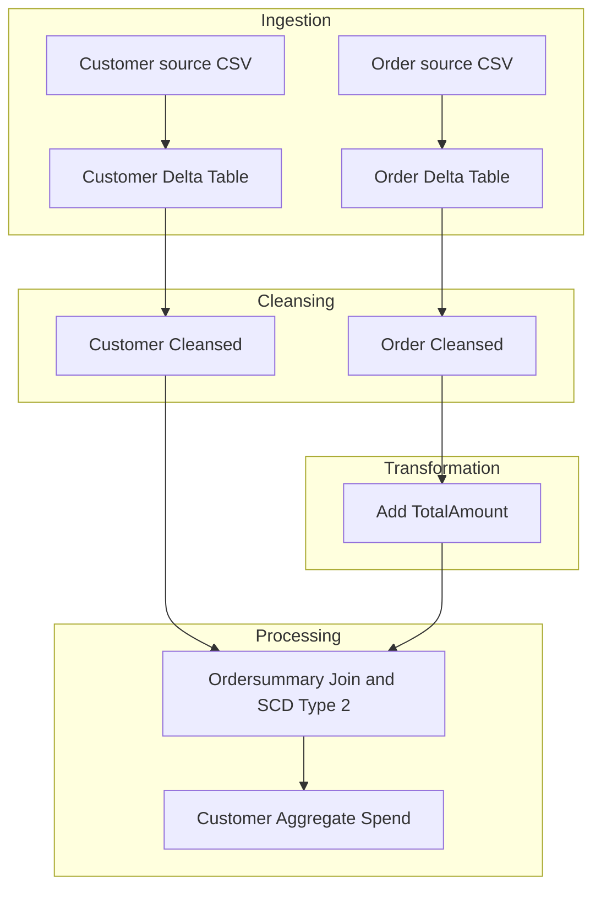

# Document Control
- System Name: Application

# Executive Summary
- This BRD outlines requirements for ingesting customer and order CSV data into Delta tables, cleansing data, computing total amounts, joining and applying SCD Type 2 for customer data, and aggregating daily customer spend.
- Implementation is specified using Delta Live Tables, leveraging defined names, schemas, and rules.

# Business Objectives
- Load source customer and order CSVs into Delta tables.
- Cleanse source data by removing “Null” values and duplicates.
- Enrich order data with a computed TotalAmount column.
- Join customer and order data on CustId to create the ordersummary table.
- Apply SCD Type 2 change tracking for customer data.
- Create an aggregate table tracking customer spend by day.
- Implement the entire pipeline using Delta Live Tables.

# In-Scope
- Source ingestion from defined paths into Delta tables.
- Creation and management of customer, order, ordersummary, and customeraggregatespend tables.
- Data cleansing actions (removal of nulls and duplicates).
- Computation of the TotalAmount column in order data.
- Join and SCD Type 2 handling for ordersummary.
- Aggregation of spend data into customeraggregatespend.
- Use of Delta Live Tables for pipeline execution.

# Out-of-Scope
- Integration of data sources, systems, or fields not present in the requirements.
- Specification of security, access controls, SLAs, monitoring, and alerting.
- Performance tuning or scaling parameters.
- Scheduling, orchestration, or DevOps details outside of the pipeline steps.
- Data quality metrics beyond cleansing steps provided.
- User interfaces, reporting, or analytics layers.

# Stakeholders
- Information not present in requirements input.

# Business Requirements

### BR-CORE-001 — Source Ingestion
- Description: Ingest customer and order CSV files from specified file system locations into respective Delta tables.
- Business Value: Provides a structured, persistent landing for raw business data.
- Priority: High

### BR-CORE-002 — Data Schemas
- Description: Define Delta tables with specified schemas for customer (CustId, Name, EmailId, Region) and order (OrderId, ItemName, PricePerUnit, Qty, Date, CustId).
- Business Value: Ensures data structure consistency and mapping to business entities.
- Priority: High

### BR-CORE-003 — Computed TotalAmount
- Description: Compute and add a TotalAmount column to order data (PricePerUnit × Qty).
- Business Value: Enables direct financial analytics and aggregations.
- Priority: High

### BR-CORE-004 — Data Cleansing
- Description: Remove “Null”/Null values and duplicate records from customer and order tables.
- Business Value: Improves data quality, ensuring trustworthy analytics and operations.
- Priority: High

### BR-CORE-005 — Ordersummary Table Creation
- Description: Join cleansed customer and order data on CustId; create an ordersummary table applying SCD Type 2 for customer changes.
- Business Value: Provides an integrated, historical view of customer-order relationships.
- Priority: High

### BR-CORE-006 — SCD Type 2 Change Handling
- Description: Implement SCD Type 2 logic for customer attributes in ordersummary, tracking full history via Active/Inactive flags and Start/End dates (fields referenced but not explicitly defined).
- Business Value: Enables accurate historical analysis and compliance.
- Priority: High

### BR-CORE-007 — Aggregation Table Creation
- Description: Aggregate ordersummary data into customeraggregatespend, summing TotalAmount for each Name and Date.
- Business Value: Delivers actionable insights into customer spending patterns.
- Priority: High

### BR-CORE-008 — Pipeline Implementation in Delta Live Tables
- Description: Orchestrate all data ingestion, transformation, SCD handling, and aggregation steps using Delta Live Tables.
- Business Value: Provides scalability, automation, and reliability for data processing workflows.
- Priority: High

# Assumptions & Constraints
- Only explicitly defined content from requirements is assumed.
- Delta Live Tables is the mandated implementation technology.
- SCD Type 2 flag/date fields are referenced for process but not defined in schema.
- Any attributes not described in requirements are not considered.

# Success Metrics
- All source and target tables created as specified, populated with expected data.
- Cleansing and computed logic executed with zero tolerance for data quality exceptions (as per rules specified).
- SCD Type 2 changes accurately reflected in ordersummary.
- Aggregated customer spend totals align with source data validation.
- End-to-end data pipeline successfully operationalized in Delta Live Tables.

# Risks & Mitigations
- Ambiguity in SCD Type 2 tracking fields (StartDate, EndDate, Active): Clarify field requirements with stakeholders.
- Data quality not covered beyond null and duplicate removal: Plan for iterative enhancement as required.
- Lack of specified error handling, retries, and monitoring: Incorporate basic logging and alerting in the implementation phase.
- Platform/environment assumptions limited to use of Delta Live Tables: Engage technical architects for deployment requirements.

# Approval
- Information not present in requirements input.

# Appendix

Appendix A: Source Definitions
Source Name | Type | Location | Format | Notes
----------- | ---- | -------- | ------ | -----
Customer source | CSV | /Volumes/gen_ai_poc_databrickscoe/sdlc_wizard/customerdata | CSV | Loaded into Delta table customer
Order source | CSV | /Volumes/gen_ai_poc_databrickscoe/sdlc_wizard/orderdata | CSV | Loaded into Delta table order

Appendix B: Target Definitions
Target Name | Layer | Table | Columns | Notes
----------- | ----- | ----- | ------- | -----
customer | Raw | customer | CustId, Name, EmailId, Region | Target from Customer source
order | Raw | order | OrderId, ItemName, PricePerUnit, Qty, Date, CustId | Target from Order source
ordersummary | Curated | ordersummary | CustId, Name, EmailId, Region, OrderId, ItemName, PricePerUnit, Qty, Date | SCD Type 2 with customer join
customeraggregatespend | Aggregate | customeraggregatespend | Name, TotalAmount, Date | Aggregated spend per day

Appendix C: Transformations
Step | Transformation | Input | Output | Logic
---- | ------------- | ----- | ------ | -----
1 | Remove nulls | customer, order | cleansed tables | Delete records with Null/"Null"
2 | Remove duplicates | customer, order | cleansed tables | Keep only distinct records
3 | Compute TotalAmount | order | order | PricePerUnit × Qty
4 | Join and SCD2 | customer, order | ordersummary | Join on CustId; apply SCD Type 2
5 | Aggregate | ordersummary | customeraggregatespend | sum(TotalAmount) by Name, Date

Appendix D: Business Rules
Rule ID | Area | Description | Source
-------- | ----- | ----------- | ------
BR-1 | Computed Column | TotalAmount = PricePerUnit × Qty | Requirements
BR-2 | Cleansing | Remove “Null” values | Requirements
BR-3 | Deduplication | Remove duplicates | Requirements
BR-4 | Join | Join customer to order on CustId | Requirements
BR-5 | SCD Type 2 | Inactivate/activate records, track StartDate/EndDate | Requirements
BR-6 | Aggregation | Group by Name, Date; sum TotalAmount | Requirements

Appendix E: Process Flow
Step | Description | Dependency
---- | ----------- | ----------
1 | Load customer and order CSVs | Source file system
2 | Cleanse data (null/duplicate removal) | Step 1
3 | Compute TotalAmount in order | Step 2
4 | Join and apply SCD Type 2, build ordersummary | Step 3
5 | Aggregate to customeraggregatespend | Step 4

Appendix F: Data Flow Diagram

