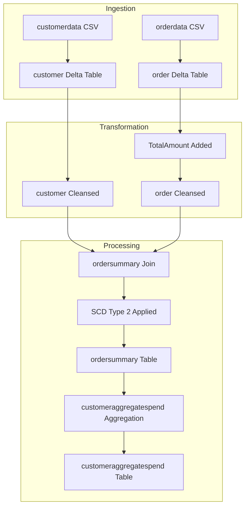

# Document Control
- Document Title: Business Requirements Document (BRD)
- System Name: Application
- Version: 1.0
- Date: Not present in source JSON
- Author: Not present in source JSON

# Executive Summary
- The BRD outlines requirements for ingesting customer and order CSV data into Delta tables, applying cleansing, computing TotalAmount, joining for ordersummary with SCD Type 2 history, and aggregating daily spend in customeraggregatespend, all implemented via Delta Live Tables.
- System Name: Application

# Business Objectives
- Load source CSVs into Delta tables for customer and order data.
- Cleanse data by removing "Null"/Null literals and duplicates.
- Enrich orders with a computed TotalAmount as PricePerUnit × Qty.
- Create an ordersummary table by joining customer and order on CustId.
- Apply SCD Type 2 processing for customer data to maintain historical records.
- Aggregate spend per Name and Date in customeraggregatespend.
- Execute all steps within Delta Live Tables.

# In-Scope
- Source ingestion from specified file system locations.
- Creation and management of Delta tables: customer, order, ordersummary, customeraggregatespend.
- Defined cleansing actions.
- Computation of TotalAmount.
- Join and SCD Type 2 logic for ordersummary.
- Aggregate processing for customeraggregatespend.
- Implementation through Delta Live Tables.

# Out-of-Scope
- Data sources, systems, or fields not in source JSON.
- Security, access controls, SLAs, monitoring, alerting.
- Performance tuning, scaling parameters.
- Scheduling, orchestration, or DevOps beyond "implement steps 1–10 using Delta Live Tables".
- Data quality metrics beyond stated cleansing.
- User interfaces, reports, or analytics layers.

# Stakeholders
- Not present in source JSON

# Business Requirements

### BR-CORE-001 — Source Ingestion
- Description: Load customer and order CSVs from defined paths into Delta tables.
- Business Value: Establishes foundational datasets for downstream processing.
- Priority: High

### BR-CORE-002 — Schema Definition
- Description: Apply explicit schemas for customer and order tables as indicated in requirements.
- Business Value: Ensures consistent structure for all processes.
- Priority: High

### BR-CORE-003 — Computed Columns
- Description: Add and calculate TotalAmount column in order table as PricePerUnit × Qty.
- Business Value: Automates order enrichment for accurate financial data.
- Priority: High

### BR-CORE-004 — Data Cleansing
- Description: Remove "Null"/Null literals and duplicate records from both customer and order tables.
- Business Value: Improves data quality for reliable processing.
- Priority: High

### BR-CORE-005 — Ordersummary Creation
- Description: Create the ordersummary table by joining customer and order tables on CustId, applying SCD Type 2 for customer attributes.
- Business Value: Provides a historical, cleansed, and joined dataset for analysis.
- Priority: High

### BR-CORE-006 — SCD Type 2 Handling
- Description: Set previous customer records to Inactive, new records to Active, and update StartDate and EndDate in ordersummary to track changes over time.
- Business Value: Maintains audit-ready version history for compliance and analytics.
- Priority: High

### BR-CORE-007 — Spend Aggregation
- Description: Aggregate spend for each customer by Name and Date in customeraggregatespend.
- Business Value: Enables insights into customer purchasing trends.
- Priority: Medium

### BR-CORE-008 — Delta Live Tables Implementation
- Description: Orchestrate the pipeline steps using Delta Live Tables.
- Business Value: Utilizes automation for reliability and maintainability.
- Priority: High

# Assumptions & Constraints
- No assumptions beyond explicit requirements.
- Implementation must utilize Delta Live Tables.
- Attributes for SCD Type 2 (StartDate, EndDate, Active) referenced but not fully specified.
- All table and column naming strictly follows source JSON.

# Success Metrics
- Accurate and complete ingestion of customer and order CSV data.
- No "Null" or duplicate records in managed tables.
- Correct computation of TotalAmount field.
- Full SCD Type 2 history for customer changes in ordersummary.
- Accurate daily spend aggregates in customeraggregatespend.
- All steps automated under Delta Live Tables.

# Risks & Mitigations
- Ambiguous SCD Type 2 attribute definitions (risk: misimplementation)
  - Mitigation: Flag for clarification with stakeholders.
- Data quality issues beyond literal cleansing (risk: undetected anomalies)
  - Mitigation: Recommend augmenting with additional quality checks.
- Monitoring and alerting not defined (risk: pipeline failures unnoticed)
  - Mitigation: Suggest implementation-specific alerting in future phases.

# Approval
- Approval details not present in source JSON.

# Appendix

Appendix A: Source Definitions

| Source Name     | Type  | Location                                                       | Format | Notes                                 |
|-----------------|-------|---------------------------------------------------------------|--------|---------------------------------------|
| customerdata    | CSV   | /Volumes/gen_ai_poc_databrickscoe/sdlc_wizard/customerdata    | CSV    | Loaded into Delta table customer      |
| orderdata       | CSV   | /Volumes/gen_ai_poc_databrickscoe/sdlc_wizard/orderdata       | CSV    | Loaded into Delta table order         |

Appendix B: Target Definitions

| Target Name             | Layer    | Table                 | Columns                                                | Notes                                |
|------------------------|----------|-----------------------|--------------------------------------------------------|--------------------------------------|
| customer               | Bronze   | customer              | CustId, Name, EmailId, Region                          | Target for customer source           |
| order                  | Bronze   | order                 | OrderId, ItemName, PricePerUnit, Qty, Date, CustId     | Target for order source              |
| ordersummary           | Silver   | ordersummary          | CustId, Name, EmailId, Region, OrderId, ItemName,      | Join of customer and order with      |
|                        |          |                       | PricePerUnit, Qty, Date                                | SCD Type 2 history                   |
| customeraggregatespend | Gold     | customeraggregatespend| Name, TotalAmount, Date                                | Aggregation on ordersummary          |

Appendix C: Transformations

| Step                        | Transformation                       | Input      | Output                 | Logic                                     |
|-----------------------------|--------------------------------------|------------|------------------------|-------------------------------------------|
| Add computed column         | TotalAmount = PricePerUnit × Qty     | order      | order                  | Expression-based                          |
| Remove literals & duplicate | Cleansing                            | customer   | customer               | Remove "Null"/Null, deduplicate           |
| Remove literals & duplicate | Cleansing                            | order      | order                  | Remove "Null"/Null, deduplicate           |
| Join                        | Join                                 | customer, order | ordersummary        | Join on CustId                            |
| SCD Type 2                  | Change history                       | ordersummary | ordersummary          | Set Inactive/Active, StartDate, EndDate   |
| Aggregation                 | Sum TotalAmount by Name, Date        | ordersummary | customeraggregatespend | group by Name, Date, sum(TotalAmount)    |

Appendix D: Business Rules

| Rule ID     | Area        | Description                                                    | Source           |
|-------------|-------------|----------------------------------------------------------------|------------------|
| BR-001      | Computation | TotalAmount = PricePerUnit × Qty                               | Requirements     |
| BR-002      | Cleansing   | Remove "Null"/Nulls, remove duplicates in customer and order   | Requirements     |
| BR-003      | Join        | Join on CustId for customer and order                          | Requirements     |
| BR-004      | SCD Type 2  | Handle customer changes with SCD Type 2 in ordersummary        | Requirements     |
| BR-005      | Aggregation | Sum TotalAmount by Name and Date in customeraggregatespend     | Requirements     |

Appendix E: Process Flow

| Step           | Description                                               | Dependency              |
|----------------|----------------------------------------------------------|-------------------------|
| 1              | Ingest customer CSV as customer table                    | Source CSV available    |
| 2              | Ingest order CSV as order table                          | Source CSV available    |
| 3              | Add computed column TotalAmount to order                 | Order ingestion         |
| 4              | Cleanse customer and order tables                        | Prior load              |
| 5              | Create ordersummary with join and SCD Type 2 processing  | Cleansed tables         |
| 6              | Aggregate spend to customeraggregatespend                | ordersummary built      |

Appendix F: Data Pipeline Diagram

