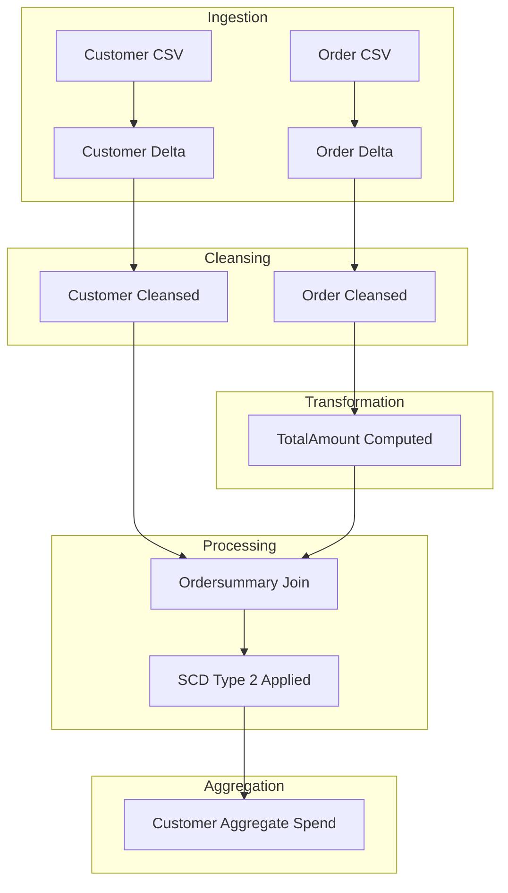

# Document Control
- Document Title: Business Requirements Document (BRD)
- System Name: Application
- Version: 1.0
- Date: Not present in source JSON
- Author: Not present in source JSON
- Status: Draft

# Executive Summary
- This BRD outlines the ingestion, cleansing, transformation, and aggregation of customer and order CSV data into Delta tables using Delta Live Tables in the Application system.
- Focus is on SCD Type 2 handling for customer changes and creation of an aggregate spend table with specified lineage and rules.

# Business Objectives
- Load source CSVs into Delta tables for customer and order data.
- Cleanse data by removing "Null"/Null literals and duplicates.
- Enrich orders with computed TotalAmount.
- Join customer and order to produce an ordersummary table with SCD Type 2 change handling.
- Produce daily customer spend aggregates in customeraggregatespend.
- Implement the pipeline using Delta Live Tables.

# In-Scope
- Source ingestion from file system.
- Creation and management of Delta tables: customer, order, ordersummary, customeraggregatespend.
- Data cleansing as specified.
- Computation of TotalAmount field.
- Join logic and SCD Type 2 handling for customer changes in ordersummary.
- Aggregate processing for customeraggregatespend.
- Delta Live Tables implementation.

# Out-of-Scope
- Systems or fields not in source JSON.
- Security, access controls, SLAs, monitoring, alerting.
- Performance and scaling parameters.
- Scheduling and orchestration.
- Data quality metrics beyond cleansing actions.
- User interface, reports, analytics consumption.

# Stakeholders
- Not present in source JSON.

# Business Requirements

### BR-BI-001 — Source Ingestion
- Description: Load customer CSV and order CSV into respective Delta tables.
- Business Value: Enables reliable raw data intake for downstream processing.
- Priority: High

### BR-BI-002 — Schema Definition
- Description: Customer table with CustId, Name, EmailId, Region; Order table with OrderId, ItemName, PricePerUnit, Qty, Date, CustId.
- Business Value: Ensures consistent entity modelling and downstream join compatibility.
- Priority: High

### BR-DQ-003 — Data Cleansing
- Description: Remove "Null"/Null literals and duplicate records from customer and order tables.
- Business Value: Improves data quality and accuracy of analytics.
- Priority: High

### BR-EN-004 — Computed Column TotalAmount
- Description: Add TotalAmount column to order calculated as PricePerUnit × Qty.
- Business Value: Supports spend analytics and aggregation.
- Priority: High

### BR-TR-005 — Ordersummary Table Creation
- Description: Create ordersummary Delta table as joined output of customer and order.
- Business Value: Centralizes customer order facts for analytics and historic tracking.
- Priority: High

### BR-TR-006 — SCD Type 2 Handling in Ordersummary
- Description: Implement SCD Type 2 logic for customer changes; maintain Active/Inactive, StartDate, EndDate fields.
- Business Value: Enables full history and auditability for customer dimension.
- Priority: High

### BR-TR-007 — Aggregate Table Creation
- Description: Create customeraggregatespend by aggregating sum(TotalAmount) grouped by Name and Date.
- Business Value: Provides actionable KPIs for daily spend reporting.
- Priority: High

### BR-IM-008 — End-to-End Delta Live Tables Pipeline
- Description: Implement all pipeline steps using Delta Live Tables with defined dependencies.
- Business Value: Streamlines operationalization and repeatability.
- Priority: High

# Assumptions & Constraints
- No assumptions made beyond explicit requirements.
- Delta Live Tables is the prescribed platform.
- StartDate, EndDate, Active assumed for SCD Type 2 but explicit types/definitions are not specified.
- Any missing technical fields or parameters are not present in source JSON.

# Success Metrics
- 100% of customer and order source data correctly loaded into Delta tables.
- Deduplication and null literal removal demonstrated in target data.
- All computed and aggregate fields accurately populated.
- SCD Type 2 changes reflected in historical customer attributes.
- Daily spend totals match business logic for all processed data.
- Pipeline executes end-to-end in Delta Live Tables without manual intervention.

# Risks & Mitigations
- Potential ambiguity in SCD Type 2 tracking field types or names: Flag for confirmation with data architect.
- Data quality limited to cleansing rules provided: Recommend future enhancement of profiling routines.
- Error handling and monitoring requirements unspecified: Review implementation post-pilot, add as needed.
- Performance scaling not addressed: Assess manually during initial load; revisit for large volumes.

# Approval
- Business Owner: Not present in source JSON
- Data Architect: Not present in source JSON
- Date Approved: Not present in source JSON

# Appendix

Appendix A: Source Definitions
Source Name | Type | Location | Format | Notes
----------- | ---- | -------- | ------ | -----
customerdata | CSV | /Volumes/gen_ai_poc_databrickscoe/sdlc_wizard/customerdata | CSV | Load as Delta table 'customer'
orderdata | CSV | /Volumes/gen_ai_poc_databrickscoe/sdlc_wizard/orderdata | CSV | Load as Delta table 'order'

Appendix B: Target Definitions
Target Name | Layer | Table | Columns | Notes
----------- | ----- | ----- | ------- | -----
customer | Bronze | Delta | CustId, Name, EmailId, Region | Ingest from customer CSV
order | Bronze | Delta | OrderId, ItemName, PricePerUnit, Qty, Date, CustId | Ingest from order CSV
ordersummary | Silver | Delta | CustId, Name, EmailId, Region, OrderId, ItemName, PricePerUnit, Qty, Date | Join of customer and order, SCD Type 2
customeraggregatespend | Gold | Delta | Name, TotalAmount, Date | Aggregation by Name, Date

Appendix C: Transformations
Step | Transformation | Input | Output | Logic
---- | ------------- | ----- | ------ | -----
1 | Remove "Null"/Null literals | customer, order | customer, order | Filter out any 'Null' strings/nulls
2 | Deduplicate | customer, order | customer, order | Remove duplicate records
3 | Compute TotalAmount | order | order | PricePerUnit × Qty
4 | Join | customer, order | ordersummary | Join on CustId
5 | SCD Type 2 | ordersummary | ordersummary | Set Active/Inactive; update StartDate/EndDate
6 | Aggregate | ordersummary | customeraggregatespend | Group by Name, Date; sum on TotalAmount

Appendix D: Business Rules
Rule ID | Area | Description | Source
-------- | ----- | ----------- | ------
BR-1 | Computation | TotalAmount = PricePerUnit × Qty | Provided requirement
BR-2 | Cleansing | Remove "Null"/Null, deduplicate | Provided requirement
BR-3 | SCD Type 2 | Maintain full customer attribute history | Provided requirement
BR-4 | Aggregation | Daily spend per Name | Provided requirement

Appendix E: Process Flow
Step | Description | Dependency
---- | ----------- | ----------
1 | Ingest customer and order CSVs | Source paths
2 | Cleanse nulls and duplicates | Step 1
3 | Compute TotalAmount in order | Step 2
4 | Join to create ordersummary table | Step 3
5 | Apply SCD Type 2 to customer in ordersummary | Step 4
6 | Aggregate to customeraggregatespend | Step 5

Appendix F: Data Flow Diagram

