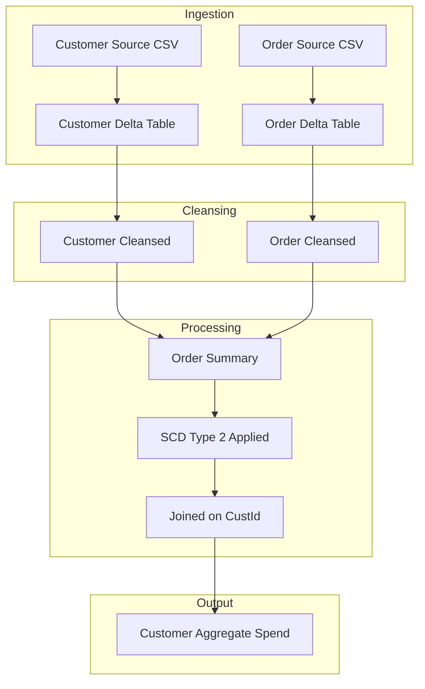

# Document Control
- System Name: Application
- Version: 1.0
- Date: Not present in source JSON
- Owner: Not present in source JSON

# Executive Summary
- This BRD outlines the ingestion of customer and order CSV files into Delta tables, implements data cleansing, computes order-level spend, joins datasets to create an order summary with SCD Type 2 change tracking for customer data, and generates a table with daily customer spend aggregates.
- Implementation is performed using Delta Live Tables, maintaining the exact names, paths, schemas, and business logic specified.

# Business Objectives
- Ingest customer and order CSV data into designated Delta tables.
- Cleanse the ingested data by removing "Null" values and duplicates.
- Enrich order records with a computed TotalAmount (PricePerUnit multiplied by Qty).
- Join customer and order datasets on CustId to produce ordersummary.
- Implement SCD Type 2 logic for tracking customer attribute changes.
- Aggregate daily customer spend for analytics.
- Orchestrate all steps leveraging Delta Live Tables.

# In-Scope
- Loading designated customer and order source files into Delta tables.
- Schema definitions and table creation for customer, order, ordersummary, and customeraggregatespend.
- Null value and duplicate removal.
- Addition of the computed TotalAmount column.
- Customer/order join processes with SCD Type 2 handling.
- Aggregation of spend results.
- Use of Delta Live Tables for all pipeline steps.

# Out-of-Scope
- Data sources or systems not specified in the requirements.
- Access controls, SLAs, monitoring, and alerting.
- Performance tuning or scaling.
- User interfaces, dashboards, and reports.
- Scheduling, orchestration, or DevOps concerns beyond DLT implementation notes.
- Data quality metrics apart from listed cleansing steps.

# Stakeholders
- Information not present in source JSON.

# Business Requirements

### BR-ING-001 — Customer and Order Ingestion
- Description: Load customer and order CSV files from specified paths into target Delta tables.
- Business Value: Centralizes raw operational data for reliable processing and analysis.
- Priority: High

### BR-DCL-002 — Data Cleansing
- Description: Remove all "Null" (case-insensitive) and duplicate records from customer and order datasets.
- Business Value: Improves data quality and analytic accuracy downstream.
- Priority: High

### BR-ENR-003 — Computed TotalAmount
- Description: Add a TotalAmount column to order table as PricePerUnit multiplied by Qty.
- Business Value: Enables granular spend analytics and aggregation.
- Priority: Medium

### BR-JOI-004 — Customer–Order Join
- Description: Join cleansed customer and order Delta tables on CustId to form the ordersummary table.
- Business Value: Correlates order activity with customer attributes for reporting and change tracking.
- Priority: High

### BR-SCD-005 — SCD Type 2 Handling
- Description: Track and maintain full history of customer attribute changes in ordersummary via SCD Type 2 (set previous records to Inactive, new records to Active, update StartDate/EndDate).
- Business Value: Preserves customer history and ensures data temporal accuracy.
- Priority: High

### BR-AGR-006 — Customer Spend Aggregation
- Description: Aggregate ordersummary to create customeraggregatespend table, grouping by Name and Date, with sum of TotalAmount.
- Business Value: Provides enterprise spend analytics capability.
- Priority: Medium

### BR-IMP-007 — Delta Live Tables Implementation
- Description: Implement requirements using Delta Live Tables, preserving steps, names, and schemas as provided.
- Business Value: Ensures manageability, scalability, and repeatability of the data pipeline using DLT capabilities.
- Priority: High

# Assumptions & Constraints
- Only explicit requirements from the specification are used.
- Delta Live Tables is required as the implementation approach.
- Field names, case, and paths are preserved as provided.
- Additional SCD Type 2 attributes such as StartDate, EndDate, and Active flag are referenced but not fully defined.
- No external dependencies or attributes are considered.

# Success Metrics
- 100% of records from specified sources are loaded without "Null" or duplicate contamination.
- Computed TotalAmount is present in order and customeraggregatespend tables.
- ordersummary contains complete customer and order attributes with SCD Type 2 history.
- Spend aggregation matches raw data roll-up post cleansing and SCD application.
- Delta Live Tables execution completes without pipeline errors.

# Risks & Mitigations
- Ambiguity in SCD Type 2 attribute field types or values can affect correct history tracking; recommend confirming field definitions.
- Data quality controls are limited to Null and duplicates; edge cases (type mismatches, outliers) are not addressed.
- Error handling, monitoring, and alerts are not defined; risk of silent failures or data quality slip.
- Mitigation: Clarify SCD field requirements, validate pipelines with representative data, and extend scope to include QA if needed.

# Approval
- Approver Name: Not present in source JSON
- Date: Not present in source JSON
- Signature: Not present in source JSON

# Appendix

Appendix A: Source Definitions  
Source Name | Type | Location | Format | Notes
----------- | ---- | -------- | ------ | -----
Customer source | CSV | /Volumes/gen_ai_poc_databrickscoe/sdlc_wizard/customerdata | CSV | Loaded into Delta table customer
Order source | CSV | /Volumes/gen_ai_poc_databrickscoe/sdlc_wizard/orderdata | CSV | Loaded into Delta table order

Appendix B: Target Definitions  
Target Name | Layer | Table | Columns | Notes
----------- | ----- | ----- | ------- | -----
customer | Bronze/Silver equivalent | customer | CustId, Name, EmailId, Region | From source
order | Bronze/Silver equivalent | order | OrderId, ItemName, PricePerUnit, Qty, Date, CustId | From source
ordersummary | Silver/Gold equivalent | ordersummary | CustId, Name, EmailId, Region, OrderId, ItemName, PricePerUnit, Qty, Date | Joined, SCD Type 2
customeraggregatespend | Gold | customeraggregatespend | Name, TotalAmount, Date | Aggregated

Appendix C: Transformations  
Step | Transformation | Input | Output | Logic
---- | ------------- | ----- | ------ | -----
1 | Data Cleansing | customer/order | customer/order | Remove "Null", remove duplicates
2 | Computed Column | order | order | TotalAmount = PricePerUnit × Qty
3 | Join | customer, order | ordersummary | Join on CustId, SCD Type 2 logic
4 | Aggregation | ordersummary | customeraggregatespend | Sum(TotalAmount) by Name and Date

Appendix D: Business Rules  
Rule ID | Area | Description | Source
-------- | ----- | ----------- | ------
BR-1 | Computed Column | TotalAmount = PricePerUnit × Qty | Requirements
BR-2 | Cleansing | Remove "Null"/Null, remove duplicates | Requirements
BR-3 | Join | Join on CustId | Requirements
BR-4 | SCD Type 2 | Maintain historical records, Inactive/Active flags, StartDate/EndDate updates | Requirements
BR-5 | Aggregation | Group by Name, Date, sum TotalAmount | Requirements

Appendix E: Process Flow  
Step | Description | Dependency
---- | ----------- | ----------
1 | Ingest customer/order files to Delta tables | Source files present
2 | Cleanse data (Null/duplicate removal) | Step 1
3 | Compute TotalAmount in order | Step 2
4 | Create ordersummary via join and SCD Type 2 | Steps 2-3
5 | Aggregate spend to customeraggregatespend | Step 4

# Process Flow Diagram

