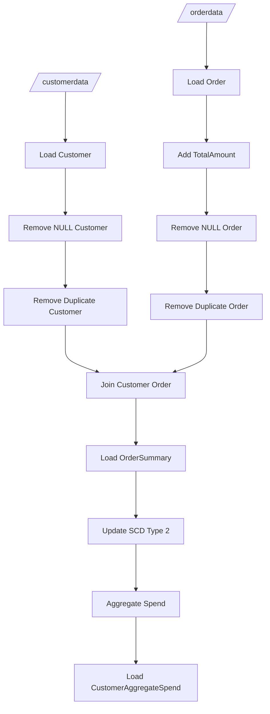

Business Requirements Document (BRD)
Project: Customer & Order Data Ingestion, SCD Type 2 Order Summary, and Customer Aggregate Spend
Prepared by: Senior Business Analyst
Date: 2026-03-29
Version: 1.0

1. Executive summary
- Purpose: Define business and technical requirements to ingest customer and order data from CSV, transform and cleanse, produce an SCD Type 2 "ordersummary" table, produce customer daily aggregate spend ("customeraggregatespend"), and implement the pipeline using Delta Lake / Delta Live Tables.
- Business value: Provide a reliable, historically-aware orders dataset per customer and daily aggregated spend to support reporting, analytics, customer 360, billing validation, and trend analysis. Ensure data quality (no nulls/duplicates), lineage, and SCD Type 2 change history for customer attributes.

2. Scope
In scope:
- Read source CSV files for customer and order datasets from specified volume paths.
- Create Delta tables for both source datasets: customer and order.
- Apply schema definitions, calculate TotalAmount for orders, remove nulls/Null strings and duplicates.
- Create an SCD Type 2 ordersummary table (catalog: gen_ai_poc_databrickscoe, schema: sdlc_wizard, table: ordersummary), populated by joining customer and order data on CustId.
- Implement change-capture logic so updates to customer attributes cause SCD Type 2 behavior (historical rows expire, new rows inserted).
- Create and populate customeraggregatespend (catalog: gen_ai_poc_databrickscoe, schema: sdlc_wizard, table: customeraggregatespend) containing daily aggregated TotalAmount per customer Name and Date.
- Implement entire pipeline using Delta Live Tables (DLT) on Databricks to enable managed pipelines, declarative transforms, and built-in quality/monitoring.
Out of scope:
- Downstream reporting/dashboard implementation (BI layer).
- Master data management (beyond SCD Type 2 in ordersummary).
- Real-time streaming beyond Delta Live Tables capabilities unless requested.
- External system integrations for notifications and data consumers (unless required later).

3. Stakeholders
- Business owner(s): Sales/Orders analytics team, Finance.
- Data engineering: Pipeline build and operations.
- Data platform/Cloud operations: Manage Databricks workspace, Delta storage, catalog access, permissions.
- Data governance: Approve schemas, data retention, and SCD rules.
- Security and compliance: Verify data privacy, PII handling (EmailId), and access controls.
- Reporting/Analytics consumers: BI developers, analysts.

4. Assumptions
- Source CSV data is placed in the specified volume paths and is accessible by Databricks cluster executing the pipeline.
  - customer: /Volumes/gen_ai_poc_databrickscoe/sdlc_wizard/customerdata
  - order: /Volumes/gen_ai_poc_databrickscoe/sdlc_wizard/orderdata
- Standard CSV formatting (header row present or schema mapping available). If header absent, explicit schema mapping will be used.
- CustId field is the stable business key linking customer and order records.
- Databricks workspace has catalog gen_ai_poc_databrickscoe and schema sdlc_wizard available or can be created.
- Delta Live Tables is available and authorized in the environment.
- Date field on order is in parseable date format (ISO recommended). Timezones will be normalized to UTC unless business requires otherwise.
- PII handling (EmailId) will follow organizational privacy policies; encryption or masking will be applied at rest or in views if required.
- Retention policies and storage lifecycle for SCD history will be defined separately.

5. High-level requirements (functional)
FR-1: Source ingestion
- FR-1.1: Read customer CSV files from the given volume path and load into a Delta table named customer in catalog gen_ai_poc_databrickscoe.sdlc_wizard.
- FR-1.2: Read order CSV files from the given volume path and load into a Delta table named order in the same catalog/schema.

FR-2: Source schemas
- FR-2.1: customer must conform to schema: CustId, Name, EmailId, Region.
- FR-2.2: order must conform to schema: OrderId, ItemName, PricePerUnit, Qty, Date, CustId.

FR-3: Data transformation & cleansing
- FR-3.1: Add column TotalAmount to order using calculation: TotalAmount = PricePerUnit * Qty.
- FR-3.2: Remove records containing NULLs or the literal string "Null" in any required field from both customer and order datasets (business-defined required fields: at minimum CustId in both, OrderId for order, Name for customer). Define acceptable behavior for partially null rows (drop vs quarantine).
- FR-3.3: Remove duplicate records from both tables. Duplicates defined as identical values across the table’s primary set of fields (customer: CustId or full record; order: OrderId or full record). Business must confirm deduplication key; default: customer dedupe on CustId, order dedupe on OrderId.

FR-4: Ordersummary SCD Type 2 target
- FR-4.1: Create ordersummary table (if not exists) in gen_ai_poc_databrickscoe.sdlc_wizard with schema (base fields): CustId, Name, EmailId, Region, OrderId, ItemName, PricePerUnit, Qty, Date, TotalAmount, plus SCD metadata columns: EffectiveStartDate (StartDate), EffectiveEndDate (EndDate), IsActive (boolean), RowHash or ChangeHash (optional), RecordInsertedAt, RecordUpdatedAt, SourceSystem, VersionNumber (optional).
- FR-4.2: Populate ordersummary by joining cleaned customer and order datasets on CustId.
- FR-4.3: Implement SCD Type 2 behavior:
  - On new joins where there is no existing record for the business key (OrderId or composite?), insert new active record with EffectiveStartDate = load time and EffectiveEndDate = null, IsActive = true.
  - On detected changes to customer attributes (Name, EmailId, Region) for an existing business natural key, mark prior record(s) IsActive = false, set EffectiveEndDate = current load time, and insert a new active record with updated customer attributes and EffectiveStartDate = current load time. EndDate semantics must capture non-overlapping periods.
  - Define SCD business key: The requirement states join on CustId. Clarify whether SCD key is CustId + OrderId (preferred to track changes at order line level) or CustId alone. Default recommendation: use composite business key [OrderId] as transaction key and use CustId for linking; SCD Type 2 will version customer attributes per order-level row. Confirm with business.
- FR-4.4: Maintain full history in ordersummary; do not delete historical rows; only expire them via EffectiveEndDate.

FR-5: Customer aggregate spend
- FR-5.1: Create customeraggregatespend table (if not exists) in catalog gen_ai_poc_databrickscoe.sdlc_wizard with schema: Name, TotalAmount, Date and supporting metadata columns (e.g., AggregationDate, RecordInsertedAt).
- FR-5.2: Aggregate TotalAmount from ordersummary grouped by Name and Date (Date is order.Date). Load results into customeraggregatespend. The aggregation should sum TotalAmount per Name per Date.
- FR-5.3: Decide whether aggregation is a full refresh or incremental upsert. Default recommendation: upsert by key (Name, Date), updating TotalAmount when underlying ordersummary changes.

FR-6: Implementation & orchestration
- FR-6.1: Implement steps 1–5 and 10 using Delta Live Tables for managed pipelines, ensuring declarative transforms, built-in data quality checks, and scheduling/monitoring.
- FR-6.2: The DLT pipeline must create/manage Delta tables specified and support idempotent runs.
- FR-6.3: Provide quality checks and exceptions handling (e.g., quarantine or dead-letter for malformed rows).

6. Non-functional requirements (NFR)
- NFR-1: Data quality & governance
  - SLO: Zero-tolerance for duplicates and records with nulls in business-key fields.
  - Maintain audit/logging metadata for each pipeline run, including row counts ingested, dropped, quarantined, and processed.
- NFR-2: Performance & scalability
  - Pipeline must handle expected daily ingestion volume (TBD by business). Design to scale horizontally via Databricks compute.
- NFR-3: Availability & reliability
  - Pipeline should have retry logic; target SLA for pipeline completion: (to be defined).
- NFR-4: Security & compliance
  - Ensure catalog/table ACLs restrict access to PII (EmailId). Support encryption at rest and in transit per organizational policy.
- NFR-5: Maintainability & support
  - Provide well-documented DLT pipeline code, unit/integration tests, and runbook for operations.

7. Detailed data model
7.1 Source tables (Delta)
- customer (Delta)
  - CustId: string / integer (business key) — required
  - Name: string
  - EmailId: string (PII)
  - Region: string
  - Metadata: RecordInsertedAt, SourceFile, SourceFileTimestamp (optional)

- order (Delta)
  - OrderId: string / integer (business/transaction key) — required
  - ItemName: string
  - PricePerUnit: decimal(precision) — required
  - Qty: integer — required
  - Date: date/datetime — required
  - CustId: string / integer — required
  - TotalAmount: decimal(PricePerUnit * Qty) — computed
  - Metadata: RecordInsertedAt, SourceFile

7.2 Target: ordersummary (SCD Type 2)
- Recommended columns:
  - SurrogateKey: bigint (auto-generated)
  - CustId: string / integer (business link)
  - OrderId: string / integer
  - ItemName: string
  - PricePerUnit: decimal
  - Qty: integer
  - Date: date/datetime
  - TotalAmount: decimal
  - Name: string
  - EmailId: string
  - Region: string
  - EffectiveStartDate (StartDate): timestamp
  - EffectiveEndDate (EndDate): timestamp (nullable)
  - IsActive: boolean
  - RowHash: string (optional — hash over business attribute columns to detect changes)
  - RecordInsertedAt: timestamp
  - RecordUpdatedAt: timestamp
  - SourceSystem: string (e.g., "source_csv")
  - VersionNumber: integer (optional)
- Primary/indexing considerations:
  - Physical primary key: SurrogateKey.
  - Uniqueness for upsert and SCD change detection: define natural key(s): OrderId (transaction) and CustId for customer context. Use RowHash to detect attribute changes for SCD.

7.3 Target: customeraggregatespend
- Columns:
  - Name: string
  - Date: date
  - TotalAmount: decimal (sum of TotalAmount from ordersummary)
  - AggregationRunAt: timestamp
  - SourceSnapshotId: string (optional)
- Primary key: (Name, Date)

8. Business rules and data quality
- BR-1: Required fields: CustId required in both datasets; OrderId required in order; PricePerUnit and Qty required to compute TotalAmount. Any record missing these will be quarantined and logged.
- BR-2: Null vs literal "Null": Treat literal string "Null" (case-insensitive) in any required field as null and handle per BR-1.
- BR-3: Deduplication: For customer, dedupe on CustId; for order, dedupe on OrderId. If business requires different dedupe keys, update design accordingly.
- BR-4: SCD change detection:
  - Changes in customer attributes (Name, EmailId, Region) trigger SCD Type 2 behavior for rows tied to that CustId in ordersummary.
  - Change detection approach: calculate hash of relevant customer attributes per CustId and compare to current active record’s hash; if different, expire prior active rows and insert new rows with updated attributes.
  - If the same customer attribute change should be reflected across all order rows for historical periods or only new orders, clarify with business. Default: attribute changes cause new SCD-active rows for new events; existing order-level rows will be versioned (i.e., each order record's customer attribute values are versioned at time of change).
- BR-5: Effective dates:
  - EffectiveStartDate = timestamp of when record became effective (load time).
  - EffectiveEndDate = null for active row; set to timestamp of change when expired.
  - Time granularity: timestamp (UTC). Business to confirm timezone and rounding rules.
- BR-6: Aggregation semantics:
  - Aggregation of TotalAmount grouped by Name and Date must use the ordersummary logical view of orders (active rows as of a selected snapshot or include historical versions?). Default: sum using ordersummary records for the order Date (i.e., each order row contributes its TotalAmount to the Date it occurred) regardless of SCD versions. If aggregation should reflect the Name effective at order time, ensure ordersummary maintains Name as it was for the order’s EffectiveStartDate that covers order.Date.
- BR-7: Upserts for customeraggregatespend:
  - Upsert by (Name, Date): replace TotalAmount with computed sum; maintain AggregationRunAt as last aggregation time.

9. Data flow and pipeline design (logical steps)
- Step 1: Ingest CSVs into staging Delta tables
  - Use Delta Live Tables to define two source tables reading CSVs at given paths.
  - Apply schema enforcement and type casting; log and quarantine malformed rows.

- Step 2: Clean & transform
  - Compute TotalAmount in order: PricePerUnit * Qty.
  - Normalize Date field to date/timestamp type.
  - Trim whitespace and normalize casing for textual fields if required.
  - Filter out records with required-field nulls or literal "Null" (case-insensitive); persist them to quarantine table with reason.
  - Deduplicate per dedupe keys.

- Step 3: Create or ensure existence of ordersummary table with SCD metadata columns.

- Step 4: Join cleaned customer and order tables on CustId to produce records for target.
  - Produce change detection hash for customer attributes (Name, EmailId, Region).
  - Apply SCD Type 2 logic:
    - For each incoming record, identify matching active record(s) in ordersummary by natural/business key (recommended: OrderId; confirm).
    - If no match, insert new active row.
    - If match and RowHash differs, expire existing active row(s) (set EffectiveEndDate and IsActive=false) and insert new active row with updated attributes.
    - If match and RowHash same, no change (optionally update housekeeping fields).

- Step 5: Persist changes transactionally to ordersummary (Delta supports ACID via MERGE).
  - Use MERGE INTO with conditions for insert/update/expire, leveraging RowHash and business keys.

- Step 6: Aggregate ordersummary to create customeraggregatespend
  - Group by Name and Date and compute sum(TotalAmount).
  - Upsert results into customeraggregatespend by (Name, Date).

- Step 7: Monitoring & alerting
  - Implement DLT expectations/quality checks (e.g., row counts, null thresholds).
  - Capture lineage and metrics: records ingested, processed, inserted, updated, quarantined.
  - Send alerts for pipeline failures or data anomalies per agreed thresholds.

10. Implementation details & technology
- Platform: Databricks using Delta Lake and Delta Live Tables (DLT).
- Storage: Delta tables stored in workspace-managed or external storage (e.g., ADLS, S3) with proper access controls.
- DLT constructs:
  - Declarative tables/streams: define datasets as DLT tables/views.
  - Expectations: implement data quality rules to fail or quarantine bad records.
  - Workflows: schedule DLT pipeline runs (frequency: daily / as required).
- Upsert & SCD pattern:
  - Use MERGE INTO with Delta to implement SCD Type 2 semantics.
  - Use RowHash to detect changes to customer attributes for efficient comparisons.
  - Use surrogate keys and timestamps for history management.
- Idempotency:
  - Make ingestion idempotent: use file-level metadata or unique record keys to prevent reprocessing duplicates across runs.
- Logging & observability:
  - Enable DLT metrics, run logs, and custom audit tables for lineage.

11. Security, privacy, and compliance
- Protect PII (EmailId):
  - Restrict access via catalog and table ACLs.
  - Use masked views or column-level access where required.
  - Consider tokenization or encryption for EmailId if mandated.
- Audit logging of access and changes should be enabled.
- Data retention policy for SCD history must be defined (retain indefinitely or purge after X years) and implemented using vacuum and retention settings consistent with Delta and compliance.

12. Error handling and exceptions
- Define quarantine table(s) for records failing validation with fields: source_record, error_reason, source_path, ingestion_time.
- Pipeline should continue processing valid data when quarantined records exist.
- Implement retries for transient failures; escalate persistent failures to platform ops.

13. Acceptance criteria
- Source CSVs are read and loaded into Delta tables customer and order with defined schema.
- order table contains TotalAmount that equals PricePerUnit * Qty for all non-quarantined rows.
- No records with nulls in required fields or literal "Null" remain in production tables; such rows are quarantined with reasons.
- Duplicate records removed per agreed dedupe keys.
- ordersummary exists with SCD Type 2 columns and stores full history of customer attribute changes with correct EffectiveStartDate, EffectiveEndDate, and IsActive flags.
- SCD logic triggers when customer attribute values change, expiring prior rows and inserting new active rows; history preserved.
- customeraggregatespend is populated with sum(TotalAmount) grouped by Name and Date, upserted correctly.
- The entire pipeline is implemented and operational in Delta Live Tables, with monitoring and quality checks enabled.
- Relevant documentation and runbooks provided.

14. Open questions / decisions required
- Q1: Confirm deduplication keys:
  - For customer: dedupe by CustId or full-record?
  - For order: dedupe by OrderId or full-record?
- Q2: SCD business key to version: Should SCD Type 2 be applied per OrderId (i.e., version each order record when customer attributes change) or per CustId (i.e., maintain customer dimension separately)? Recommended: version order-level rows using OrderId and also consider maintaining a customer dimension SCD Type 2 table for customer-centric history.
- Q3: Aggregation semantics:
  - Should customeraggregatespend reflect Name as current (latest) or Name as it was on the order.Date (historical)? Clarify expected behavior.
- Q4: Timezone handling and Date granularity (date vs timestamp).
- Q5: Retention policy for ordersummary history (number of years) and vacuum retention to enable deletion.
- Q6: Handling of partial nulls (e.g., missing EmailId) — quarantine vs allow with null.
- Q7: Frequency of pipeline runs (batch frequency) and expected data volumes.
- Q8: Required performance SLAs and cost constraints.

15. Implementation timeline (high level)
- Week 1: Requirements validation, finalize dedupe keys, SCD key, and aggregation semantics; confirm retention, privacy requirements.
- Week 2: Environment setup (catalogs, storage paths, permissions), initial DLT pipeline skeleton, ingestion and staging tables.
- Week 3: Implement cleansing transforms, TotalAmount calculation, dedupe, and quarantine handling; unit tests.
- Week 4: Implement ordersummary SCD Type 2 MERGE logic and upsert patterns; integration tests.
- Week 5: Implement customeraggregatespend aggregation and upsert; end-to-end tests and validation; create runbook.
- Week 6: Performance tuning, monitoring, and handover to operations.

16. Deliverables
- Delta Live Tables pipeline code and notebooks/scripts.
- Deployed Delta tables: customer, order, ordersummary, customeraggregatespend, quarantine tables.
- Data quality checks and DLT expectations.
- Documentation: BRD, data dictionary, runbook (operations), and test/validation results.
- Handover materials for DataOps team.

17. Appendix: Mapping from provided raw steps to BRD actions
- Raw Step 1 -> FR-1 ingestion into Delta customer & order.
- Raw Step 2 -> FR-2 source schemas.
- Raw Step 3 -> FR-3.1 add TotalAmount.
- Raw Step 4 -> FR-3.2/3.3 null and duplicate removal (quarantine rules documented).
- Raw Step 5 -> FR-4.1 create ordersummary (catalog/schema/table provided).
- Raw Step 6 -> FR-4.2/FR-4.3 join and SCD Type 2 logic (join on CustId).
- Raw Step 7 -> FR-4.1/7 target schema fields enumerated, plus required SCD metadata.
- Raw Step 8 -> FR-4.3 detailed SCD update logic; maintain full history.
- Raw Step 9 -> FR-5.1 create customeraggregatespend with columns Name, TotalAmount, Date.
- Raw Step 10 -> FR-5.2 aggregate TotalAmount grouped by Name and Date; load into customeraggregatespend.
- Raw Step 11 -> FR-6 implement using Delta Live Tables.

18. Signoff
Business Owner: ____________________ Date: _______
Data Engineering Lead: ____________________ Date: _______
Data Governance: ____________________ Date: _______

End of Document.

## Data Flow Diagram (DFD)

