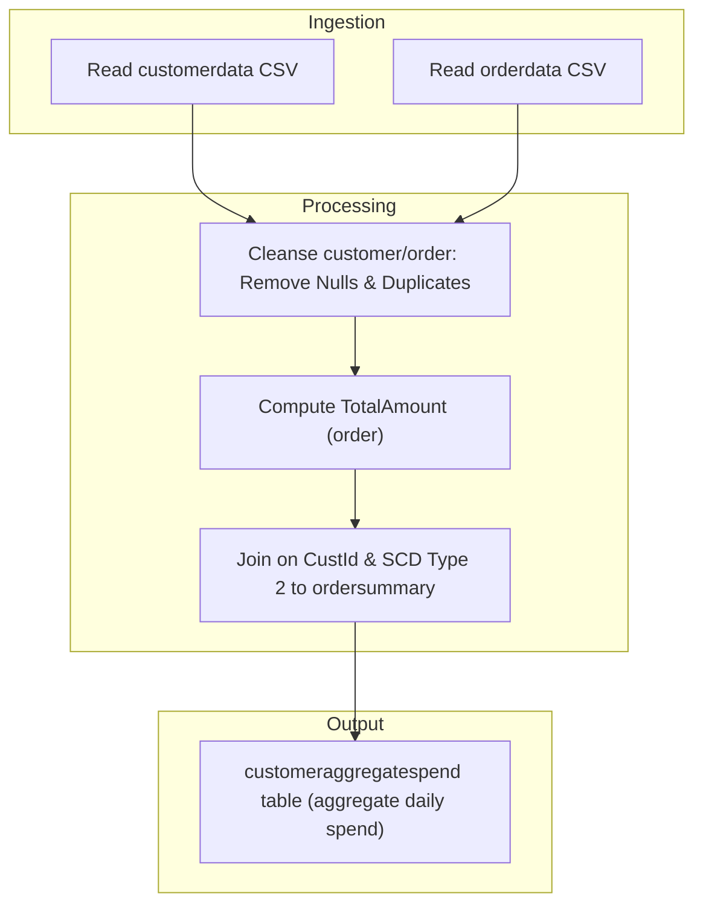

# TR-APP-001
- Related Functional Requirement: FR-1 Source Ingestion
- Objective: Implement automated data ingestion from structured CSV sources into Delta tables using Delta Live Tables.

- Target Cluster Configuration:
  - Cluster Name: dlt-customer-order-ingest
  - Runtime Version: Databricks Runtime 11.3 LTS or higher
  - Node Type: Standard_DS3_v2 (or equivalent)
  - Driver Node: 1 node
  - Worker Nodes: 2–4 nodes (autoscaling enabled)
  - Autoscaling: Enabled (2–4)
  - Auto Termination: 30 minutes
  - Libraries: PySpark, Delta Lake, DLT libraries

- Source Data Details:
  - Source Type: CSV
  - Location: /Volumes/gen_ai_poc_databrickscoe/sdlc_wizard/customerdata and /Volumes/gen_ai_poc_databrickscoe/sdlc_wizard/orderdata
  - Schema: customer(CustId, Name, EmailId, Region); order(OrderId, ItemName, PricePerUnit, Qty, Date, CustId)

- Target Data Details:
  - Table Name: customer, order
  - Storage Format: Delta
  - Partitioning Strategy: None specified

- Job Flow:
  1. Read customer and order CSVs from defined locations
  2. Write raw data to Delta tables
  3. Register Delta tables in metastore

- Transformations & Logic:
  - Schema enforcement as defined
  - No explicit transformations

- Error Handling & Logging:
  - Log ingestion status per file
  - Validate schema on load
  - Fail job on unrecoverable errors


# TR-APP-002
- Related Functional Requirement: FR-2 Schemas
- Objective: Enforce explicit schemas on ingested data for type safety and data quality.

- Target Cluster Configuration:
  - Cluster Name: dlt-schema-enforcement
  - Runtime Version: Databricks Runtime 11.3 LTS or higher
  - Node Type: Standard_DS3_v2
  - Driver Node: 1 node
  - Worker Nodes: 2 nodes
  - Autoscaling: Disabled
  - Auto Termination: 20 minutes
  - Libraries: PySpark, Delta Lake

- Source Data Details:
  - Source Type: Delta (from prior ingestion)
  - Location: customer, order Delta tables
  - Schema: as specified

- Target Data Details:
  - Table Name: customer, order
  - Storage Format: Delta
  - Partitioning Strategy: None

- Job Flow:
  1. Apply schema during read of raw data
  2. Validate and enforce column data types
  3. Log invalid records and move to quarantine set

- Transformations & Logic:
  - Data type conversion as necessary

- Error Handling & Logging:
  - Record failed schema matches
  - Move invalid records to quarantine


# TR-APP-003
- Related Functional Requirement: FR-3 Computed Column
- Objective: Implement computation of TotalAmount column in order table (PricePerUnit × Qty).

- Target Cluster Configuration:
  - Cluster Name: dlt-compute-totalamount
  - Runtime Version: Databricks Runtime 11.3 LTS
  - Node Type: Standard_DS3_v2
  - Driver Node: 1 node
  - Worker Nodes: 2 nodes
  - Autoscaling: Disabled
  - Auto Termination: 20 minutes
  - Libraries: PySpark, Delta Lake

- Source Data Details:
  - Source Type: Delta
  - Location: order Delta table
  - Schema: OrderId, ItemName, PricePerUnit, Qty, Date, CustId

- Target Data Details:
  - Table Name: order (with TotalAmount)
  - Storage Format: Delta
  - Partitioning Strategy: None

- Job Flow:
  1. Read order Delta table
  2. Compute TotalAmount = PricePerUnit * Qty per record
  3. Write enriched data to same or new Delta table

- Transformations & Logic:
  - Expression: order.withColumn("TotalAmount", col("PricePerUnit") * col("Qty"))

- Error Handling & Logging:
  - Validate numeric values for computation
  - Log any issues with data types


# TR-APP-004
- Related Functional Requirement: FR-4 Data Cleansing
- Objective: Remove explicit "Null"/Null literals and duplicate records from all source and staging tables.

- Target Cluster Configuration:
  - Cluster Name: dlt-cleansing
  - Runtime Version: Databricks Runtime 11.3 LTS
  - Node Type: Standard_DS3_v2
  - Driver Node: 1 node
  - Worker Nodes: 2 nodes
  - Autoscaling: Disabled
  - Auto Termination: 20 minutes
  - Libraries: PySpark, Delta Lake

- Source Data Details:
  - Source Type: Delta
  - Location: customer, order tables
  - Schema: as previously defined

- Target Data Details:
  - Table Name: customer_clean, order_clean
  - Storage Format: Delta
  - Partitioning Strategy: None

- Job Flow:
  1. Read source tables (customer, order)
  2. Filter out rows with "Null" literal values or system nulls
  3. Drop duplicate records using all columns
  4. Store cleansed data to new Delta tables

- Transformations & Logic:
  - .filter(), .dropDuplicates() in PySpark

- Error Handling & Logging:
  - Log count of removed records for audit
  - Raise error if all records are dropped


# TR-APP-005
- Related Functional Requirement: FR-5 Create Target Table ordersummary
- Objective: Create ordersummary table with proper catalog and schema if not exists.

- Target Cluster Configuration:
  - Cluster Name: dlt-ordersummary
  - Runtime Version: Databricks Runtime 11.3 LTS
  - Node Type: Standard_DS3_v2
  - Driver Node: 1 node
  - Worker Nodes: 2 nodes
  - Autoscaling: Disabled
  - Auto Termination: 15 minutes
  - Libraries: PySpark, Delta Lake

- Source Data Details:
  - Source Type: DataFrame (post cleansing)
  - Location: customer_clean, order_clean

- Target Data Details:
  - Table Name: gen_ai_poc_databrickscoe.sdlc_wizard.ordersummary
  - Storage Format: Delta
  - Partitioning Strategy: None specified

- Job Flow:
  1. Verify if target table exists in catalog
  2. Create table with defined schema if not exist

- Transformations & Logic:
  - None beyond schema definition

- Error Handling & Logging:
  - Log table creation status


# TR-APP-006
- Related Functional Requirement: FR-6 Join and Load with SCD Type 2
- Objective: Join customer/order on CustId to load into ordersummary with SCD Type 2 logic.

- Target Cluster Configuration:
  - Cluster Name: dlt-scd2-processing
  - Runtime Version: Databricks Runtime 11.3 LTS
  - Node Type: Standard_DS3_v2
  - Driver Node: 1 node
  - Worker Nodes: 2 nodes
  - Autoscaling: Disabled
  - Auto Termination: 25 minutes
  - Libraries: PySpark, Delta Lake

- Source Data Details:
  - Source Type: Delta
  - Location: customer_clean, order_clean
  - Schema: customer(CustId, Name, EmailId, Region); order(OrderId, ItemName, PricePerUnit, Qty, Date, CustId, TotalAmount)

- Target Data Details:
  - Table Name: gen_ai_poc_databrickscoe.sdlc_wizard.ordersummary
  - Storage Format: Delta
  - Partitioning Strategy: None specified

- Job Flow:
  1. Join customer_clean and order_clean on CustId
  2. Apply SCD Type 2 operations on customer attributes in ordersummary
  3. Write resulting records (history-tracked) to target Delta table

- Transformations & Logic:
  - SCD 2 implementation: flag active/inactive, update StartDate/EndDate, use Merge or window functions

- Error Handling & Logging:
  - Log number of inserted/updated records
  - Handle overlapping histories, raise conflicts


# TR-APP-007
- Related Functional Requirement: FR-7 ordersummary Schema
- Objective: Enforce and manage schema for ordersummary as per requirement.

- Target Cluster Configuration:
  - Cluster Name: dlt-ordersummary-schema
  - Runtime Version: Databricks Runtime 11.3 LTS
  - Node Type: Standard_DS3_v2
  - Driver Node: 1 node
  - Worker Nodes: 2 nodes
  - Autoscaling: Disabled
  - Auto Termination: 15 minutes
  - Libraries: PySpark, Delta Lake

- Source Data Details:
  - Source Type: DataFrame join output
  - Location: ordersummary stream

- Target Data Details:
  - Table Name: ordersummary
  - Storage Format: Delta
  - Partitioning Strategy: None

- Job Flow:
  1. Cast and enforce fields as: CustId, Name, EmailId, Region, OrderId, ItemName, PricePerUnit, Qty, Date

- Transformations & Logic:
  - Data type enforcement/assertion

- Error Handling & Logging:
  - Log schema enforcement status


# TR-APP-008
- Related Functional Requirement: FR-8 SCD Type 2 Change Handling Rules (customer dimension)
- Objective: Maintain historical changes in customer data within ordersummary using SCD Type 2.

- Target Cluster Configuration:
  - Cluster Name: dlt-scd2-rules
  - Runtime Version: Databricks Runtime 11.3 LTS
  - Node Type: Standard_DS3_v2
  - Driver Node: 1 node
  - Worker Nodes: 2 nodes
  - Autoscaling: Disabled
  - Auto Termination: 30 minutes
  - Libraries: PySpark, Delta Lake

- Source Data Details:
  - Source Type: Delta
  - Location: ordersummary Delta table

- Target Data Details:
  - Table Name: ordersummary
  - Storage Format: Delta
  - Partitioning Strategy: None

- Job Flow:
  1. Detect changes in customer attributes per CustId
  2. Mark previous records as Inactive
  3. Insert new version as Active, with updated StartDate/EndDate

- Transformations & Logic:
  - Use window functions and Merge statement for SCD 2

- Error Handling & Logging:
  - Log change history events
  - Audit field-level changes


# TR-APP-009
- Related Functional Requirement: FR-9 Create Aggregate Table customeraggregatespend
- Objective: Create customeraggregatespend table in catalog/schema with correct structure.

- Target Cluster Configuration:
  - Cluster Name: dlt-customeraggregatespend
  - Runtime Version: Databricks Runtime 11.3 LTS
  - Node Type: Standard_DS3_v2
  - Driver Node: 1 node
  - Worker Nodes: 2 nodes
  - Autoscaling: Disabled
  - Auto Termination: 10 minutes
  - Libraries: PySpark, Delta Lake

- Source Data Details:
  - Source Type: ordersummary
  - Location: gen_ai_poc_databrickscoe.sdlc_wizard.ordersummary

- Target Data Details:
  - Table Name: gen_ai_poc_databrickscoe.sdlc_wizard.customeraggregatespend
  - Storage Format: Delta
  - Partitioning Strategy: None

- Job Flow:
  1. Create table if it does not exist
  2. Register in metastore

- Transformations & Logic:
  - None (DDL only)

- Error Handling & Logging:
  - Log table creation and registration


# TR-APP-010
- Related Functional Requirement: FR-10 Aggregate Loading
- Objective: Compute and load daily spend sum per Name into customeraggregatespend.

- Target Cluster Configuration:
  - Cluster Name: dlt-aggregate-load
  - Runtime Version: Databricks Runtime 11.3 LTS
  - Node Type: Standard_DS3_v2
  - Driver Node: 1 node
  - Worker Nodes: 2 nodes
  - Autoscaling: Disabled
  - Auto Termination: 15 minutes
  - Libraries: PySpark, Delta Lake

- Source Data Details:
  - Source Type: ordersummary Delta
  - Location: gen_ai_poc_databrickscoe.sdlc_wizard.ordersummary

- Target Data Details:
  - Table Name: gen_ai_poc_databrickscoe.sdlc_wizard.customeraggregatespend
  - Storage Format: Delta
  - Partitioning Strategy: None

- Job Flow:
  1. Group ordersummary by Name and Date
  2. Aggregate sum(TotalAmount) for each group
  3. Load results into customeraggregatespend

- Transformations & Logic:
  - Spark .groupBy("Name", "Date").agg(sum("TotalAmount"))

- Error Handling & Logging:
  - Log aggregation completion
  - Flag groups with missing values


# TR-APP-011
- Related Functional Requirement: FR-11 Implementation Modality
- Objective: Ensure all transformations, cleansing, aggregation, joins, and writing to targets are orchestrated within Delta Live Tables framework.

- Target Cluster Configuration:
  - Cluster Name: dlt-main-pipeline
  - Runtime Version: Databricks Runtime 11.3 LTS or higher
  - Node Type: Standard_DS3_v2
  - Driver Node: 1 node
  - Worker Nodes: 2–4 nodes
  - Autoscaling: Enabled (2–4)
  - Auto Termination: 60 minutes
  - Libraries: PySpark, Delta Lake, DLT libraries

- Source Data Details:
  - Source Type: As per above jobs
  - Location: As per above jobs

- Target Data Details:
  - Table Name: All targets as per requirements
  - Storage Format: Delta

- Job Flow:
  1. Orchestrate end-to-end job dependencies in Delta Live Tables pipeline
  2. Validate each step with exception handling and logging
  3. Ensure data lineage and monitoring within pipeline

- Transformations & Logic:
  - Modularize notebook/scripts for each major transformation
  - Reuse code-reuse patterns for reliability

- Error Handling & Logging:
  - Pipeline-level error catching
  - Write logs to Databricks workspace or external storage



```mermaid
flowchart LR
    A["New/Changed customer/order record"] --> B{"CustId exists in ordersummary?"}

    B --|No| C["Insert as Active record (StartDate=Now, EndDate=null, Active=1)"]
    B --|Yes| D{"Customer attributes changed?"}

    D --|No Change| E["Retain existing active record"]
    D --|Changed| F["Set EndDate=Now, Active=0 for previous record"]
    F --> G["Insert new record with updated fields and Active=1, StartDate=Now, EndDate=null"]
```
