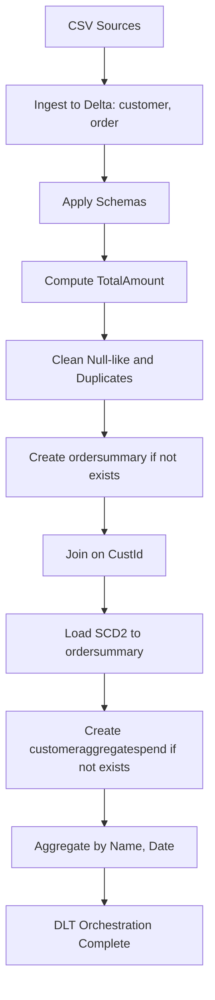
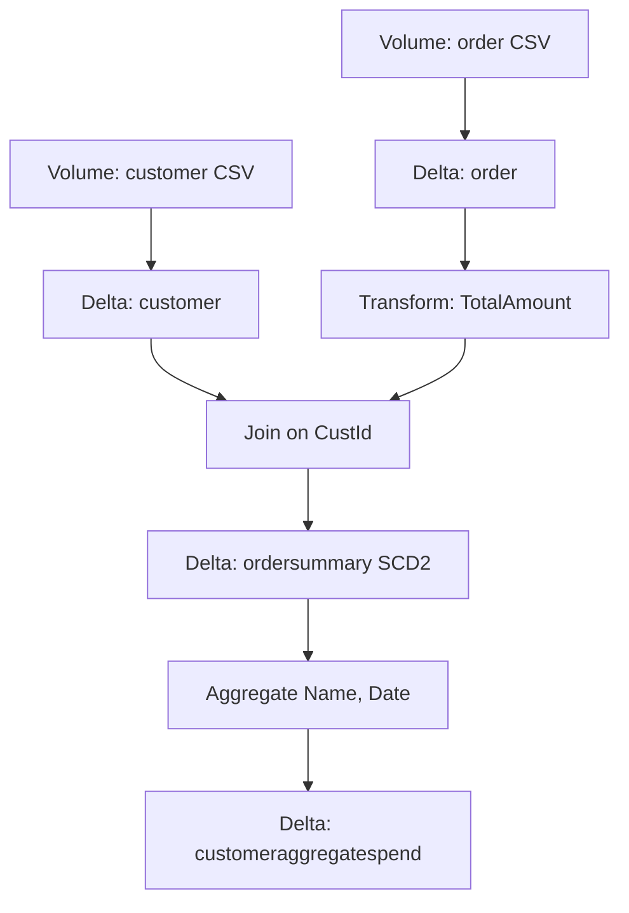
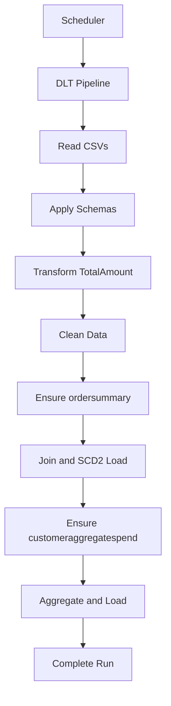
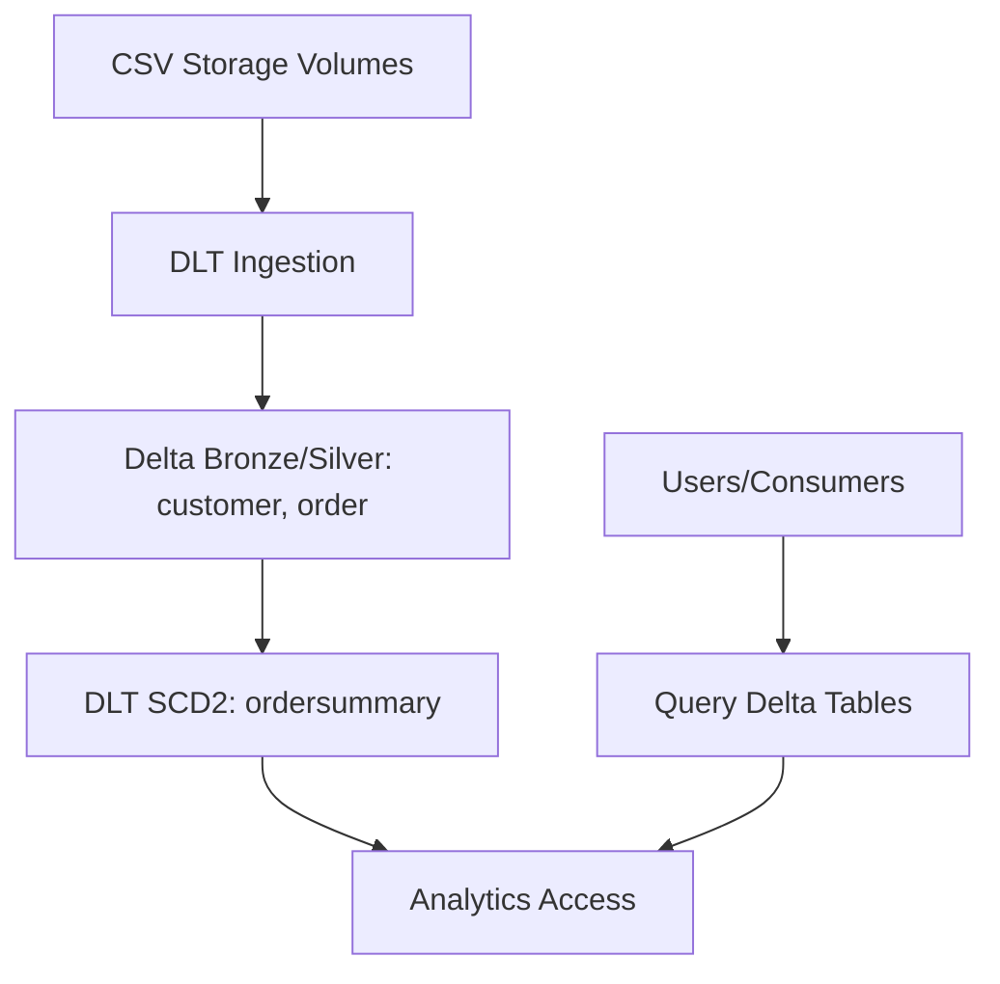

Functional Requirements Document (FRD)
System name: SCD2_DLT_Pipeline

1. Purpose and Scope
- Purpose: Define functional specifications to ingest CSV data into Delta, cleanse, transform, build SCD Type 2 ordersummary, compute customer aggregate spend, and orchestrate via Delta Live Tables (DLT).
- In scope: CSV ingestion (customer, order), schema application, TotalAmount derivation, null-like and duplicate removal, SCD Type 2 ordersummary, customeraggregatespend, DLT orchestration.
- Out of scope: Security, SLAs, environments, monitoring, downstream BI, unspecified entities/columns/systems.

2. Actors and Systems
- Actors: Data Engineer (<TBD>), Platform Scheduler (<TBD>), DLT runtime.
- Systems: Volume storage (CSV), Delta Lake tables, Delta Live Tables.
- Environments: <TBD>.

3. Data Sources and Targets
- Sources: customer CSV at /Volumes/gen_ai_poc_databrickscoe/sdlc_wizard/customerdata; order CSV at /Volumes/gen_ai_poc_databrickscoe/sdlc_wizard/orderdata.
- Targets: Delta tables customer, order (<TBD> catalog/schema); ordersummary at gen_ai_poc_databrickscoe.sdlc_wizard.ordersummary; customeraggregatespend at gen_ai_poc_databrickscoe.sdlc_wizard.customeraggregatespend.

4. Data Schemas
- customer: CustId, Name, EmailId, Region (types <TBD>).
- order: OrderId, ItemName, PricePerUnit, Qty, Date, CustId (types <TBD>).
- ordersummary: CustId, Name, EmailId, Region, OrderId, ItemName, PricePerUnit, Qty, Date, RecordStatus, StartDate, EndDate (types <TBD>).
- customeraggregatespend: Name, TotalAmount, Date (types <TBD>).

5. Functional Requirements
- FR-CMN-001 Title: Ingest CSV to Delta (customer, order)
  - Description: Read CSVs from volumes and load into Delta tables customer and order.
  - Preconditions: Source CSVs available; target storage accessible.
  - Main Flow:
    1) Read customer CSV from configured path.
    2) Read order CSV from configured path.
    3) Write datasets to Delta tables customer and order.
  - Alternate Flows:
    - A1: Source not found -> mark pipeline failed; log error; stop.
  - Acceptance Criteria:
    - AC1: customer and order Delta tables exist and contain rows when sources present.
    - AC2: Fail with clear error when sources missing.

- FR-SCH-002 Title: Apply explicit schemas
  - Description: Enforce defined schemas for customer and order on read or before write.
  - Preconditions: FR-CMN-001 executed or source streams available.
  - Main Flow:
    1) Define schema for customer fields.
    2) Define schema for order fields.
    3) Apply schemas to ingested data.
  - Alternate Flows:
    - A1: Type mismatch -> cast where safe; else quarantine row (<TBD quarantine>).
  - Acceptance Criteria:
    - AC1: Columns and order match definitions.
    - AC2: Rows violating schema are handled per A1 or <TBD>.

- FR-TRN-003 Title: Derive TotalAmount in order
  - Description: Add TotalAmount = PricePerUnit * Qty.
  - Preconditions: FR-SCH-002 complete for order.
  - Main Flow:
    1) Compute TotalAmount expression.
    2) Persist updated order table/view for downstream steps.
  - Alternate Flows:
    - A1: Null PricePerUnit or Qty -> TotalAmount null.
  - Acceptance Criteria:
    - AC1: TotalAmount equals product for valid numeric inputs.
    - AC2: Column available for downstream join/aggregation.

- FR-DQ-004 Title: Remove null-like values and duplicates
  - Description: Clean customer and order by removing records containing "Null"/"null" per business context and dropping duplicates.
  - Preconditions: FR-TRN-003 completed for order; FR-SCH-002 applied.
  - Main Flow:
    1) Identify rows with any field containing "Null" or "null" string.
    2) Exclude identified rows.
    3) Deduplicate remaining rows (all columns as key).
  - Alternate Flows:
    - A1: If dedup key needs refinement -> use all columns by default.
  - Acceptance Criteria:
    - AC1: No rows remain where any field equals "Null"/"null" as string.
    - AC2: No duplicate rows remain.

- FR-TGT-005 Title: Create ordersummary if not exists
  - Description: Ensure ordersummary table exists in gen_ai_poc_databrickscoe.sdlc_wizard.
  - Preconditions: Catalog/schema accessible.
  - Main Flow:
    1) Check for table existence.
    2) Create with defined schema including SCD metadata if absent.
  - Alternate Flows:
    - A1: Missing catalog/schema -> fail with error.
  - Acceptance Criteria:
    - AC1: ordersummary present with required columns.

- FR-JOIN-006 Title: Join customer and order on CustId
  - Description: Produce joined dataset for SCD Type 2 loading.
  - Preconditions: FR-DQ-004 complete; FR-TGT-005 complete.
  - Main Flow:
    1) Inner join customer and order on CustId (<TBD join type default inner>).
    2) Select target columns for ordersummary base.
  - Alternate Flows:
    - A1: If join type must include non-matching -> <TBD>.
  - Acceptance Criteria:
    - AC1: Joined rows contain fields per ordersummary non-SCD columns.

- FR-SCD-007 Title: Implement SCD Type 2 load for ordersummary
  - Description: Maintain history with Active/Inactive, StartDate, EndDate on natural key CustId, OrderId.
  - Preconditions: FR-JOIN-006 complete; FR-TGT-005 complete.
  - Main Flow:
    1) Identify current active records by key.
    2) Detect changes across any tracked attributes (Name, EmailId, Region, ItemName, PricePerUnit, Qty, Date).
    3) For changed keys, set prior record EndDate to current load timestamp; set RecordStatus to Inactive.
    4) Insert new record with StartDate=current load timestamp; EndDate=null; RecordStatus=Active.
    5) For new keys, insert Active record with StartDate set; EndDate=null.
  - Alternate Flows:
    - A1: Late-arriving data handling -> treat as new change with StartDate at load time (<TBD backfill policy>).
  - Acceptance Criteria:
    - AC1: Only one Active record per key at any time.
    - AC2: Complete historical chain with non-overlapping date ranges.
    - AC3: Status values exactly Active/Inactive.

- FR-SCH-008 Title: Ensure ordersummary schema
  - Description: Validate presence of required business and SCD columns.
  - Preconditions: FR-SCD-007 executed at least once.
  - Main Flow:
    1) Verify required columns exist.
    2) Add missing columns if permissible (<TBD migration>).
  - Alternate Flows:
    - A1: If immutable schema -> fail with descriptive error.
  - Acceptance Criteria:
    - AC1: ordersummary contains declared columns with correct names and case.

- FR-TGT-009 Title: Create customeraggregatespend if not exists
  - Description: Ensure target table exists in gen_ai_poc_databrickscoe.sdlc_wizard.
  - Preconditions: Catalog/schema accessible.
  - Main Flow:
    1) Check for table existence.
    2) Create with columns Name, TotalAmount, Date.
  - Alternate Flows:
    - A1: Missing catalog/schema -> fail.
  - Acceptance Criteria:
    - AC1: customeraggregatespend present with required columns.

- FR-AGG-010 Title: Aggregate spend by Name and Date
  - Description: Compute SUM(TotalAmount) from ordersummary grouped by Name and Date.
  - Preconditions: FR-SCD-007 complete; FR-TGT-009 complete.
  - Main Flow:
    1) Select Active records from ordersummary.
    2) Group by Name, Date.
    3) Compute SUM(TotalAmount) as TotalAmount.
    4) Load results into customeraggregatespend (upsert/overwrite <TBD>).
  - Alternate Flows:
    - A1: No Active records -> write empty partition/set.
  - Acceptance Criteria:
    - AC1: Values equal sum of contributing orders.
    - AC2: No duplicate Name-Date rows after load.

- FR-ORC-011 Title: Orchestrate pipeline using Delta Live Tables
  - Description: Implement steps FR-CMN-001 through FR-AGG-010 in DLT with deterministic DAG.
  - Preconditions: DLT pipeline configured; permissions granted.
  - Main Flow:
    1) Define DLT tables/views with dependencies matching DAG.
    2) Configure execution order via DLT dependencies.
    3) Execute pipeline; monitor status.
  - Alternate Flows:
    - A1: Step failure -> DLT marks table failed; halt downstream; surface error.
  - Acceptance Criteria:
    - AC1: DLT run produces all target tables populated per preceding FRs.
    - AC2: DAG reflects Appendix K order.
    - AC3: Re-runs are idempotent for unchanged inputs.

6. Business Rules Alignment
- BR-TotalAmount: PricePerUnit * Qty enforced in FR-TRN-003.
- BR-DataQuality: Remove "Null"/"null" and duplicates enforced in FR-DQ-004.
- BR-SCD2: CustId+OrderId key; Active/Inactive; StartDate/EndDate enforced in FR-SCD-007.
- BR-Aggregation: Group by Name, Date; SUM(TotalAmount) enforced in FR-AGG-010.

7. Assumptions and Constraints
- Assumptions: Missing data types and join type are <TBD>.
- Constraints: Use only specified columns/expressions; preserve names/case; DLT used for orchestration.

8. Error Handling and Logging
- Strategy: Fail-fast on missing sources/targets; log descriptive errors in DLT event logs; retry policy <TBD>.

9. Security and Access
- Access controls, PII handling, and compliance: <TBD>.

10. Performance and SLA
- Volume, latency, schedule, and SLAs: <TBD>.

11. Test Scenarios and Acceptance (traceable to FRs)
- T1 -> FR-CMN-001: customer and order populated.
- T2 -> FR-TRN-003: TotalAmount correct.
- T3 -> FR-DQ-004: No "Null"/"null" or duplicates.
- T4 -> FR-JOIN-006: Joined records present.
- T5 -> FR-SCD-007: SCD2 fields and history correct.
- T6 -> FR-AGG-010: Aggregates correct by Name, Date.
- T7 -> FR-ORC-011: DLT orchestrates end-to-end.

12. Open Items
- Data types for all columns: <TBD>.
- Join type for FR-JOIN-006: <TBD> (default inner).
- Scheduling/triggers for DLT: <TBD>.
- Quarantine/reject handling for bad rows: <TBD>.
- Upsert/overwrite strategy for aggregates: <TBD>.

Mermaid diagrams

System flow diagram


Process flow / flowchart
```mermaid
graph TD;
A[Start] --> B[Read customer and order CSV];
B --> C[Apply Schemas];
C --> D[Add TotalAmount];
D --> E[Remove Null-like and Duplicates];
E --> F[Ensure ordersummary Exists];
F --> G[Join customer+order];
G --> H[Apply SCD2 Logic];
H --> I[Ensure customeraggregatespend Exists];
I --> J[Aggregate SUM(TotalAmount)];
J --> K[End];
```

Data flow diagram (DFD)


Sequence diagram


High-level architecture diagram
