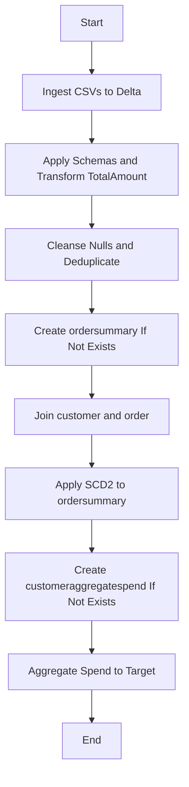
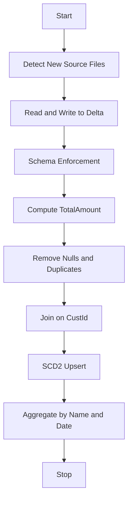
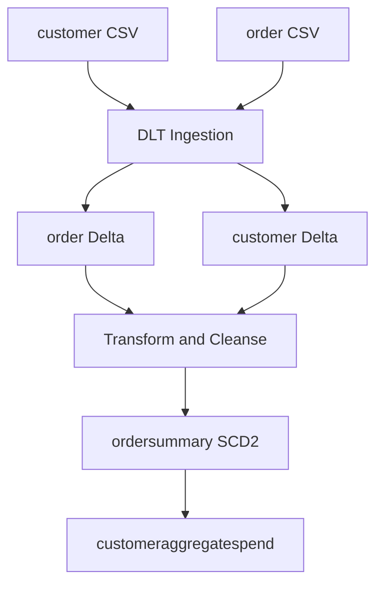
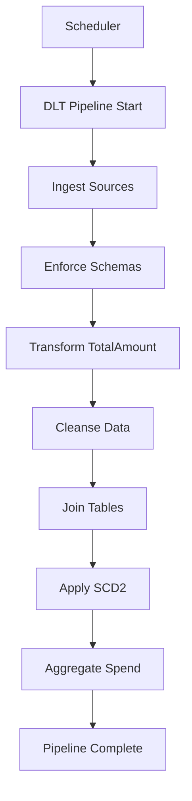
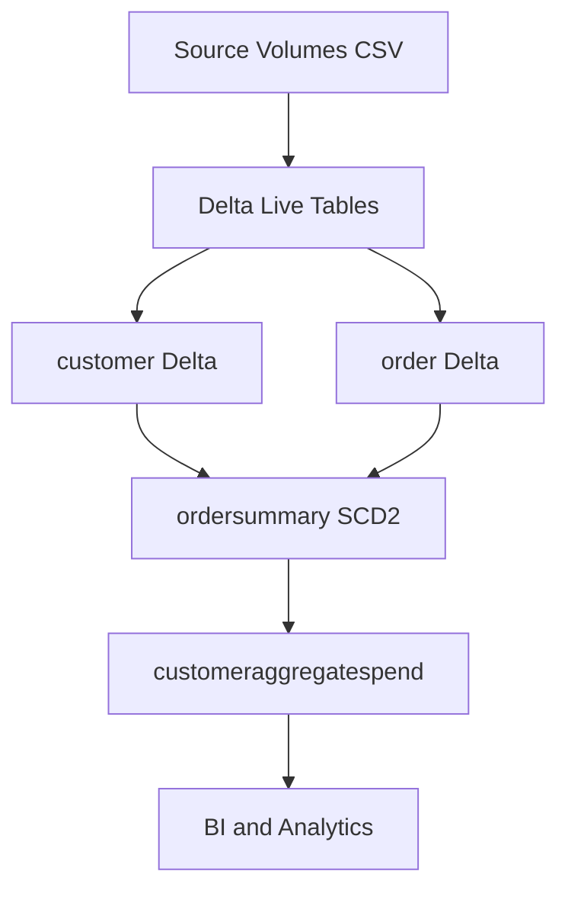

Concise Functional Requirements Document (FRD)
System Name: CustomerOrderDLT

1. Purpose and Scope
- Purpose: Specify functional behavior to ingest, cleanse, transform, historize, and aggregate customer/order data using Delta Live Tables, producing Delta tables: customer, order, ordersummary (SCD2), and customeraggregatespend.
- In Scope: CSV ingestion; schema enforcement; TotalAmount derivation; null removal and deduplication; inner join; SCD2 on ordersummary; aggregation to customeraggregatespend; table creation in catalog gen_ai_poc_databrickscoe and schema sdlc_wizard; orchestration via Delta Live Tables.
- Out of Scope: Any information not present in provided BRD JSON.

2. Assumptions and Constraints
- Assumptions: Only details in BRD are authoritative; missing technical specifics marked <TBD>.
- Constraints: Sources are CSV; targets are Delta; orchestrator is Delta Live Tables; ordersummary and customeraggregatespend created if not exists in specified catalog/schema.

3. Actors and Systems
- Primary System: CustomerOrderDLT.
- External Sources: CSV files at provided volume paths.
- Storage: Unity Catalog tables in gen_ai_poc_databrickscoe.sdlc_wizard and other <TBD> locations for customer and order Delta targets.
- Users: Data engineering and analytics consumers (<TBD>).

4. Data Entities and Schemas
- customer: CustId, Name, EmailId, Region; data types <TBD>.
- order: OrderId, ItemName, PricePerUnit, Qty, Date, CustId; data types <TBD>.
- ordersummary: CustId, Name, EmailId, Region, OrderId, ItemName, PricePerUnit, Qty, Date, RecordStatus, StartDate, EndDate; data types <TBD>.
- customeraggregatespend: Name, TotalAmount, Date; data types <TBD>.

5. Interfaces and Sources
- Input Interfaces:
  - customer CSV: /Volumes/gen_ai_poc_databrickscoe/sdlc_wizard/customerdata.
  - order CSV: /Volumes/gen_ai_poc_databrickscoe/sdlc_wizard/orderdata.
- Output Tables:
  - customer (Delta) <catalog/schema TBD>.
  - order (Delta) <catalog/schema TBD>.
  - ordersummary (Delta) gen_ai_poc_databrickscoe.sdlc_wizard.
  - customeraggregatespend (Delta) gen_ai_poc_databrickscoe.sdlc_wizard.

6. Functional Requirements
- FR-CMN-001 Title: Ingest Source CSVs to Delta
  - Description: Read customer and order CSV files from specified volume paths and persist as Delta tables.
  - Preconditions: Source paths accessible; target_format = delta.
  - Main Flow:
    1) Detect new/available CSV files for customer and order at configured paths.
    2) Read CSV with schema-on-read or inferred <TBD>.
    3) Write to Delta targets (customer, order) with idempotent upsert/overwrite mode <TBD>.
  - Alternate Flows:
    - A1: No new files -> skip write, log no-op.
    - A2: Malformed CSV -> quarantine to error path <TBD>, log error.
  - Acceptance Criteria:
    - AC1: Data from CSV appears in corresponding Delta tables.
    - AC2: Failures are logged with file and reason.
    - AC3: No duplicate writes occur for unchanged inputs <TBD>.

- FR-SCH-002 Title: Enforce Source Schemas
  - Description: Apply explicit schemas for customer and order; define and enforce ordersummary schema.
  - Preconditions: FR-CMN-001 completed for initial loads.
  - Main Flow:
    1) Define column names per BRD for customer and order.
    2) Enforce data types <TBD> with casting and reject invalid rows <TBD>.
    3) Define ordersummary schema including SCD2 columns.
  - Alternate Flows:
    - A1: Type cast fails -> route to error handling <TBD>.
  - Acceptance Criteria:
    - AC1: Tables conform to defined column sets.
    - AC2: Ordersummary includes RecordStatus, StartDate, EndDate.

- FR-TRN-003 Title: Derive TotalAmount on order
  - Description: Compute TotalAmount = PricePerUnit * Qty.
  - Preconditions: FR-SCH-002 schema available; order table present.
  - Main Flow:
    1) Add TotalAmount column using expression.
    2) Persist transformed order table in Delta.
  - Alternate Flows:
    - A1: Null/invalid inputs -> resulting TotalAmount null; record flagged for cleansing in FR-DQ-004.
  - Acceptance Criteria:
    - AC1: Each order row has correct TotalAmount.
    - AC2: Computation adheres to numeric precision <TBD>.

- FR-DQ-004 Title: Data Quality — Null Removal and Deduplication
  - Description: Remove rows containing "Null" (string) or null values; deduplicate customer and order.
  - Preconditions: FR-CMN-001, FR-TRN-003 executed.
  - Main Flow:
    1) Identify rows with any column equal to "Null" or null across selected columns <TBD>.
    2) Remove identified rows.
    3) Deduplicate based on keys: customer(<TBD> CustId?), order(<TBD> OrderId?).
    4) Persist cleansed Delta tables.
  - Alternate Flows:
    - A1: Missing keys for dedup -> use full-row hash <TBD>.
  - Acceptance Criteria:
    - AC1: No remaining "Null"/null per defined scope.
    - AC2: No duplicate keys remain per deduplication rules.

- FR-TGT-005 Title: Create ordersummary Table If Not Exists
  - Description: Ensure ordersummary table exists in gen_ai_poc_databrickscoe.sdlc_wizard.
  - Preconditions: Catalog/schema accessible.
  - Main Flow:
    1) Check existence of target.
    2) Create with defined schema if missing.
  - Alternate Flows:
    - A1: Exists -> proceed without modification.
  - Acceptance Criteria:
    - AC1: ordersummary available prior to load.

- FR-JOI-006 Title: Join customer and order on CustId
  - Description: Perform inner join to produce base dataset for ordersummary.
  - Preconditions: FR-DQ-004 complete; both tables available and cleansed.
  - Main Flow:
    1) Join customer (left) with order (right) on CustId.
    2) Select columns required by ordersummary (excluding SCD2 columns).
  - Alternate Flows:
    - A1: No matching CustId -> rows excluded by inner join.
  - Acceptance Criteria:
    - AC1: Joined dataset contains only matching CustId pairs.
    - AC2: Column mapping matches ordersummary schema.

- FR-SCD-007 Title: Implement SCD Type 2 on ordersummary
  - Description: Maintain historical versions with business keys CustId and OrderId; change tracking from customer attributes.
  - Preconditions: FR-TGT-005, FR-JOI-006 complete.
  - Main Flow:
    1) Compare incoming joined rows to current Active versions using keys (CustId, OrderId).
    2) If no existing Active version -> insert new Active with StartDate=load_date, EndDate=null.
    3) If non-key attributes (Name, EmailId, Region, ItemName, PricePerUnit, Qty, Date) changed due to customer changes, then:
       3.1) Set current Active to Inactive with EndDate=load_date-1 <TBD>.
       3.2) Insert new Active with StartDate=load_date, EndDate=null.
    4) Preserve unchanged rows as-is.
    5) Ensure RecordStatus in {Active, Inactive}.
  - Alternate Flows:
    - A1: Late-arriving data -> reconcile using Date vs load_date policy <TBD>.
    - A2: Multiple changes in a batch -> close previous, keep only one Active.
  - Acceptance Criteria:
    - AC1: Exactly one Active version per key at any time.
    - AC2: Historical versions closed with non-null EndDate.
    - AC3: RecordStatus, StartDate, EndDate populated per rules.

- FR-AGG-008 Title: Create and Populate customeraggregatespend
  - Description: Aggregate sum(TotalAmount) by Name and Date from ordersummary.
  - Preconditions: FR-SCD-007 completed; target table existence checked/created.
  - Main Flow:
    1) Create customeraggregatespend if not exists in specified catalog/schema.
    2) Read Active records from ordersummary.
    3) Group by Name, Date; compute sum(TotalAmount).
    4) Write to customeraggregatespend with idempotent semantics <TBD>.
  - Alternate Flows:
    - A1: No Active records -> write empty or skip with clear status.
  - Acceptance Criteria:
    - AC1: One row per Name+Date with correct aggregated TotalAmount.
    - AC2: No duplicate aggregation rows after reruns <TBD>.

- FR-ORC-009 Title: Orchestrate with Delta Live Tables
  - Description: Implement steps via DLT with dependency order and data quality semantics.
  - Preconditions: DLT pipeline configured.
  - Main Flow:
    1) Define DLT pipeline with stages reflecting Steps 1–10.
    2) Declare expectations for null removal and deduplication.
    3) Configure target catalogs and table properties.
    4) Schedule or trigger execution <TBD>.
  - Alternate Flows:
    - A1: Stage failure -> stop downstream, log, alert <TBD>.
  - Acceptance Criteria:
    - AC1: Pipeline run builds all targets in the correct order.
    - AC2: Expectations tracked with pass/fail counts.

- FR-LIN-010 Title: Data Lineage and Dependencies
  - Description: Track lineage from sources through transformations to targets.
  - Preconditions: DLT expectations enabled.
  - Main Flow:
    1) Register lineage for each table/view in DLT.
    2) Expose dependency graph for audit.
  - Alternate Flows:
    - A1: Partial lineage due to external ops <TBD>.
  - Acceptance Criteria:
    - AC1: Lineage shows path: CSV -> Delta (customer/order) -> join -> SCD2 ordersummary -> aggregate -> customeraggregatespend.

7. Business Rules Implemented
- BRU-1: Remove rows containing "Null" or null for customer and order.
- BRU-2: Deduplicate customer and order.
- BRU-3: TotalAmount = PricePerUnit * Qty.
- BRU-4: Inner join on CustId between customer and order.
- BRU-5: SCD2 with keys CustId, OrderId; RecordStatus Active/Inactive; StartDate/EndDate.
- BRU-6: Aggregate spend by Name and Date from ordersummary.

8. Non-Functional Requirements
- Performance: <TBD>.
- Scalability: <TBD>.
- Availability: <TBD>.
- Security and Access: Unity Catalog permissions <TBD>.
- Audit/Lineage: Via DLT; additional details <TBD>.
- Compliance: <TBD>.

9. Error Handling and Logging
- Input read errors -> log with file path; move to quarantine <TBD>.
- Schema/Type errors -> log row-level counts; route to dead-letter <TBD>.
- Pipeline stage failures -> fail-fast; alerting <TBD>.

10. Test Scenarios
- T1: TotalAmount calculation correct for sample inputs.
- T2: Null removal eliminates "Null"/null rows.
- T3: Deduplication removes duplicates per keys <TBD>.
- T4: Join correctness on CustId.
- T5: SCD2 behavior on customer attribute change.
- T6: Aggregation sums match expected totals by Name and Date.

11. Open Items
- Data types for all columns: <TBD>.
- Deduplication keys for customer and order: <TBD>.
- Overwrite vs merge semantics for ingestion: <TBD>.
- Late-arriving data and date handling policy: <TBD>.
- Environments, schedules, SLAs, security roles: <TBD>.

12. Requirement ID Index
- FR-CMN-001, FR-SCH-002, FR-TRN-003, FR-DQ-004, FR-TGT-005, FR-JOI-006, FR-SCD-007, FR-AGG-008, FR-ORC-009, FR-LIN-010.

Mermaid Diagrams
System flow diagram

Process flow / flowchart

Data flow diagram (DFD)

Sequence diagram

High-level architecture diagram
