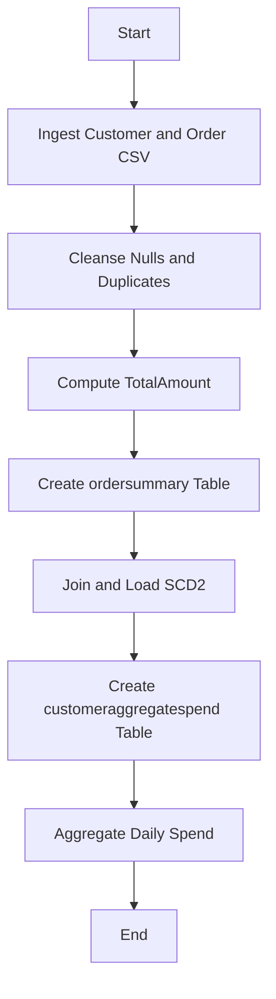
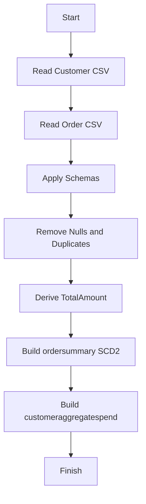
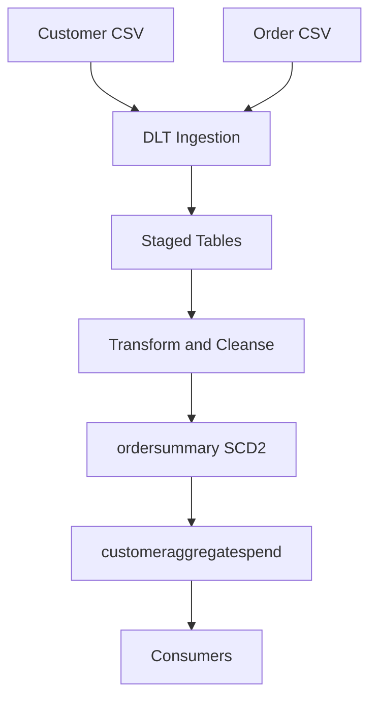
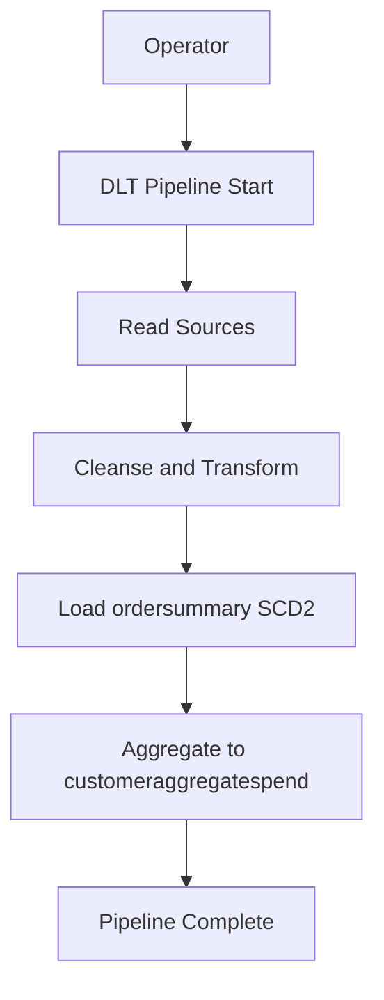
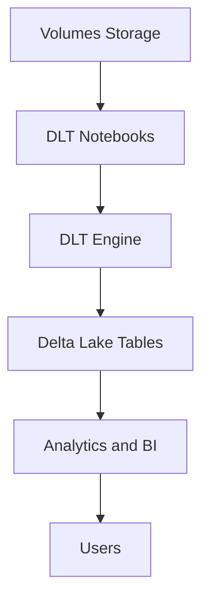

Functional Requirements Document (FRD) for system_name: DLT SCD2 Pipeline

1. Document Control
- Version: 1.0
- Owner: <TBD>
- Last Updated: <TBD>
- Source: Business Requirements Document (BRD) “Data Pipeline Steps using Delta Live Tables”

2. Scope
- In scope: Ingestion from volumes, schema enforcement, cleansing, TotalAmount derivation, join and SCD Type 2 for ordersummary, customer daily aggregate spend, DLT implementation under catalog gen_ai_poc_databrickscoe and schema sdlc_wizard.
- Out of scope: Any information not present in source JSON.

3. Actors and Systems
- Primary system: system_name: DLT SCD2 Pipeline
- Data sources: CSV in /Volumes/gen_ai_poc_databrickscoe/sdlc_wizard/customerdata and /Volumes/gen_ai_poc_databrickscoe/sdlc_wizard/orderdata
- Data targets: Delta tables in gen_ai_poc_databrickscoe.sdlc_wizard
- External actors: Data Engineer (operator) <TBD>, Scheduler <TBD>

4. Assumptions and Constraints
- Assumptions: DLT pipeline available; volume paths reachable; CSVs well-formed with headers <TBD>.
- Constraints: Use Delta Live Tables; catalog/schema fixed; no extra logic beyond BRD; missing details marked <TBD>.

5. Data Model (Logical)
- Source customer: CustId, Name, EmailId, Region; data types <TBD>.
- Source order: OrderId, ItemName, PricePerUnit, Qty, Date, CustId; data types <TBD>.
- Staged order_enriched: order + TotalAmount.
- Target ordersummary (SCD2): CustId, Name, EmailId, Region, OrderId, ItemName, PricePerUnit, Qty, Date, StartDate, EndDate, Status; data types <TBD>.
- Target customeraggregatespend: Name, TotalAmount, Date; data types <TBD>.

6. Non-Functional Requirements
- Performance: Process typical daily volume <TBD>; latency <TBD>.
- Reliability: DLT managed pipeline with retries <TBD>.
- Security: Access to volumes and targets via workspace IAM <TBD>.
- Observability: DLT event logs and expectations <TBD>.

7. Functional Requirements
- FR-ING-001 Title: Ingest customer CSV to Delta
  - Description: Read customer CSV from /Volumes/gen_ai_poc_databrickscoe/sdlc_wizard/customerdata into Delta table customer using DLT.
  - Preconditions: Volume path accessible; DLT cluster permissions granted.
  - Main Flow:
    1) Start DLT pipeline.
    2) Read CSV from specified customer path.
    3) Apply header and delimiter settings <TBD>.
    4) Write as managed Delta table customer.
  - Alternate Flows:
    - A1) Missing path: raise error and fail step; alert <TBD>.
  - Acceptance Criteria:
    - AC1: Table customer created/updated in Delta.
    - AC2: Row count > 0 when files present.

- FR-ING-002 Title: Ingest order CSV to Delta
  - Description: Read order CSV from /Volumes/gen_ai_poc_databrickscoe/sdlc_wizard/orderdata into Delta table order using DLT.
  - Preconditions: Volume path accessible; DLT cluster permissions granted.
  - Main Flow:
    1) Start DLT pipeline.
    2) Read CSV from specified order path.
    3) Apply header and delimiter settings <TBD>.
    4) Write as managed Delta table order.
  - Alternate Flows:
    - A1) Missing path: raise error and fail step; alert <TBD>.
  - Acceptance Criteria:
    - AC1: Table order created/updated in Delta.
    - AC2: Row count > 0 when files present.

- FR-SCH-003 Title: Enforce customer schema
  - Description: Enforce schema CustId, Name, EmailId, Region on customer.
  - Preconditions: FR-ING-001 completed.
  - Main Flow:
    1) Define schema with data types <TBD>.
    2) Cast columns to schema.
    3) Handle malformed records per policy <TBD>.
  - Alternate Flows:
    - A1) Extra/missing columns: log and apply evolution policy <TBD>.
  - Acceptance Criteria:
    - AC1: Customer table conforms to schema fields.
    - AC2: Malformed record handling aligns with policy <TBD>.

- FR-SCH-004 Title: Enforce order schema
  - Description: Enforce schema OrderId, ItemName, PricePerUnit, Qty, Date, CustId on order.
  - Preconditions: FR-ING-002 completed.
  - Main Flow:
    1) Define schema with data types <TBD>.
    2) Cast columns to schema.
    3) Handle malformed records per policy <TBD>.
  - Alternate Flows:
    - A1) Extra/missing columns: log and apply evolution policy <TBD>.
  - Acceptance Criteria:
    - AC1: Order table conforms to schema fields.
    - AC2: Malformed record handling aligns with policy <TBD>.

- FR-DQ-005 Title: Cleanse customer nulls and duplicates
  - Description: Remove "Null"/Null values and duplicate records from customer.
  - Preconditions: FR-SCH-003 completed.
  - Main Flow:
    1) Standardize literal "Null" strings to null.
    2) Drop records with required column nulls (CustId, Name) <TBD>.
    3) Deduplicate on business key CustId keeping latest by <TBD timestamp or hash>.
  - Alternate Flows:
    - A1) No dedupe key available: drop exact duplicates by all columns.
  - Acceptance Criteria:
    - AC1: No "Null" strings remain.
    - AC2: No duplicate CustId rows when business key defined; else no exact duplicates.

- FR-DQ-006 Title: Cleanse order nulls and duplicates
  - Description: Remove "Null"/Null values and duplicate records from order.
  - Preconditions: FR-SCH-004 completed.
  - Main Flow:
    1) Standardize "Null" strings to null.
    2) Drop rows with nulls in OrderId, CustId, Date, PricePerUnit, Qty <TBD>.
    3) Deduplicate on business key OrderId keeping latest by Date <TBD>.
  - Alternate Flows:
    - A1) If OrderId not unique: dedupe by (OrderId, ItemName, CustId, Date) <TBD>.
  - Acceptance Criteria:
    - AC1: No "Null" strings remain.
    - AC2: No duplicate OrderId rows per policy.

- FR-TRF-007 Title: Derive TotalAmount on order
  - Description: Add TotalAmount = PricePerUnit × Qty.
  - Preconditions: FR-DQ-006 completed.
  - Main Flow:
    1) Cast PricePerUnit and Qty to numeric <TBD>.
    2) Compute TotalAmount = PricePerUnit * Qty.
    3) Persist as order_enriched view/table in DLT.
  - Alternate Flows:
    - A1) Non-numeric values: coerce or drop per policy <TBD>.
  - Acceptance Criteria:
    - AC1: TotalAmount present and numeric for all retained rows.
    - AC2: Sample validation aligns with manual calculation.

- FR-TBL-008 Title: Create ordersummary table
  - Description: Ensure ordersummary exists in gen_ai_poc_databrickscoe.sdlc_wizard.
  - Preconditions: FR-TRF-007 completed; FR-DQ-005 completed.
  - Main Flow:
    1) Define target with fields listed in BRD plus SCD2 fields StartDate, EndDate, Status.
    2) Create managed Delta table if not exists with DLT.
  - Alternate Flows:
    - A1) Missing privileges: fail with actionable error.
  - Acceptance Criteria:
    - AC1: ordersummary exists at catalog.schema.table.
    - AC2: Columns include business and SCD fields.

- FR-SCD-009 Title: Join and load to SCD2 ordersummary
  - Description: Join customer and order_enriched on CustId; load into ordersummary with SCD Type 2.
  - Preconditions: FR-TBL-008 completed.
  - Main Flow:
    1) Perform inner join customer to order_enriched on CustId.
    2) Define SCD business key as (CustId, OrderId) <TBD>.
    3) Detect changes on mutable attributes (Name, EmailId, Region, ItemName, PricePerUnit, Qty, Date, TotalAmount) <TBD scope>.
    4) For changes: expire prior record (Status=Inactive, EndDate=current load ts).
    5) Insert new active record (Status=Active, StartDate=current load ts, EndDate=null).
  - Alternate Flows:
    - A1) Late-arriving data: apply as-of Date handling <TBD>.
  - Acceptance Criteria:
    - AC1: History maintained; only one active record per business key.
    - AC2: StartDate/EndDate populated per change events.

- FR-AGG-010 Title: Create customeraggregatespend table
  - Description: Ensure customeraggregatespend exists in gen_ai_poc_databrickscoe.sdlc_wizard with Name, TotalAmount, Date.
  - Preconditions: FR-SCD-009 completed.
  - Main Flow:
    1) Define target schema.
    2) Create managed Delta table if not exists with DLT.
  - Alternate Flows:
    - A1) Missing privileges: fail with actionable error.
  - Acceptance Criteria:
    - AC1: Table exists at catalog.schema.
    - AC2: Columns Name, TotalAmount, Date present.

- FR-AGG-011 Title: Aggregate daily spend
  - Description: Aggregate TotalAmount from ordersummary grouped by Name and Date into customeraggregatespend.
  - Preconditions: FR-AGG-010 completed.
  - Main Flow:
    1) Select Name, Date, TotalAmount from ordersummary.
    2) Aggregate using SUM(TotalAmount) <Assumed; confirm per BRD open question>.
    3) Write results to customeraggregatespend with overwrite or merge policy <TBD>.
  - Alternate Flows:
    - A1) If aggregation function differs: apply stakeholder-approved function <TBD>.
  - Acceptance Criteria:
    - AC1: One row per (Name, Date).
    - AC2: TotalAmount equals sum of contributing rows for the day.

- FR-OPS-012 Title: Implement pipeline in DLT
  - Description: Implement all steps using Delta Live Tables with declarative expectations for DQ.
  - Preconditions: Workspace and permissions ready.
  - Main Flow:
    1) Author DLT notebooks/pipeline specifying sources, transformations, targets.
    2) Configure cluster policy <TBD>.
    3) Configure expectations for null and duplicate removal.
    4) Schedule or trigger run <TBD>.
  - Alternate Flows:
    - A1) Manual trigger via UI on demand.
  - Acceptance Criteria:
    - AC1: DLT lineage shows steps 1–7 as per BRD.
    - AC2: Pipeline run succeeds with targets materialized.

8. Process Flows
- End-to-end order:
  - Ingest customer and order CSV
  - Cleanse nulls/duplicates
  - Derive TotalAmount
  - Create ordersummary
  - Join + SCD2 load to ordersummary
  - Create customeraggregatespend
  - Aggregate daily spend

9. Error Handling
- Ingestion failure: fail-fast; log path; alert <TBD>.
- Schema mismatch: quarantine records <TBD>.
- SCD conflict: ensure single active record; resolve by latest Date or load ts <TBD>.
- Aggregation failure: rollback write; alert <TBD>.

10. Configuration and Parameters
- CSV options: header=true, delimiter=, encoding=UTF-8 <TBD>.
- Timezone for dates: <TBD>.
- Watermark/late data threshold: <TBD>.
- Merge mode for aggregates: overwrite by Date partition <TBD>.

11. Security and Access
- Read access to volumes; write access to catalog/schema; secret scope for credentials <TBD>.
- Data masking for EmailId in non-prod <TBD>.

12. Testing and Acceptance
- Unit tests: TotalAmount math; null/duplicate removal; SCD2 state transitions.
- Integration tests: End-to-end run with sample files.
- UAT: Business validates ordersummary history and aggregate outputs.
- Acceptance: Meet Appendix P AC-1 to AC-6.

13. Open Items
- Aggregation function confirmation (SUM assumed).
- Data types and nullable constraints.
- Dedupe keys and change-detection fields.
- SCD columns exact names and data types.
- CSV formats and schema evolution policy.
- SCD business key definition.
- Final table name confirmation for customeraggregatespend.

14. Traceability
- FR-ING-001 to FR-10; mappings per BRD Appendix R.

Mermaid diagrams

System flow diagram

Process flow / flowchart

Data flow diagram (DFD)

Sequence diagram

High-level architecture diagram

Appendix A: Acceptance Criteria Mapping
- FR-OPS-012 satisfies AC-1.
- FR-TBL-008 satisfies AC-2.
- FR-AGG-010 satisfies AC-3.
- FR-SCD-009 satisfies AC-4.
- FR-DQ-005 and FR-DQ-006 satisfy AC-5.
- FR-TRF-007 satisfies AC-6.

Appendix B: ID Schema
- Pattern: FR-<MOD>-NNN where MOD ∈ {ING,SCH,DQ,TRF,TBL,SCD,AGG,OPS}.
- Example: FR-ING-001.

Appendix C: Glossary
- DLT: Delta Live Tables.
- SCD2: Slowly Changing Dimension Type 2.
- Business key: Unique identifier for SCD history tracking <TBD>.