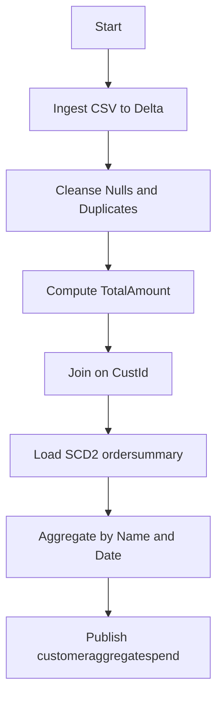
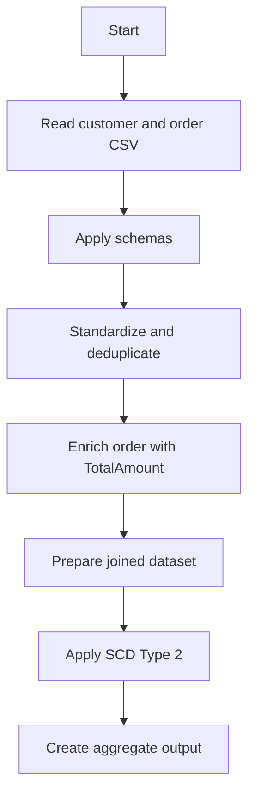
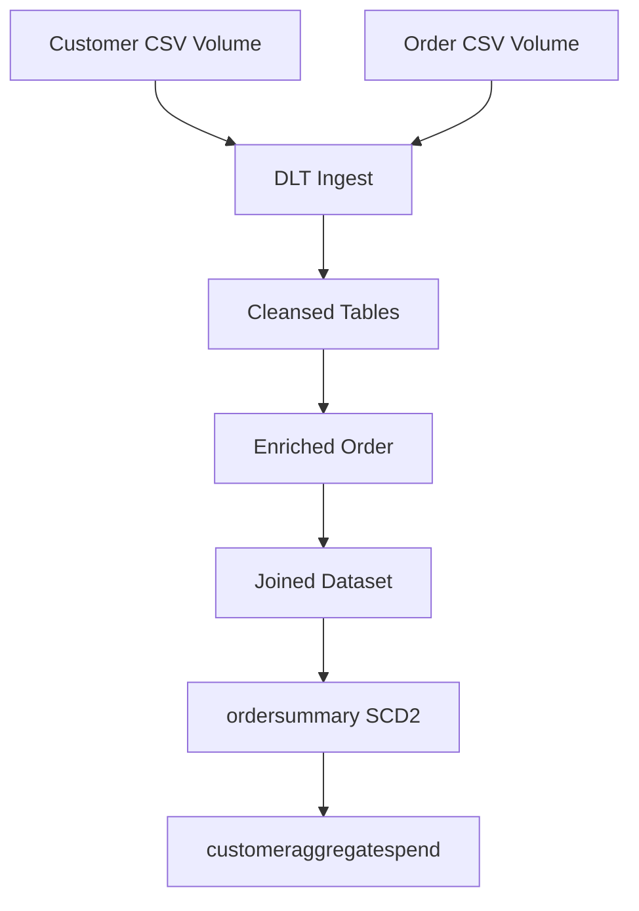
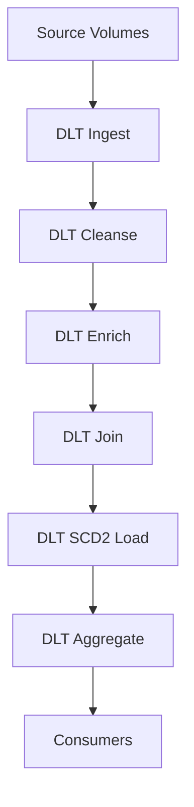
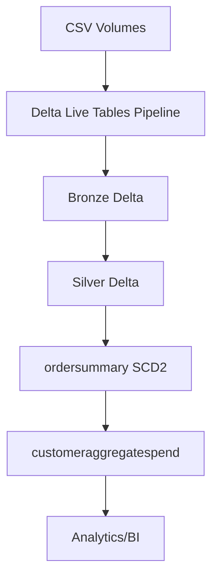

Functional Requirements Document (FRD) for system_name: CustomerOrderDLT

1. Document Control
- Purpose: Define functional specifications for CustomerOrderDLT based strictly on BRD.
- Audience: Data engineering, analytics, QA.
- References: BRD “Data Pipeline Steps using Delta Live Tables”.
- Assumptions: Only BRD content is authoritative; missing details marked <TBD>.
- Constraints: Use Delta Live Tables; targets under gen_ai_poc_databrickscoe.sdlc_wizard.

2. Scope
- In-scope: Ingestion from volumes; cleansing; transformations; SCD Type 2 for ordersummary; aggregation to customeraggregatespend; DLT implementation.
- Out-of-scope: Any logic or data not in BRD.

3. Actors and Systems
- Upstream: CSV volumes at provided paths.
- System: CustomerOrderDLT (DLT pipeline).
- Downstream: Delta tables ordersummary, customeraggregatespend.
- Operators: <TBD>.

4. Data Entities
- customer: CustId; Name; EmailId; Region; types <TBD>.
- order: OrderId; ItemName; PricePerUnit; Qty; Date; CustId; types <TBD>.
- ordersummary: CustId; Name; EmailId; Region; OrderId; ItemName; PricePerUnit; Qty; Date; SCD columns StartDate; EndDate; Status (Active/Inactive) [implied by BRD; confirm].
- customeraggregatespend: Name; TotalAmount; Date.

5. Functional Requirements
- FR-ING-001: Ingest customer CSV to Delta
  - Title: Read customer CSV from volume
  - Description: Load /Volumes/gen_ai_poc_databrickscoe/sdlc_wizard/customerdata into a managed Delta table customer using DLT.
  - Preconditions: Volume path accessible; schema fields available.
  - Main Flow:
    1) Initialize DLT pipeline;
    2) Read CSV from path with header <TBD>, delimiter <TBD>;
    3) Apply schema for customer;
    4) Write to Delta as a DLT table customer.
  - Alternate Flows:
    - A1: Missing files -> create empty table with schema and log warning.
    - A2: Malformed rows -> quarantine or drop <TBD>.
  - Acceptance Criteria:
    - AC1: customer DLT table exists and is queryable;
    - AC2: Row count >= 0; no schema drift unless allowed <TBD>.

- FR-ING-002: Ingest order CSV to Delta
  - Title: Read order CSV from volume
  - Description: Load /Volumes/gen_ai_poc_databrickscoe/sdlc_wizard/orderdata into a managed Delta table order using DLT.
  - Preconditions: Volume path accessible; schema fields available.
  - Main Flow:
    1) Initialize DLT pipeline;
    2) Read CSV from path;
    3) Apply order schema;
    4) Write to Delta as a DLT table order.
  - Alternate Flows:
    - A1: Missing files -> create empty table and log;
    - A2: Malformed rows handling <TBD>.
  - Acceptance Criteria:
    - AC1: order DLT table exists;
    - AC2: Required columns present.

- FR-SCH-003: Enforce schemas
  - Title: Apply declared schemas to source datasets
  - Description: Enforce fixed column sets for customer and order.
  - Preconditions: DLT tables created.
  - Main Flow:
    1) Define schema structs;
    2) Cast incoming columns to target types <TBD>;
    3) Reject/handle extra columns <TBD>.
  - Alternate Flows:
    - A1: Missing columns -> set to null/default and log.
  - Acceptance Criteria:
    - AC1: Exactly listed columns exist;
    - AC2: Column names match case and spelling.

- FR-DQ-004: Null and duplicate cleansing
  - Title: Remove "Null"/Null and duplicates
  - Description: Standardize null-like strings and remove duplicates for customer and order.
  - Preconditions: Ingested raw frames available.
  - Main Flow:
    1) Replace "Null" (string) with null across all columns or configured subset <TBD>;
    2) Trim whitespace on string fields <TBD>;
    3) Drop rows with all-key fields null per table <TBD>;
    4) Deduplicate using keys: customer(CustId), order(OrderId, CustId, Date) <TBD>;
    5) Persist cleansed DLT views.
  - Alternate Flows:
    - A1: If keys unknown, dedup on full-row hash.
  - Acceptance Criteria:
    - AC1: No literal "Null" values remain;
    - AC2: Duplicate rows per rule are removed.

- FR-TRN-005: Compute TotalAmount
  - Title: Derive order TotalAmount
  - Description: Add TotalAmount = PricePerUnit × Qty to order dataset.
  - Preconditions: order data cleansed with numeric fields castable.
  - Main Flow:
    1) Ensure PricePerUnit and Qty numeric;
    2) Compute TotalAmount;
    3) Persist enriched order view.
  - Alternate Flows:
    - A1: Non-numeric values -> cast failures handled as null and logged.
  - Acceptance Criteria:
    - AC1: TotalAmount populated where inputs valid;
    - AC2: Calculation equals PricePerUnit × Qty.

- FR-DIM-006: Create ordersummary table
  - Title: Ensure existence of ordersummary
  - Description: Create gen_ai_poc_databrickscoe.sdlc_wizard.ordersummary with listed columns plus SCD2 columns.
  - Preconditions: Catalog and schema accessible.
  - Main Flow:
    1) Define table schema: listed fields + StartDate; EndDate; Status (Active/Inactive);
    2) Create table if not exists via DLT.
  - Alternate Flows:
    - A1: If SCD columns must be differently named -> parameterize <TBD>.
  - Acceptance Criteria:
    - AC1: Table exists in target catalog.schema;
    - AC2: Columns present as specified.

- FR-JOIN-007: Integrate customer and order
  - Title: Join on CustId
  - Description: Join cleansed customer with enriched order on CustId to form rows for ordersummary.
  - Preconditions: Cleansed datasets ready.
  - Main Flow:
    1) Inner join on customer.CustId = order.CustId;
    2) Select required columns;
    3) Prepare payload for SCD Type 2 loader.
  - Alternate Flows:
    - A1: Left join to retain orders without customer <TBD>.
  - Acceptance Criteria:
    - AC1: Joined dataset contains only matching CustId pairs unless specified.

- FR-SCD-008: Apply SCD Type 2 to ordersummary
  - Title: SCD2 maintenance
  - Description: Detect changes in customer attributes and maintain historical rows in ordersummary.
  - Preconditions: Joined dataset available; SCD business key <TBD>.
  - Main Flow:
    1) Define business key for SCD2 (e.g., CustId + OrderId) <TBD>;
    2) Detect change in tracked fields (Name; EmailId; Region; ItemName; PricePerUnit; Qty; Date) <TBD>;
    3) For changed records: set previous row EndDate = processing_date - 1 day <TBD>; Status = Inactive;
    4) Insert new active row with StartDate = processing_date; EndDate = null; Status = Active;
    5) Maintain full history.
  - Alternate Flows:
    - A1: If only customer attributes drive SCD2 per BRD, track Name/EmailId/Region only.
  - Acceptance Criteria:
    - AC1: History exists for changed entities;
    - AC2: Exactly one active row per business key at a time;
    - AC3: StartDate/EndDate continuity holds (no overlaps).

- FR-AGG-009: Create customeraggregatespend
  - Title: Ensure existence of aggregate table
  - Description: Create gen_ai_poc_databrickscoe.sdlc_wizard.customeraggregatespend with Name, TotalAmount, Date.
  - Preconditions: Target catalog/schema accessible.
  - Main Flow:
    1) Define schema as specified;
    2) Create if not exists via DLT.
  - Alternate Flows:
    - A1: Table properties/partitioning <TBD>.
  - Acceptance Criteria:
    - AC1: Table exists in target location with columns present.

- FR-AGG-010: Aggregate daily spend
  - Title: Compute daily total spend per customer
  - Description: Aggregate from ordersummary grouped by Name and Date into customeraggregatespend.
  - Preconditions: ordersummary populated.
  - Main Flow:
    1) Select Name, Date, TotalAmount from ordersummary;
    2) Aggregate using SUM(TotalAmount) <assumed>; if not approved, mark as <TBD>;
    3) Write to customeraggregatespend.
  - Alternate Flows:
    - A1: If multiple currencies/regions -> normalization <TBD>.
  - Acceptance Criteria:
    - AC1: One row per Name, Date with TotalAmount aggregated;
    - AC2: Aggregation function explicitly defined (SUM or <TBD>).

- FR-OPS-011: Implement with Delta Live Tables
  - Title: DLT pipeline realization
  - Description: All steps implemented as DLT views/tables with dependencies.
  - Preconditions: Workspace has DLT entitlement and permissions.
  - Main Flow:
    1) Define bronze (ingest), silver (cleanse/enrich), gold (SCD2/agg) layers <TBD>;
    2) Express lineage via DLT @dlt.table/@dlt.view decorators or settings;
    3) Configure pipeline cluster/policies <TBD>;
    4) Run pipeline and validate outputs.
  - Alternate Flows:
    - A1: Auto Loader for CSV evolution <TBD>.
  - Acceptance Criteria:
    - AC1: Lineage reflects BRD flow order;
    - AC2: Pipeline runs to success with materialized targets.

6. Non-Functional Requirements
- Performance: <TBD>.
- Reliability: Idempotent reruns without duplicate outputs.
- Security: Access to volumes and catalogs restricted <TBD>.
- Observability: DLT expectations/checks for DQ rules <TBD>.

7. Data Quality Rules
- DQ-1: Replace string "Null" with null for all string columns unless excluded <TBD>.
- DQ-2: Deduplicate per key definitions <TBD>; stable deterministic rule.
- DQ-3: Reject or quarantine malformed rows <TBD>.
- DQ-4: Enforce not-null on primary identifiers (CustId, OrderId) <TBD>.

8. Interface Specifications
- Inputs: CSV files at provided volume paths; format details <TBD> (delimiter, header, encoding).
- Outputs: Delta tables in gen_ai_poc_databrickscoe.sdlc_wizard.

9. Error Handling
- Missing source path: Log error and skip step.
- Schema mismatch: Log and quarantine rows <TBD>.
- SCD2 conflicts: Abort batch and alert <TBD>.

10. Logging and Monitoring
- DLT event logs enabled <TBD>.
- Data expectations for DQ with failure thresholds <TBD>.

11. Security and Access Control
- Read access to volumes; write to target catalog/schema <TBD>.
- PII handling for EmailId <TBD>.

12. Migration and Backfill
- Initial full load then incremental runs <TBD>.
- Backfill approach for historical dates <TBD>.

13. Open Items
- Aggregation function confirmation for TotalAmount (SUM assumed) [Q1].
- Data types and nullability for all columns [Q2].
- Deduplication keys and null-removal rules [Q3].
- SCD column names and business key [Q4, Q6].
- CSV format details and schema evolution [Q5].
- Confirm customeraggregatespend table name [Q7].

14. Acceptance Criteria Mapping
- AC-1: DLT used for all steps (meets FR-OPS-011).
- AC-2: ordersummary exists in gen_ai_poc_databrickscoe.sdlc_wizard with columns (meets FR-DIM-006).
- AC-3: customeraggregatespend exists with Name, TotalAmount, Date (meets FR-AGG-009).
- AC-4: SCD2 behavior with StartDate/EndDate/Status (meets FR-SCD-008).
- AC-5: Null/duplicate removal applied (meets FR-DQ-004).
- AC-6: TotalAmount computed = PricePerUnit × Qty (meets FR-TRN-005).

15. Test Scenarios (high-level)
- TS-1: Ingest creates customer/order tables with correct columns.
- TS-2: "Null" strings converted and duplicates removed.
- TS-3: TotalAmount correctly computed.
- TS-4: SCD2 updates create prior inactive rows with EndDate set and new active row.
- TS-5: Aggregation outputs one row per Name/Date with total spend.
- TS-6: End-to-end DLT run produces all targets in order.

Mermaid Diagrams

System flow diagram

Process flow / flowchart

Data flow diagram (DFD)

Sequence diagram

High-level architecture diagram
