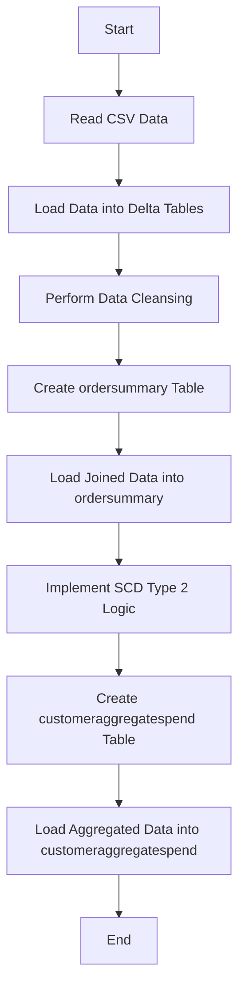
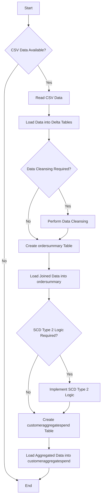
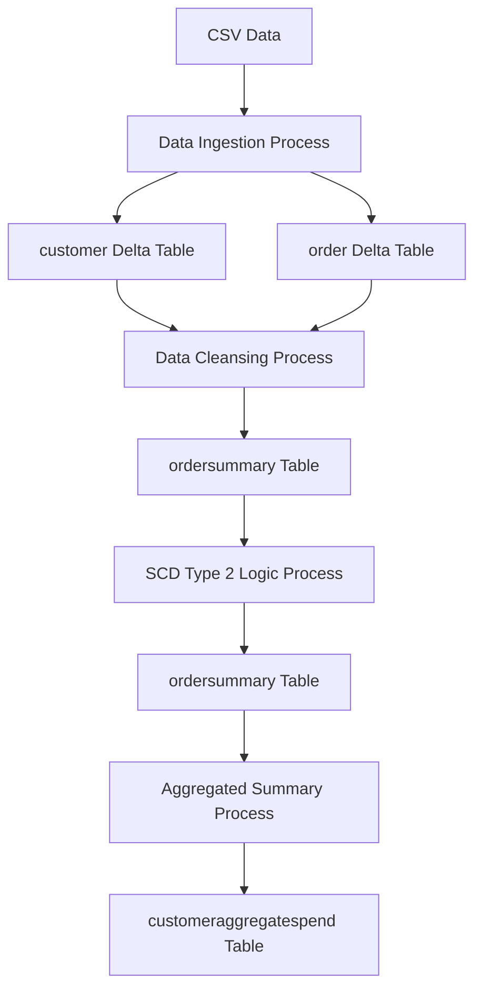
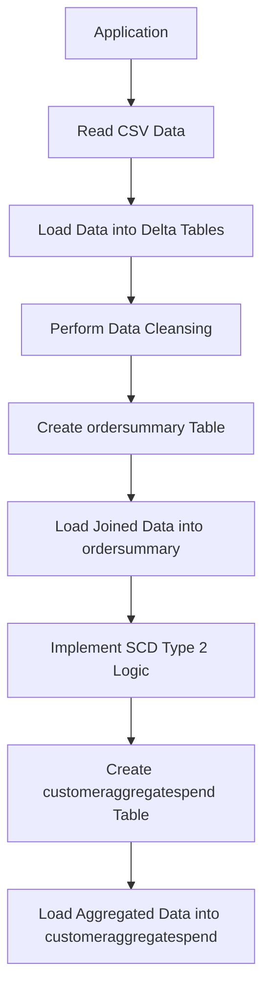
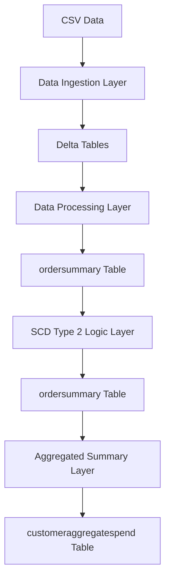

**Concise Functional Requirements Document (FRD) for the "Application"**
====================================================================

### Overview

The "Application" is a data processing pipeline designed to load customer and order data from CSV files into Delta tables, perform data cleansing, and create aggregated summaries.

### Functional Requirements

1. **Data Ingestion**
	* Read CSV data from specified locations and load it into Delta tables "customer" and "order".
	* CSV file paths: `/Volumes/gen_ai_poc_databrickscoe/sdlc_wizard/customerdata` and `/Volumes/gen_ai_poc_databrickscoe/sdlc_wizard/orderdata`.
2. **Data Cleansing**
	* Remove "Null"/null and duplicate records from "customer" and "order" tables.
3. **Data Transformation and Loading**
	* Create "ordersummary" table if it does not exist in catalog "gen_ai_poc_databrickscoe" and schema "sdlc_wizard".
	* Join "customer" and "order" data using "CustId" field and load into SCD type 2 table "ordersummary".
4. **SCD Type 2 Implementation**
	* Update SCD type 2 "ordersummary" table when there are changes in "customer" table.
	* Make old records inactive and new records active.
	* Update `StartDate` and `EndDate` accordingly.
5. **Aggregated Summary**
	* Create "customeraggregatespend" table if it does not exist in catalog "gen_ai_poc_databrickscoe" and schema "sdlc_wizard".
	* Aggregate "TotalAmount" from "ordersummary" table and group by "Name" and "Date" columns.
	* Load aggregated data into "customeraggregatespend" table.

### Diagrams

#### System Flow Diagram

#### Process Flow / Flowchart

#### Data Flow Diagram (DFD)

#### Sequence Diagram

#### High-Level Architecture Diagram
