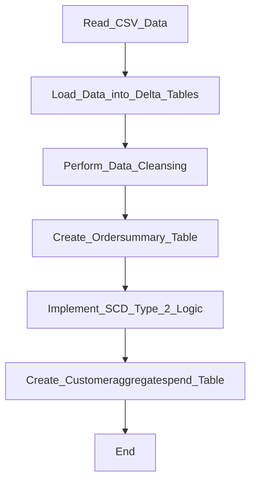
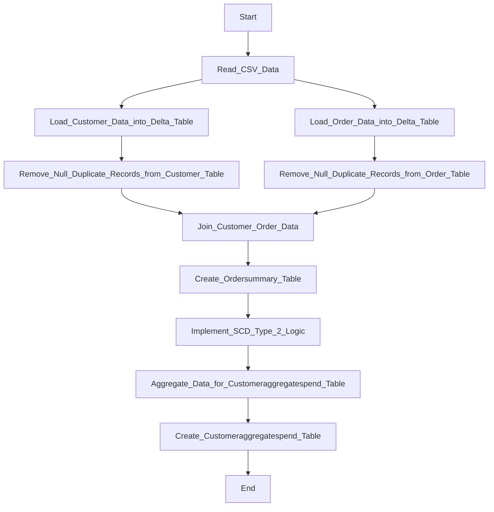
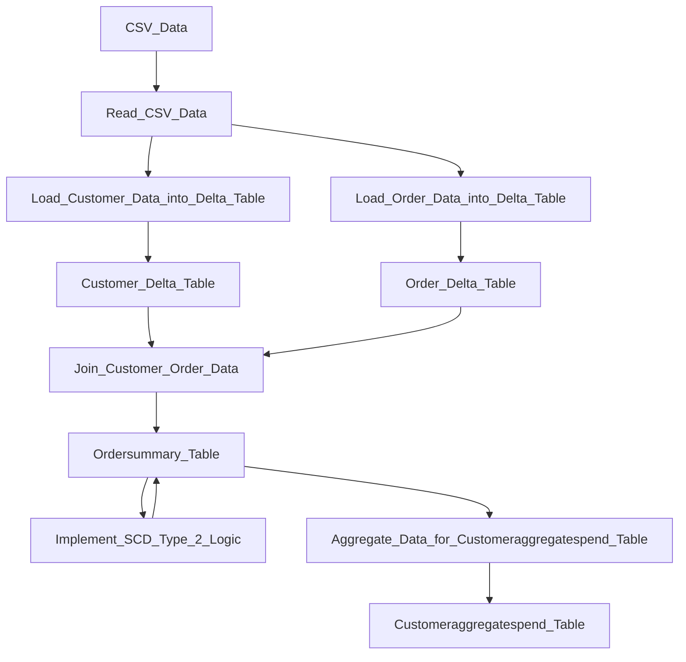
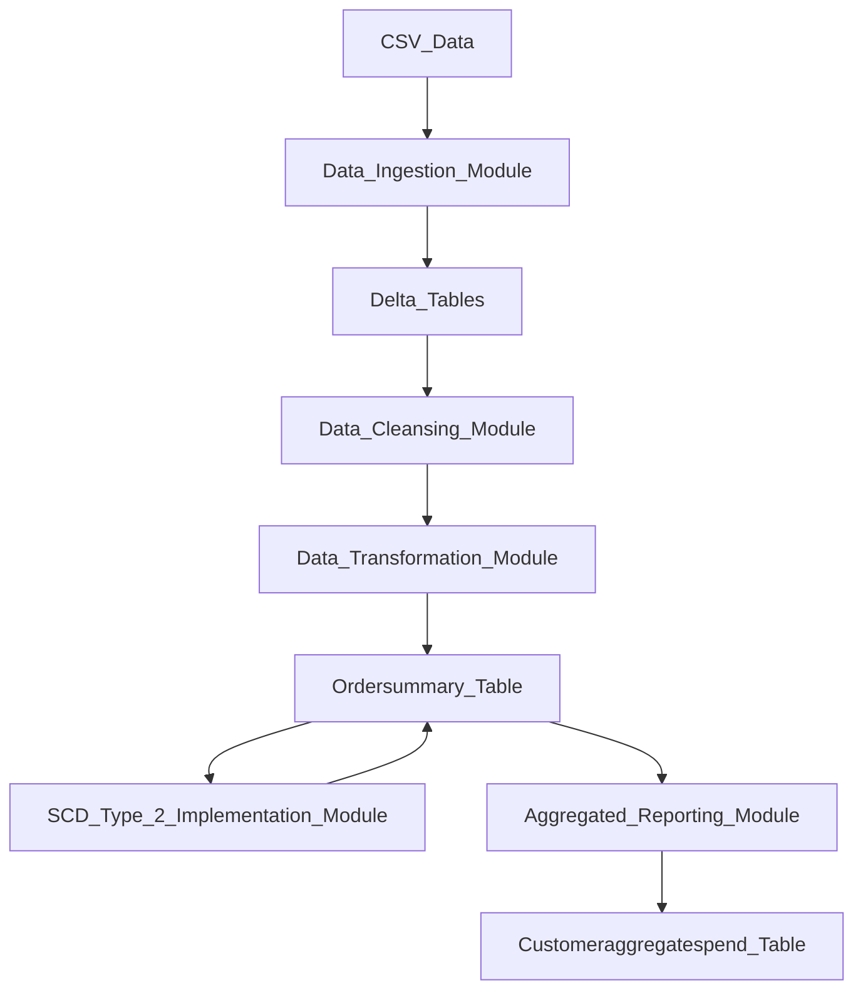

**Concise Functional Requirements Document (FRD) for the "Application"**

**Introduction:**
The Application is designed to integrate and aggregate customer and order data from source CSV files, performing data cleansing, transformation, and loading it into Delta tables for reporting purposes.

**Functional Requirements:**

1. **Data Ingestion Module**
	* Read CSV data from specified volumes: `/Volumes/gen_ai_poc_databrickscoe/sdlc_wizard/customerdata` and `/Volumes/gen_ai_poc_databrickscoe/sdlc_wizard/orderdata`
	* Load data into Delta tables for customer and order data
2. **Data Cleansing Module**
	* Remove "Null"/null and duplicate records from both customer and order tables
3. **Data Transformation Module**
	* Create an "ordersummary" table with schema: `CustId`, `Name`, `EmailId`, `Region`, `OrderId`, `ItemName`, `PricePerUnit`, `Qty`, `Date`
	* Join customer and order data using the "CustId" field and load the data into an SCD Type 2 table ("ordersummary")
4. **SCD Type 2 Implementation Module**
	* Update the SCD Type 2 table ("ordersummary") whenever there is a change in the customer table
	* Old records should be made inactive and new records should be made active, with corresponding changes to `StartDate` and `EndDate`
5. **Aggregated Reporting Module**
	* Create a new table "customeraggregatespend" with columns "Name", "TotalAmount", and "Date"
	* Aggregate the "TotalAmount" column from the "ordersummary" table and group by "Name" and "Date" columns
	* Load the aggregated data into the "customeraggregatespend" table

**System Flow Diagram**


**Process Flow / Flowchart**


**Data Flow Diagram (DFD)**


**Sequence Diagram**
```mermaid
graph TD;
participant Application as "Application";
participant Customer_Delta_Table as "Customer Delta Table";
participant Order_Delta_Table as "Order Delta Table";
participant Ordersummary_Table as "Ordersummary Table";
participant Customeraggregatespend_Table as "Customeraggregatespend Table";
Application->>Read_CSV_Data: Read CSV data;
Read_CSV_Data->>Load_Customer_Data_into_Delta_Table: Load customer data;
Read_CSV_Data->>Load_Order_Data_into_Delta_Table: Load order data;
Load_Customer_Data_into_Delta_Table->>Customer_Delta_Table: Store customer data;
Load_Order_Data_into_Delta_Table->>Order_Delta_Table: Store order data;
Application->>Join_Customer_Order_Data: Join customer and order data;
Join_Customer_Order_Data->>Ordersummary_Table: Create ordersummary table;
Application->>Implement_SCD_Type_2_Logic: Implement SCD Type 2 logic;
Implement_SCD_Type_2_Logic->>Ordersummary_Table: Update ordersummary table;
Application->>Aggregate_Data_for_Customeraggregatespend_Table: Aggregate data;
Aggregate_Data_for_Customeraggregatespend_Table->>Customeraggregatespend_Table: Create customeraggregatespend table;
```

**High-Level Architecture Diagram**
