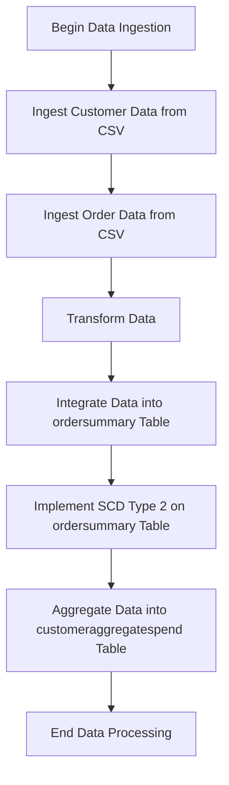
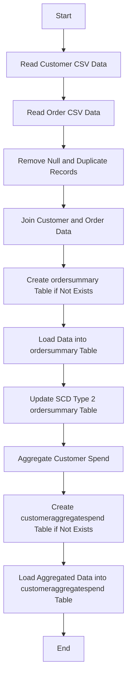
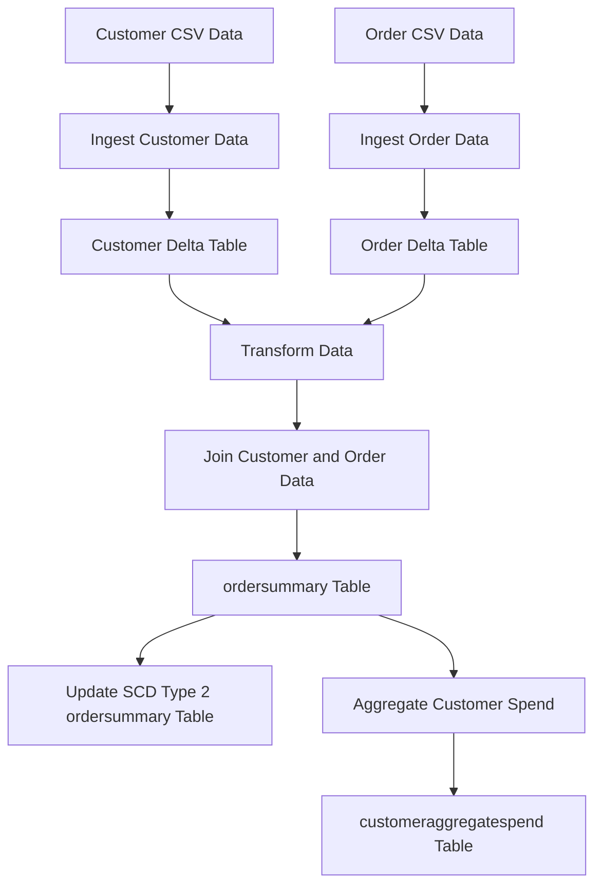
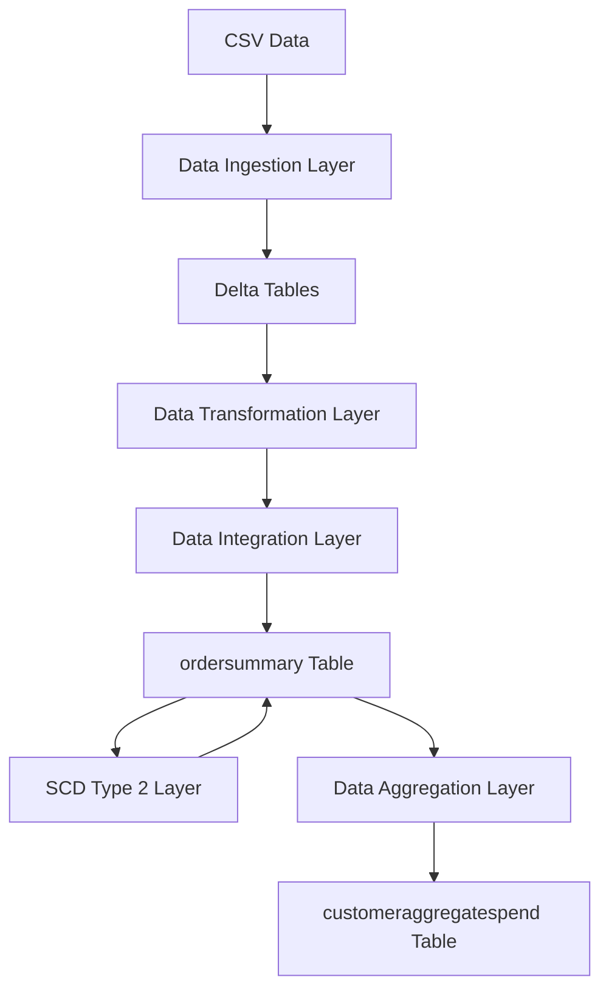

**Functional Requirements Document (FRD) for Data Platform Pipeline**

**Introduction:**
The Data Platform Pipeline is designed to integrate customer order data from CSV files into a structured database, enabling efficient data analysis and reporting. This FRD outlines the functional requirements for the pipeline.

**Functional Requirements:**

1. **Data Ingestion**
	* Read CSV data from specified locations (`/Volumes/gen_ai_poc_databrickscoe/sdlc_wizard/customerdata` and `/Volumes/gen_ai_poc_databrickscoe/sdlc_wizard/orderdata`) and load it into Delta tables "customer" and "order".
	* Validate data ingestion for correctness and completeness.

2. **Data Transformation**
	* Remove "Null"/null and duplicate records from "customer" and "order" tables.
	* Validate data transformation for correctness and completeness.

3. **Data Integration**
	* Create "ordersummary" table if it does not exist in the catalog "gen_ai_poc_databrickscoe" and schema "sdlc_wizard".
	* Join "customer" and "order" data using "CustId" and load into SCD Type 2 "ordersummary" table.
	* Validate data integration for correctness and completeness.

4. **SCD Type 2 Implementation**
	* Update SCD Type 2 "ordersummary" table whenever there is a change in the "customer" table.
	* Make old records inactive and new records active.
	* Update `StartDate` and `EndDate` accordingly.
	* Validate SCD Type 2 implementation for correctness and completeness.

5. **Data Aggregation**
	* Create "customeraggregatespend" table if it does not exist in the catalog "gen_ai_poc_databrickscoe" and schema "sdlc_wizard".
	* Aggregate "TotalAmount" from "ordersummary" table and group by "Name" and "Date".
	* Load aggregated data into "customeraggregatespend" table.
	* Validate data aggregation for correctness and completeness.

**System Flow Diagram**


**Process Flow / Flowchart**


**Data Flow Diagram (DFD)**


**Sequence Diagram**
```mermaid
graph TD;
participant CSVData as "CSV Data";
participant IngestionLayer as "Data Ingestion Layer";
participant TransformationLayer as "Data Transformation Layer";
participant IntegrationLayer as "Data Integration Layer";
participant SCDType2Layer as "SCD Type 2 Layer";
participant AggregationLayer as "Data Aggregation Layer";

CSVData -->> IngestionLayer: Provide CSV Data;
IngestionLayer -->> TransformationLayer: Load Data into Delta Tables;
TransformationLayer -->> IntegrationLayer: Transform and Join Data;
IntegrationLayer -->> SCDType2Layer: Load Data into ordersummary Table;
SCDType2Layer -->> SCDType2Layer: Update SCD Type 2 ordersummary Table;
IntegrationLayer -->> AggregationLayer: Aggregate Customer Spend;
AggregationLayer -->> CustomeraggregatespendTable: Load Aggregated Data into customeraggregatespend Table;
```

**High-Level Architecture Diagram**
