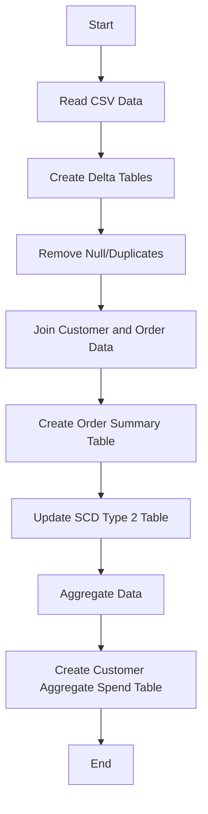
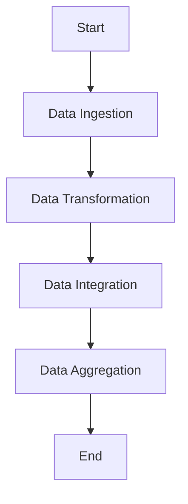
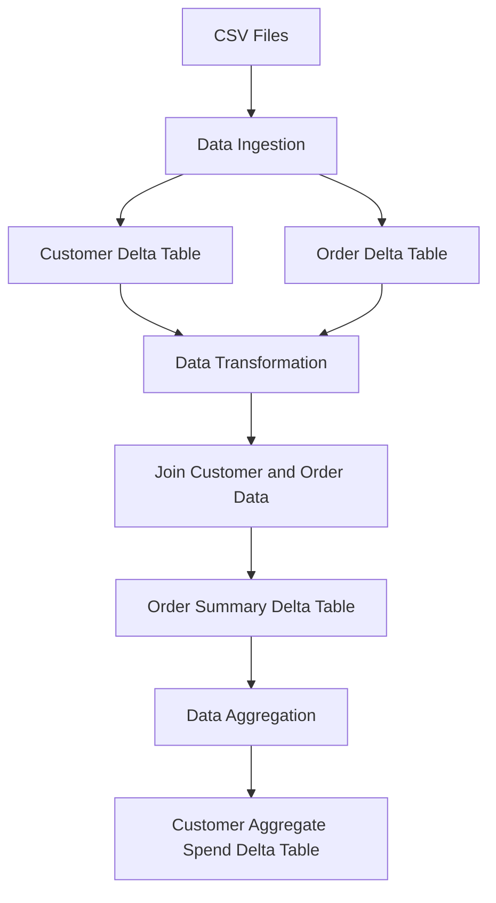
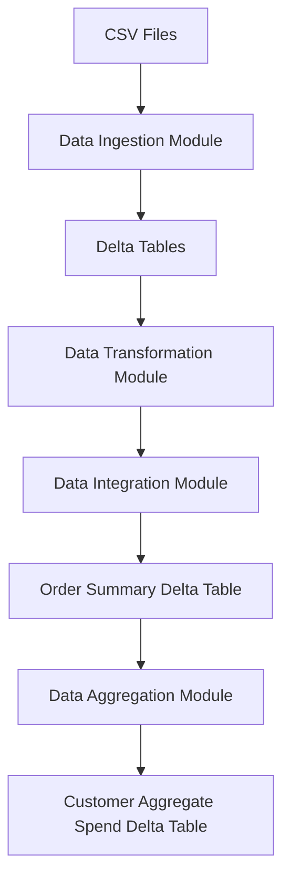

**Concise Functional Requirements Document (FRD)**

**Introduction:**
The purpose of this FRD is to outline the functional requirements for the "Application", a data integration and reporting solution that consolidates customer order data from CSV files into a structured database.

**Functional Requirements:**

1. **Data Ingestion Module**
	* Read CSV data from specified locations and load it into Delta tables "customer" and "order".
	* Handle exceptions for file not found or invalid file format.
2. **Data Transformation Module**
	* Remove "Null"/null and duplicate records from "customer" and "order" tables.
	* Validate data types and schema of ingested data.
3. **Data Integration Module**
	* Create "ordersummary" table if it does not exist and load joined data into an SCD Type 2 table.
	* Update SCD Type 2 "ordersummary" table whenever there is a change in the "customer" table.
4. **Data Aggregation Module**
	* Create "customeraggregatespend" table if it does not exist and load aggregated data into it.
	* Aggregate "TotalAmount" column from "ordersummary" table and group it by "Name" and "Date" columns.

**Detailed Functional Requirements:**

* The system should be able to read CSV data from `/Volumes/gen_ai_poc_databrickscoe/sdlc_wizard/customerdata` and `/Volumes/gen_ai_poc_databrickscoe/sdlc_wizard/orderdata`.
* The system should be able to create Delta tables "customer" and "order" with the correct schema.
* The system should be able to join "customer" and "order" data using the "CustId" field.
* The system should be able to update the SCD Type 2 "ordersummary" table by making old records inactive and new records active, and updating `StartDate` and `EndDate` accordingly.

**System Flow Diagram**


**Process Flow / Flowchart**


**Data Flow Diagram (DFD)**


**Sequence Diagram**
```mermaid
graph TD;
participant Application as "Application";
participant CSVFiles as "CSV Files";
participant DeltaTables as "Delta Tables";
Application ->> CSVFiles: Read CSV Data;
CSVFiles ->> Application: Return CSV Data;
Application ->> DeltaTables: Create Delta Tables;
Application ->> DeltaTables: Load Data into Delta Tables;
DeltaTables ->> Application: Return Delta Tables;
Application ->> DeltaTables: Join Customer and Order Data;
DeltaTables ->> Application: Return Joined Data;
Application ->> DeltaTables: Create Order Summary Table;
Application ->> DeltaTables: Update SCD Type 2 Table;
Application ->> DeltaTables: Aggregate Data;
DeltaTables ->> Application: Return Aggregated Data;
Application ->> DeltaTables: Create Customer Aggregate Spend Table;
```

**High-Level Architecture Diagram**
