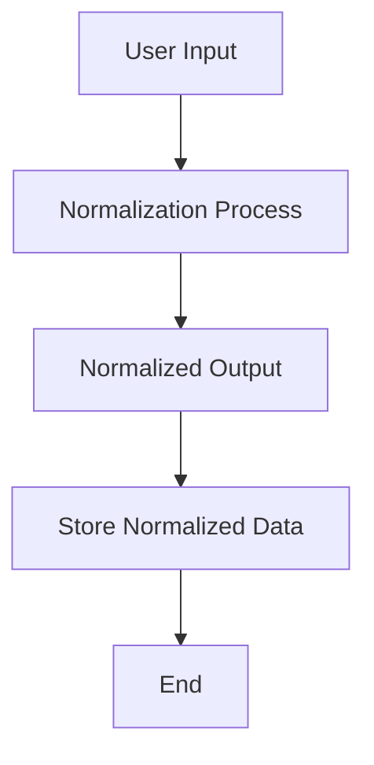
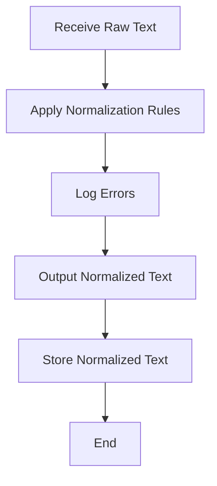
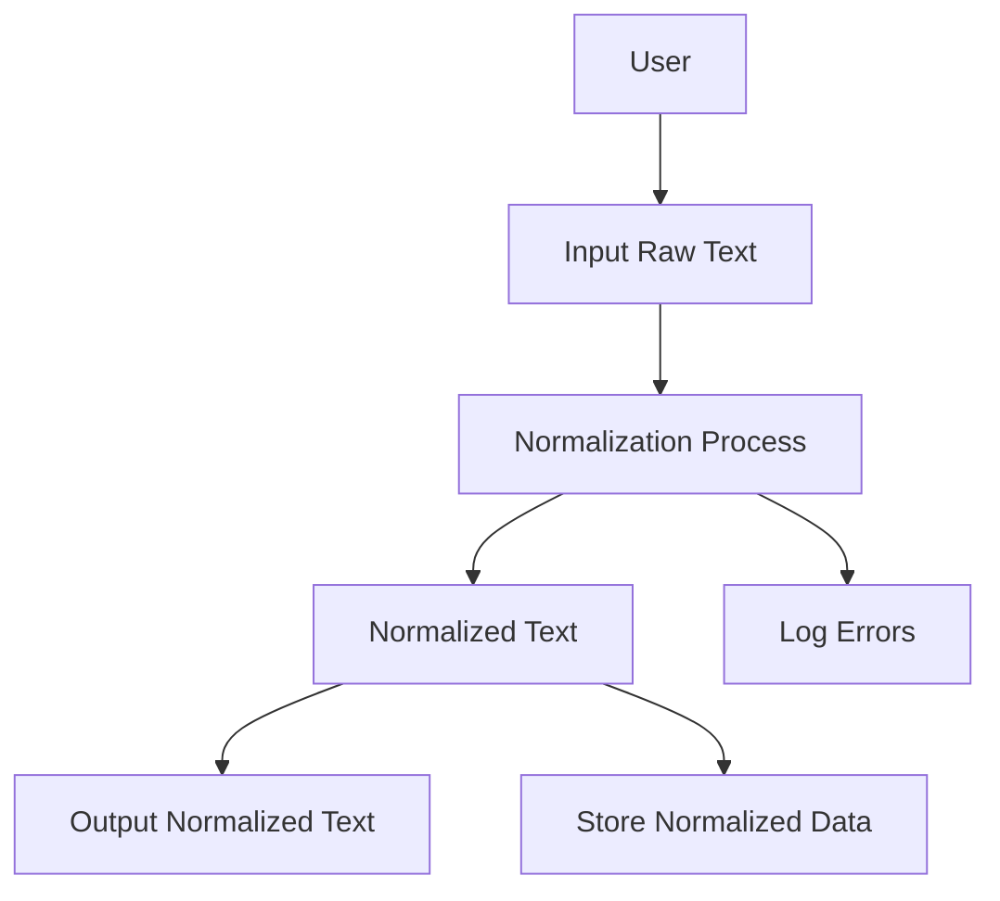
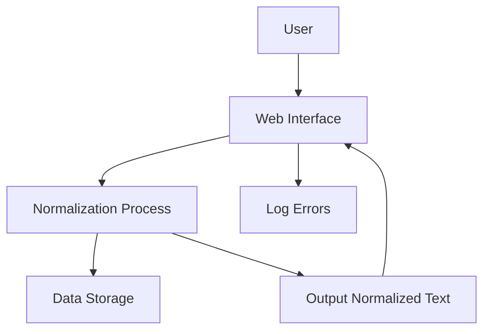
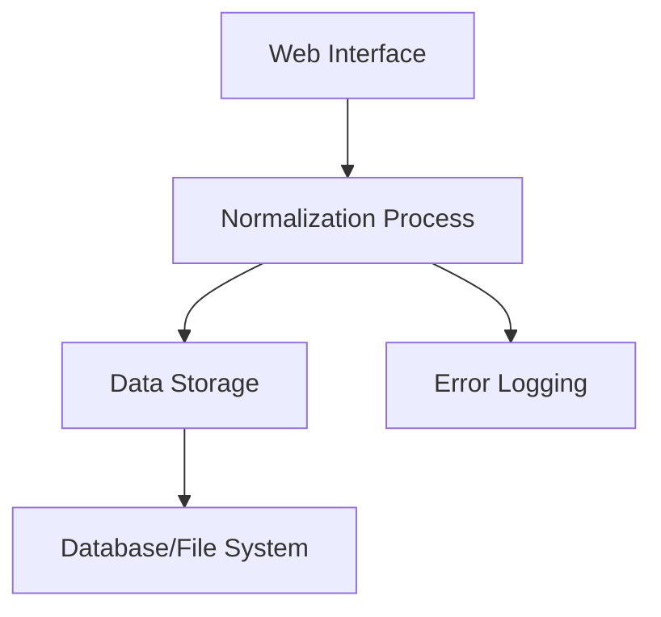

**Concise Functional Requirements Document (FRD) for the "Application"**

## Introduction
The Application is designed to normalize text data according to predefined rules, enhancing data consistency and quality across different systems within the organization.

## Functional Requirements

1. **Text Normalization**
   - The Application shall accept raw text as input.
   - The Application shall normalize input text according to predefined rules (e.g., case normalization, removal of special characters).
   - The Application shall output normalized text in a specified format (e.g., JSON, CSV).

2. **Error Handling**
   - The Application shall log any errors or exceptions encountered during the normalization process.

3. **User Interface**
   - The Application shall provide a web-based interface for users to input raw text and view the normalized output.
   - The Application shall allow authorized users to configure normalization rules through a dedicated interface.

4. **Data Storage**
   - The Application shall store normalized text data in a designated database or file system.

## Detailed Functional Requirements

### Text Normalization Process
1. The Application receives raw text input from the user or an external system.
2. The Application applies predefined normalization rules to the input text.
3. The Application outputs the normalized text in the specified format.

### Error Handling Mechanism
1. The Application identifies and logs errors or exceptions during the normalization process.
2. The Application notifies users or administrators of significant errors.

### User Interface Functionality
1. Users can input raw text through the web interface.
2. Authorized users can configure normalization rules.
3. The Application displays normalized text output to the user.

### Data Storage Management
1. The Application stores normalized text data.
2. The Application retrieves stored data as needed.

## Diagrams

### System Flow Diagram

### Process Flow / Flowchart

### Data Flow Diagram (DFD)

### Sequence Diagram

### High-Level Architecture Diagram

This FRD outlines the key functionalities and processes of the Application, focusing on text normalization, error handling, user interface, and data storage. The accompanying diagrams provide a visual representation of the system's flow, process, data flow, sequence of interactions, and high-level architecture.