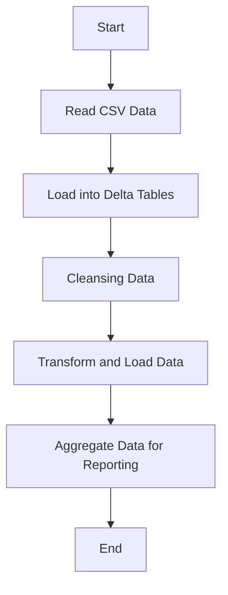
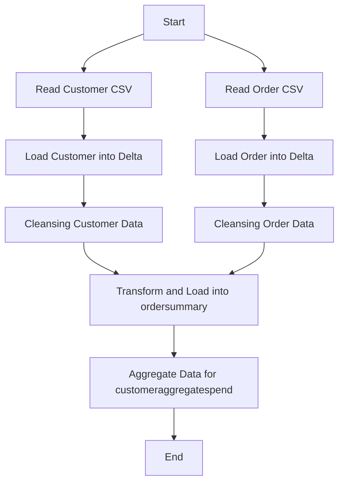
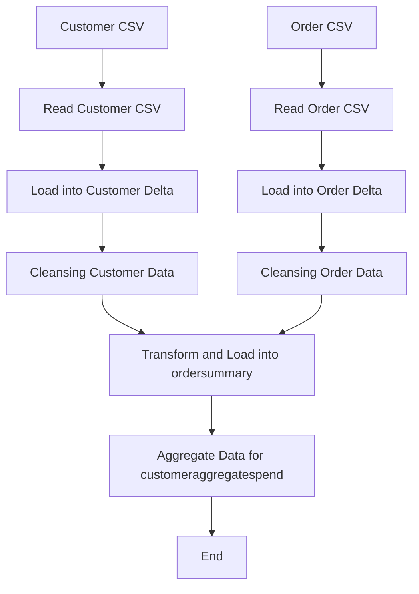
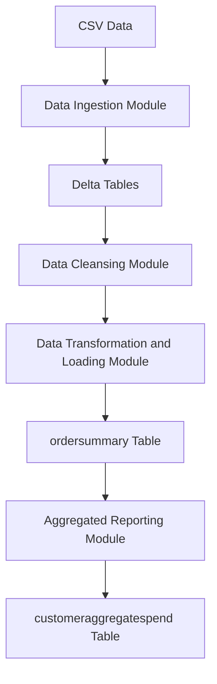

**Concise Functional Requirements Document (FRD) for the "Application"**

**Introduction:**
The Application is designed to integrate customer and order data from CSV files into Delta tables, perform data cleansing and transformation, and create aggregated reports.

**Functional Requirements:**

1. **Data Ingestion Module**
	* Read CSV data from specified volumes: `/Volumes/gen_ai_poc_databrickscoe/sdlc_wizard/customerdata` and `/Volumes/gen_ai_poc_databrickscoe/sdlc_wizard/orderdata`.
	* Load data into Delta tables `customer` and `order`.

2. **Data Cleansing Module**
	* Remove "Null"/Null and duplicate records from `customer` and `order` tables.

3. **Data Transformation and Loading Module**
	* Create `ordersummary` table if it does not exist with the specified schema.
	* Join `customer` and `order` data using "CustId" and load into SCD Type 2 table `ordersummary`.
	* Update SCD Type 2 table `ordersummary` on changes in `customer` table.

4. **Aggregated Reporting Module**
	* Create `customeraggregatespend` table if it does not exist with the specified schema.
	* Aggregate "TotalAmount" from `ordersummary` and load into `customeraggregatespend`.

**Detailed Functional Requirements:**

1. The system shall read CSV data from the specified volumes and load it into Delta tables `customer` and `order`.
2. The system shall remove "Null"/Null and duplicate records from both `customer` and `order` tables.
3. The system shall create the `ordersummary` table if it does not exist and load the joined data into an SCD Type 2 table.
4. The system shall update the SCD Type 2 table `ordersummary` whenever there is a change in the `customer` table.
5. The system shall create the `customeraggregatespend` table if it does not exist and load aggregated data into it.

**Diagrams:**

### System Flow Diagram


### Process Flow / Flowchart


### Data Flow Diagram (DFD)


### Sequence Diagram
```mermaid
graph TD;
participant CSV_Customer as "Customer CSV";
participant CSV_Order as "Order CSV";
participant Delta_Customer as "Customer Delta Table";
participant Delta_Order as "Order Delta Table";
participant ordersummary as "ordersummary Table";
participant customeraggregatespend as "customeraggregatespend Table";

CSV_Customer --> Delta_Customer: Load Data;
CSV_Order --> Delta_Order: Load Data;
Delta_Customer --> ordersummary: Transform and Load;
Delta_Order --> ordersummary: Transform and Load;
ordersummary --> customeraggregatespend: Aggregate Data;
```

### High-Level Architecture Diagram
