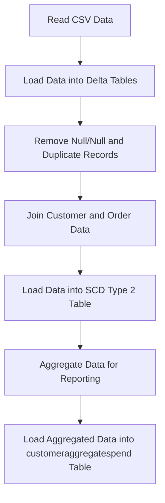
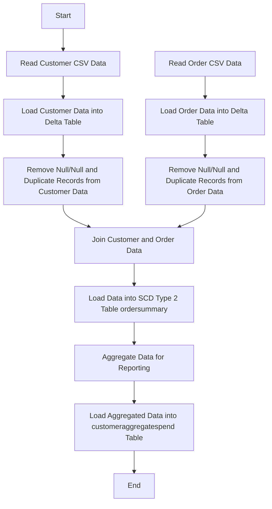
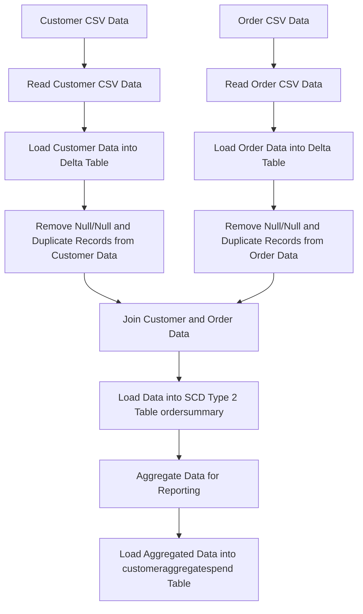
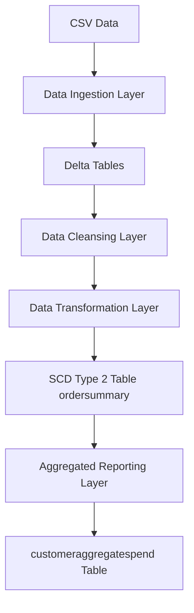

**Functional Requirements Document (FRD) for Data Platform**
===========================================================

**Introduction**
---------------

The purpose of this document is to outline the functional requirements for the Data Platform project, which aims to integrate customer and order data from CSV files into Delta tables, perform data cleansing and transformation, and create aggregated reports.

**Functional Requirements**
-------------------------

1. **Data Ingestion**
	* The system shall read CSV data from the specified volumes: `/Volumes/gen_ai_poc_databrickscoe/sdlc_wizard/customerdata` and `/Volumes/gen_ai_poc_databrickscoe/sdlc_wizard/orderdata`.
	* The system shall load the data into Delta tables `customer` and `order` with the specified schema.

2. **Data Cleansing**
	* The system shall remove "Null"/Null records from both `customer` and `order` tables.
	* The system shall remove duplicate records from both `customer` and `order` tables.

3. **Data Transformation and Loading**
	* The system shall create an `ordersummary` table if it does not exist in the catalog "gen_ai_poc_databrickscoe" and schema "sdlc_wizard" with the specified schema.
	* The system shall join the `customer` and `order` data using the "CustId" field and load the data into an SCD Type 2 table `ordersummary`.
	* The system shall update the SCD Type 2 table `ordersummary` whenever there is a change in the `customer` table.

4. **Aggregated Reporting**
	* The system shall create a `customeraggregatespend` table if it does not exist in the catalog "gen_ai_poc_databrickscoe" and schema "sdlc_wizard" with the specified schema.
	* The system shall aggregate the "TotalAmount" column from the `ordersummary` table and group it by the "Name" and "Date" columns.
	* The system shall load the aggregated data into the `customeraggregatespend` table.

**System Flow Diagram**

**Process Flow / Flowchart**

**Data Flow Diagram (DFD)**

**High-Level Architecture Diagram**
