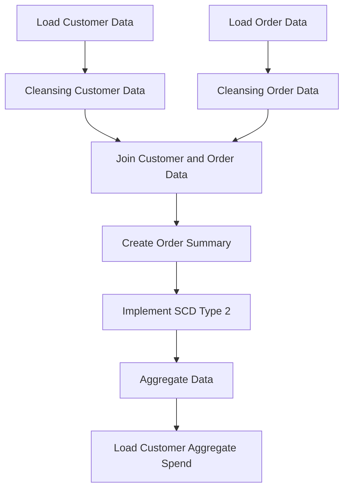
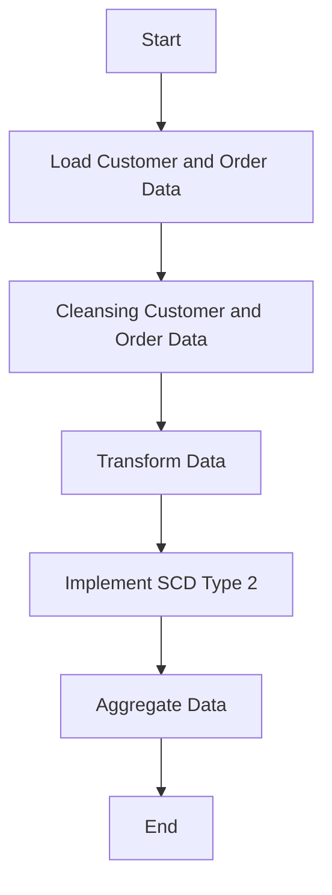
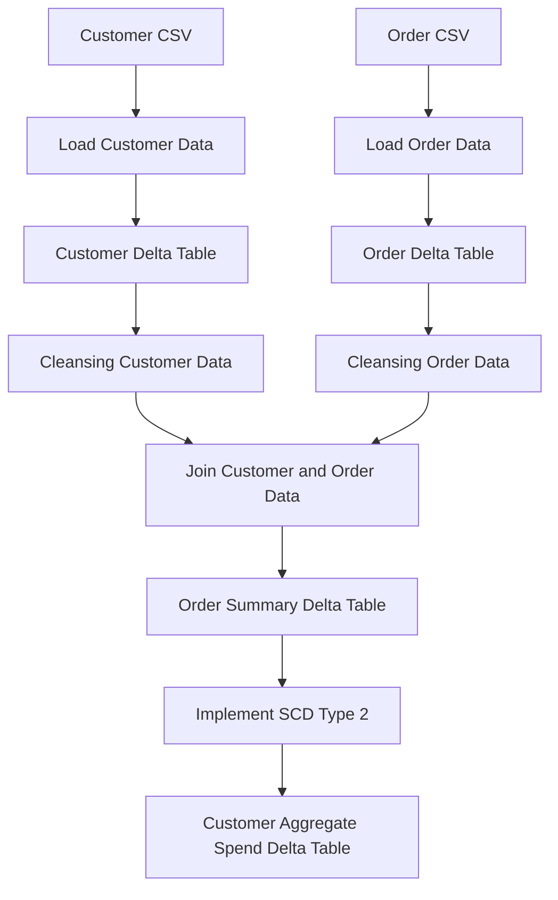
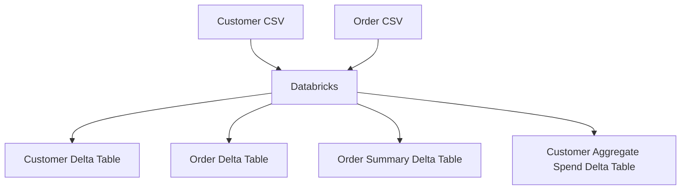

**Functional Requirements Document (FRD)**

**Project Title:** Data Integration and Aggregation for Customer and Order Data

**Document Version:** 1.0

**Prepared by:** [Your Name], Senior Business Analyst

**Date:** [Current Date]

### 1. Introduction

This Functional Requirements Document (FRD) outlines the functional requirements for the data integration and aggregation project involving customer and order data.

### 2. Functional Requirements

The following functional requirements have been identified:

1. **Data Loading**:
	* Load customer data from CSV file `/Volumes/gen_ai_poc_databrickscoe/sdlc_wizard/customerdata` into `customer` delta table.
	* Load order data from CSV file `/Volumes/gen_ai_poc_databrickscoe/sdlc_wizard/orderdata` into `order` delta table.
2. **Data Cleansing**:
	* Remove null records from `customer` and `order` tables.
	* Remove duplicate records from `customer` and `order` tables.
3. **Data Transformation**:
	* Join `customer` and `order` tables using `CustId` field.
	* Create `ordersummary` table with schema: `CustId`, `Name`, `EmailId`, `Region`, `OrderId`, `ItemName`, `PricePerUnit`, `Qty`, `Date`.
4. **SCD Type 2 Implementation**:
	* Implement SCD type 2 logic on `ordersummary` table.
	* Update `StartDate` and `EndDate` columns accordingly.
5. **Data Aggregation**:
	* Aggregate data from `ordersummary` table.
	* Create `customeraggregatespend` table with schema: `Name`, `TotalAmount`, `Date`.

### 3. System Flow Diagram

### 4. Process Flow / Flowchart

### 5. Data Flow Diagram (DFD)

### 6. High-Level Architecture Diagram

The above FRD provides a concise overview of the functional requirements for the data integration and aggregation project. The included diagrams illustrate the system flow, process flow, data flow, and high-level architecture of the proposed solution.