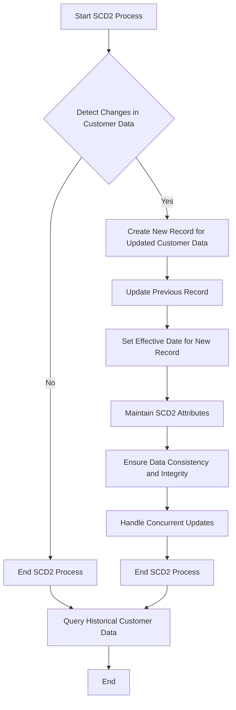

# , 3. Description, 4. Preconditions, 5. Main Flow /

Your FRD will contain these sections: 1. Requirement ID, 2. Title, 3. Description, 4. Preconditions, 5. Main Flow / Functional Steps.

## Flow Diagram

#### Additional Requirements
- The system shall provide a mechanism for querying historical customer data based on the `customer_id` and date ranges.
- The system shall ensure that data retrieval is efficient and scalable.

#### Justification for Additional Information
The additional details on handling concurrent updates and querying historical data are derived from the overall BRD context to ensure a comprehensive FRD.
