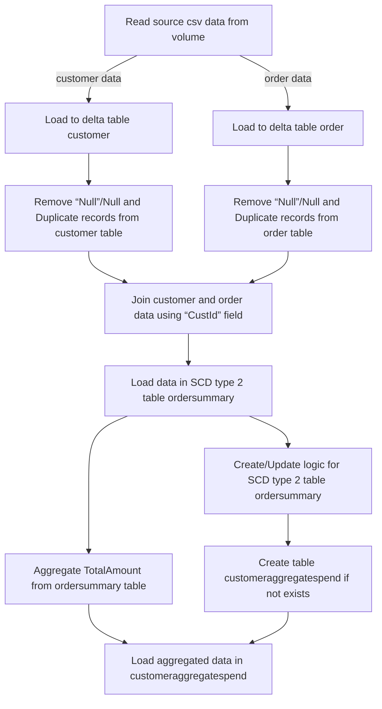

# SCD Type 2 Implementation for Customer and Order Data

### Functional Requirement Document (FRD)

#### 1. Requirement ID
REQ-001

#### 2. Title
SCD Type 2 Implementation for Customer and Order Data

#### 3. Description
This document outlines the functional requirements for implementing a Slowly Changing Dimension (SCD) Type 2 process for customer and order data. The process involves reading data from CSV files, loading it into Delta tables, performing data cleansing, joining customer and order data, and maintaining SCD Type 2 history in the `ordersummary` table.

#### 4. Preconditions
- The source CSV files for customer and order data are available at the specified paths.
- The necessary catalog and schema (`gen_ai_poc_databrickscoe.sdlc_wizard`) exist in the Databricks environment.
- The Delta tables for customer and order data are not pre-initialized.

#### 5. Main Flow / Functional Steps

1. **Read Source Data**:
   - Read customer data from CSV file located at `/Volumes/gen_ai_poc_databrickscoe/sdlc_wizard/customerdata`.
   - Read order data from CSV file located at `/Volumes/gen_ai_poc_databrickscoe/sdlc_wizard/orderdata`.

2. **Load Data into Delta Tables**:
   - Load customer data into a Delta table named `customer`.
   - Load order data into a Delta table named `order`.

3. **Data Cleansing**:
   - Remove records with "Null" or null values from both `customer` and `order` tables.
   - Remove duplicate records from both `customer` and `order` tables.

4. **Create `ordersummary` Table**:
   - Create the `ordersummary` table if it does not exist in the `gen_ai_poc_databrickscoe.sdlc_wizard` catalog and schema.
   - The schema of `ordersummary` should be: `CustId`, `Name`, `EmailId`, `Region`, `OrderId`, `ItemName`, `PricePerUnit`, `Qty`, `Date`.

5. **Join and Load Data into SCD Type 2 Table**:
   - Join `customer` and `order` data on the `CustId` field.
   - Load the joined data into the `ordersummary` SCD Type 2 table.

6. **Implement SCD Type 2 Logic**:
   - When there is a change in the `customer` table, update the `ordersummary` table accordingly.
   - Mark old records as Inactive and new records as Active.
   - Update `StartDate` and `EndDate` for the affected records.

7. **Create `customeraggregatespend` Table**:
   - Create a new table named `customeraggregatespend` if it does not exist, with columns `Name`, `TotalAmount`, and `Date`.

8. **Aggregate and Load Data into `customeraggregatespend`**:
   - Aggregate the `TotalAmount` from the `ordersummary` table, grouped by `Name` and `Date`.
   - Load the aggregated data into the `customeraggregatespend` table.

#### 6. Flow Diagram

Flow Diagram section added with PNG image!
