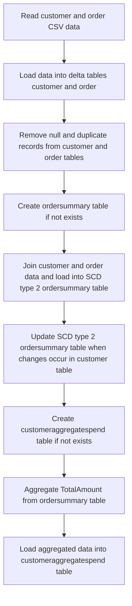
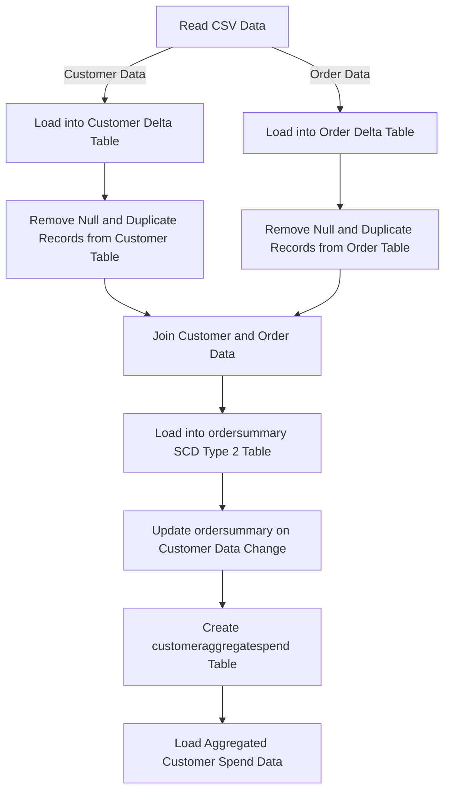

# # Flow Diagram

1. Requirement Overview
The requirement is to develop a data processing pipeline that reads customer and order data from CSV files, transforms the data, and loads it into various tables in a Databricks catalog.

2. Actors and Roles
* The system will be acting as the primary actor to process the customer and order data.

3. Functional Scope
* Read customer and order data from CSV files.
* Load data into delta tables.
* Remove null and duplicate records.
* Create and populate the "ordersummary" table using SCD type 2.
* Update the "ordersummary" table when there are changes in the customer table.
* Create and populate the "customeraggregatespend" table.

4. Main Flow
* Read source CSV data from volume and load to delta tables "customer" and "order".
  - Customer data path: /Volumes/gen_ai_poc_databrickscoe/sdlc_wizard/customerdata
  - Order data path: /Volumes/gen_ai_poc_databrickscoe/sdlc_wizard/orderdata
* Remove "Null"/Null and Duplicate records from both "customer" and "order" tables.
* Create "ordersummary" table if not exists in catalog="gen_ai_poc_databrickscoe" and schema="sdlc_wizard".
* Join "customer" and "order" data using "CustId" field and load the data into SCD type 2 "ordersummary" table.
* Include logic to update the SCD type 2 "ordersummary" table whenever there is a change in the "customer" table.
* Create "customeraggregatespend" table if not exists with columns "Name", "TotalAmount", and "Date".
* Aggregate "TotalAmount" from "ordersummary" table and group by "Name" and "Date" columns.
* Load the aggregated data into "customeraggregatespend" table.

5. Alternate / Exception Flows
* Handling null and duplicate records in "customer" and "order" tables.
* Updating SCD type 2 "ordersummary" table when changes occur in the "customer" table.

6. Preconditions
* Customer and order CSV files exist at the specified paths.
* Databricks catalog and schema are properly configured.

7. Postconditions
* "ordersummary" table is populated with joined customer and order data.
* "customeraggregatespend" table is populated with aggregated data.
* SCD type 2 "ordersummary" table is updated when changes occur in the "customer" table.

8. Validation Rules
* "customer" table schema: CustId, Name, EmailId, Region.
* "order" table schema: OrderId, ItemName, PricePerUnit, Qty, Date, CustId.
* "ordersummary" table schema: CustId, Name, EmailId, Region, OrderId, ItemName, PricePerUnit, Qty, Date.
* "customeraggregatespend" table schema: Name, TotalAmount, Date.
* TotalAmount is calculated by aggregating data from "ordersummary" table.

## Flow Diagram

Flow Diagram section added with PNG image!

## Flow Diagram

Flow Diagram section added with PNG image (rendered as Mermaid diagram above).
